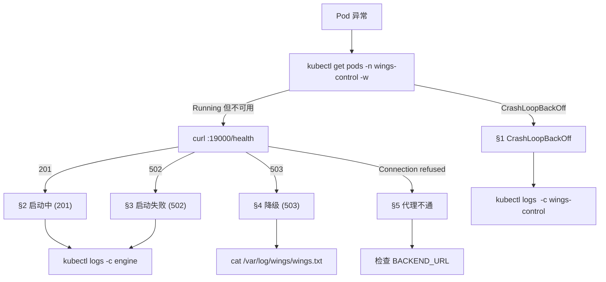
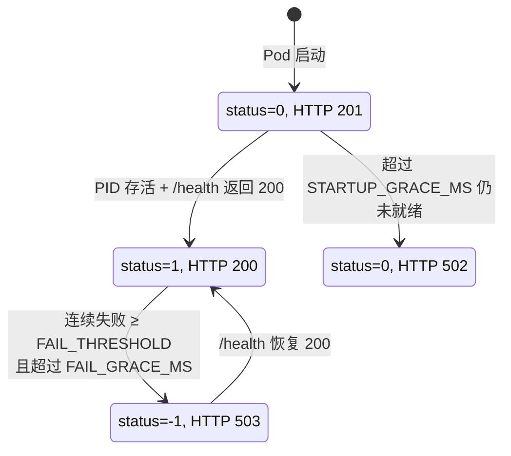
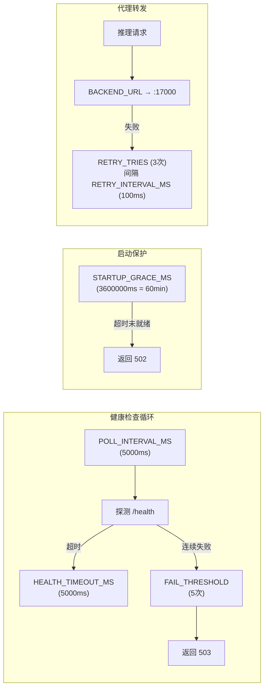
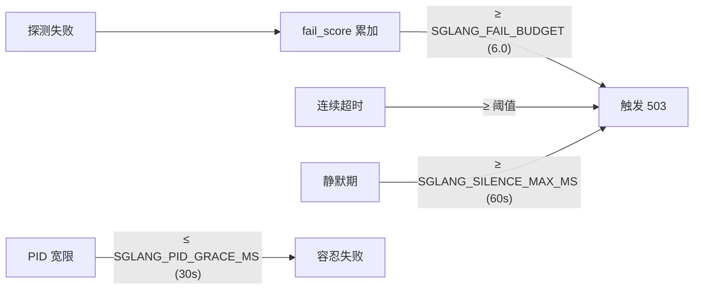
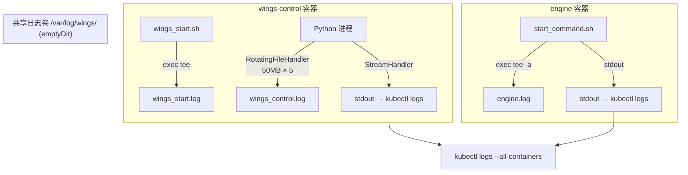
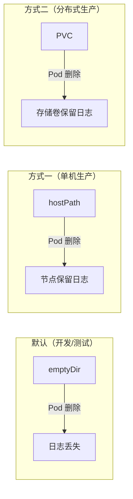
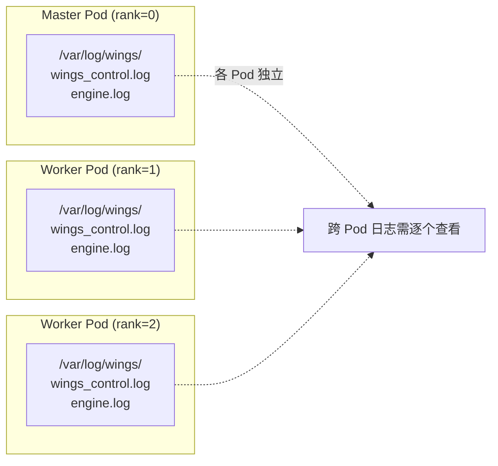

# 故障排查指南

## 快速诊断流程图



### 命令速查

```bash
# 1. Pod 状态
kubectl get pods -n wings-control -w

# 2. 健康检查
curl http://<NODE_IP>:19000/health

# 3. Sidecar 日志
kubectl logs <pod> -c wings-control -n wings-control

# 4. 引擎日志
kubectl logs <pod> -c engine -n wings-control

# 5. 聚合日志（Pod 内文件）
kubectl exec <pod> -c wings-control -n wings-control -- tail -f /var/log/wings/*.log
```

---

## 健康状态机



### 健康检查响应对照表

| HTTP 状态码 | 内部 status | phase | 含义 | 对应章节 |
|:-----------:|:-----------:|-------|------|----------|
| **201** | 0 | `starting` | 引擎正在加载模型（正常过渡状态） | §2 |
| **200** | 1 | `ready` | 引擎就绪，可接收推理请求 | — |
| **502** | 0 | `starting` | 超过宽限期仍未就绪 | §3 |
| **503** | -1 | `degraded` | 曾就绪后降级（引擎崩溃/超时） | §4 |

---

## 常见问题

### 1. Pod 持续 CrashLoopBackOff

**症状**: Pod 反复重启

**排查**:
```bash
kubectl describe pod <pod> -n wings-control
kubectl logs <pod> -c wings-control --previous -n wings-control
```

**常见原因**:

| 原因 | 日志特征 | 解决 |
|------|----------|------|
| 镜像拉取失败 | `ImagePullBackOff` | 检查镜像名和仓库可达性 |
| 模型路径错误 | `model_path not found` | 检查 `MODEL_PATH` 和 hostPath 挂载 |
| NPU 驱动缺失 | `cannot find npu-smi` | 检查 Ascend 驱动挂载 (`/usr/local/Ascend/driver`) |
| GPU 不可见 | `CUDA_VISIBLE_DEVICES` empty | 检查 `nvidia.com/gpu` 资源配额 |

### 2. 健康检查返回 201 (启动中)

**症状**: `curl :19000/health` 长时间返回 201

**说明**: 201 是 **正常的启动过渡状态**，表示引擎正在加载模型。

**排查**:
```bash
# 查看详细健康信息
curl -s http://<NODE_IP>:19000/health | python -m json.tool

# 预期响应 (启动中):
# {"s": 0, "p": "starting", "backend_ok": false, "ever_ready": false}

# 预期响应 (就绪):
# {"s": 1, "p": "ready", "backend_ok": true, "ever_ready": true}
```

**常见原因**:
- 大模型加载耗时长（正常，等待即可）
- 引擎启动脚本未执行（检查 engine 容器的 entrypoint 是否等待 `start_command.sh`）
- `start_command.sh` 未写入共享卷

```bash
# 检查共享卷
kubectl exec <pod> -c engine -n wings-control -- ls -la /shared-volume/
kubectl exec <pod> -c engine -n wings-control -- cat /shared-volume/start_command.sh
```

### 3. 健康检查返回 502 (启动失败)

**症状**: 超过宽限期后返回 502

**原因**: 在 `STARTUP_GRACE_MS`（默认 60 分钟）内引擎未成功响应 `/health`

**排查**:
```bash
# 检查引擎是否启动
kubectl exec <pod> -c engine -n wings-control -- ps aux | grep -E 'vllm|sglang|mindie'

# 检查引擎端口是否监听
kubectl exec <pod> -c wings-control -n wings-control -- curl -s http://127.0.0.1:17000/health

# 查看引擎日志
kubectl logs <pod> -c engine -n wings-control --tail=100
```

**常见原因**:
| 原因 | 解决 |
|------|------|
| OOM | 降低 `GPU_MEMORY_UTILIZATION` 或 `MAX_MODEL_LEN` |
| Triton 初始化失败 (Ascend) | 检查 Triton 补丁日志: `grep triton` |
| Ray 集群未连通 (分布式) | 检查 headless service DNS 和节点间网络 |

### 4. 健康检查返回 503 (降级)

**症状**: 曾经就绪 (200)，后变为 503

**原因**: 引擎进程崩溃或连续探测失败超过阈值

**排查**:
```bash
# PID 检查
kubectl exec <pod> -c wings-control -n wings-control -- cat /var/log/wings/wings.txt

# 引擎进程是否存活
kubectl exec <pod> -c engine -n wings-control -- ps aux
```

### 5. 代理返回 502/504

**症状**: 通过 :18000 请求推理返回 502 或 504

**原因**: Proxy 无法连通后端引擎

**排查**:
```bash
# 直接访问引擎
kubectl exec <pod> -c wings-control -n wings-control -- \
  curl -s http://127.0.0.1:17000/v1/models

# 检查 BACKEND_URL
kubectl exec <pod> -c wings-control -n wings-control -- env | grep BACKEND_URL
```

**常见错误**:
- `BACKEND_URL` 指向了错误的地址 → 检查 `RANK_IP` 和 `MASTER_IP`
- 引擎监听在非 0.0.0.0 地址 → 检查引擎启动参数中的 `--host`

### 6. 分布式: Ray Worker 连接失败

**症状**: rank>0 节点无法加入 Ray 集群

**排查**:
```bash
# 从 worker 节点检查 head 可达性
kubectl exec <pod>-1 -c engine -n wings-control -- \
  python -c "import socket; print(socket.getaddrinfo('<sts>-0.<svc>', 6379))"

# Ray 状态
kubectl exec <pod>-0 -c engine -n wings-control -- ray status
```

**常见原因**:
| 原因 | 解决 |
|------|------|
| Headless Service 未创建 | 检查 `clusterIP: None` 的 Service |
| DNS 未解析 | 检查 CoreDNS Pod 和 resolv.conf |
| 防火墙 | 开放 6379 (Ray GCS) 和 8265 (Ray Dashboard) |
| Ray 版本不一致 | 确保所有节点使用相同镜像 |

### 7. 分布式: Ascend HCCL 通信失败

**症状**: MindIE 分布式模式下节点间通信错误

**排查**:
```bash
# 检查 HCCL 端口
kubectl exec <pod> -c engine -n wings-control -- \
  ss -tlnp | grep 27070

# 检查 ranktable.json
kubectl exec <pod> -c engine -n wings-control -- \
  cat /shared-volume/ranktable.json
```

**常见原因**:
- 缺少 `privileged: true`
- 驱动路径未挂载（`/usr/local/Ascend/driver`、`/usr/local/dcmi`）
- HCCL 端口 27070 被防火墙阻断

### 8. Triton NPU 补丁相关

**症状**: vLLM-Ascend 启动时报 Triton 错误

**日志特征**:
```
ImportError: cannot import name 'driver' from 'triton.runtime'
```

**说明**: `vllm_adapter.py` 会自动尝试补丁，在日志中搜索:
```bash
kubectl logs <pod> -c engine -n wings-control | grep -i triton
```

**如果自动补丁失败**:
```bash
# 手动验证 Triton 路径
kubectl exec <pod> -c engine -n wings-control -- \
  python -c "import triton; print(triton.__file__)"
```

### 9. CANN 库冲突 (Ascend)

**症状**: `libascendcl.so` 或 `libhccl.so` 加载报错

**排查**:
```bash
# 检查 LD_LIBRARY_PATH 是否包含宿主机驱动和容器内 CANN
kubectl exec <pod> -c engine -n wings-control -- \
  bash -c 'echo $LD_LIBRARY_PATH | tr ":" "\n" | grep -i ascend'

# 检查是否有重复库
kubectl exec <pod> -c engine -n wings-control -- \
  find / -name "libascendcl.so*" 2>/dev/null
```

**解决**: 确保宿主机驱动版本与容器内 CANN 版本兼容，LD_LIBRARY_PATH 中驱动路径在 CANN 路径之前。

---

## 环境变量调优

### 参数关系图



### 健康检查参数

| 变量 | 默认值 | 说明 |
|------|--------|------|
| `STARTUP_GRACE_MS` | 3600000 (60min) | 启动宽限期，大模型可适当增加 |
| `POLL_INTERVAL_MS` | 5000 | 探测间隔 (ms) |
| `FAIL_THRESHOLD` | 5 | 连续失败次数阈值 |
| `HEALTH_TIMEOUT_MS` | 5000 | 单次探测超时 (ms) |
| `WINGS_SKIP_PID_CHECK` | false | K8s sidecar 模式设为 true |

### 代理参数

| 变量 | 默认值 | 说明 |
|------|--------|------|
| `HTTPX_MAX_CONNECTIONS` | 2048 | httpx 最大连接数 |
| `RETRY_TRIES` | 3 | 重试次数（含首次） |
| `RETRY_INTERVAL_MS` | 100 | 重试间隔 (ms) |

### SGLang 专用

SGLang 流式场景下超时更常见，采用「宽容但可退化」计分机制：



| 变量 | 默认值 | 说明 |
|------|--------|------|
| `SGLANG_FAIL_BUDGET` | 6.0 | 失败预算 (权重)，累积到此值触发 503 |
| `SGLANG_PID_GRACE_MS` | 30000 | PID 宽限期 (ms) |
| `SGLANG_SILENCE_MAX_MS` | 60000 | 静默最大时间 (ms) → 503 |

---

## 日志架构

### 日志写入流向



### kubectl 远程查看（stdout）

| 组件 | 日志来源 | 前缀 |
|------|----------|------|
| Launcher | Sidecar 容器 stdout | `[wings-launcher]` |
| Proxy | Sidecar 容器 stdout | `[wings-proxy]` |
| Health | Sidecar 容器 stdout | `[wings-health]` |
| Engine | Engine 容器 stdout | 引擎原生日志 |

```bash
# 一次性查看所有容器日志
kubectl logs <pod> -n wings-control --all-containers=true --tail=50

# 实时流式查看引擎日志
kubectl logs -f <pod> -c engine -n wings-control

# 实时流式查看 sidecar 日志
kubectl logs -f <pod> -c wings-control -n wings-control
```

### 共享日志卷（Pod 内 `/var/log/wings/`）

wings-control 和 engine 容器通过 `log-volume` (emptyDir) 共享 `/var/log/wings/` 目录，Pod 存活期间日志持续保存。

| 日志文件 | 写入者 | 内容 | 滚动策略 |
|---------|--------|------|---------|
| `wings_start.log` | `wings_start.sh` 的 `exec tee` | shell 进程全量输出（涵盖 Python、pip、报错等） | 按时间戳备份，保留 5 个 |
| `wings_control.log` | Python `RotatingFileHandler` | wings-launcher / wings-proxy / wings-health 结构化日志 | 50MB × 5 备份 |
| `engine.log` | `start_command.sh` 的 `tee -a` | 推理引擎全部 stdout/stderr（模型加载、推理请求、GPU 指标） | 无自动滚动 |
| `wings.txt` | wings-control Python 进程 | 引擎 PID（第一行） | 无滚动 |

#### 日志目录结构

```
/var/log/wings/
├── wings_start.log                      ← 当前 shell 全量日志
├── wings_start.log.2026-03-14_10-00-00  ← 备份 (上次启动)
├── wings_control.log                    ← 当前 Python 结构化日志
├── wings_control.log.1                  ← 滚动备份 1 (最近 50MB)
├── wings_control.log.2                  ← 滚动备份 2
├── engine.log                           ← 引擎全量输出
└── wings.txt                            ← 引擎 PID
```

#### 使用样例

```bash
# 查看日志文件列表和大小
kubectl exec <pod> -c wings-control -n wings-control -- ls -lh /var/log/wings/

# 聚合查看所有日志（任一容器内执行）
kubectl exec <pod> -c wings-control -n wings-control -- tail -f /var/log/wings/*.log

# 只看引擎日志
kubectl exec <pod> -c wings-control -n wings-control -- tail -100 /var/log/wings/engine.log

# 查看 proxy 请求日志
kubectl exec <pod> -c wings-control -n wings-control -- grep wings-proxy /var/log/wings/wings_control.log

# 查看健康检查日志
kubectl exec <pod> -c wings-control -n wings-control -- grep wings-health /var/log/wings/wings_control.log
```

### 日志持久化（可选）

默认 `log-volume` 使用 `emptyDir`，Pod 删除后日志丢失。如需持久化，修改 K8s 模板中的 volume 定义：



```yaml
# 方式一：hostPath（单机场景）
volumes:
  - name: log-volume
    hostPath:
      path: /var/log/wings-pods/<pod-name>
      type: DirectoryOrCreate

# 方式二：PVC（分布式场景）
volumes:
  - name: log-volume
    persistentVolumeClaim:
      claimName: wings-logs-pvc
```

### 分布式场景日志



StatefulSet 多 Pod 跨节点部署时，每个 Pod 有独立的 `/var/log/wings/` 目录。跨 Pod 日志需逐个查看：

```bash
# 查看 master (rank 0) 日志
kubectl exec infer-0 -c wings-control -n wings-control -- tail -f /var/log/wings/*.log

# 查看 worker (rank 1) 日志
kubectl exec infer-1 -c wings-control -n wings-control -- tail -f /var/log/wings/*.log

# 批量查看所有 Pod 引擎日志
for pod in $(kubectl get pods -n wings-control -l app=infer -o name); do
  echo "=== $pod ==="
  kubectl exec $pod -c engine -n wings-control -- tail -20 /var/log/wings/engine.log
done
```
