3.1	功能迁移
【需求背景】
Wings V2 单容器架构包含约 52 项功能模块，在向 V1 Sidecar 三容器架构迁移时，需逐项评估每项功能的保留/不迁移/删除/新增决策。
【需求价值】
确保核心推理链路 100% 保留，多模态等非解耦功能有序裁剪，Sidecar 架构新增能力完整覆盖，输出完整的功能迁移清单。
【需求详情】
1)	保留 34 项核心推理功能。
2)	不迁移 12 项 V2 独有模块。
3)	主动删除 6 项多模态/xLLM 相关功能。
4)	新增 28 项 Sidecar 架构能力。
3.1.1	实现设计
功能迁移方法论：逐文件对比 V2 `wings/wings/` 与 V1 `wings-control/app/` 目录，通过文件名/函数名/类名 + 代码 diff 判定每项功能迁移状态。

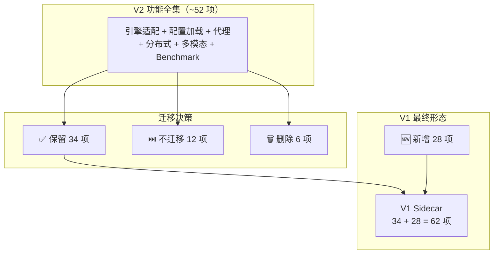
```mermaid
graph TD
    subgraph "V2 功能全集（~52 项）"
        ALL["引擎适配 + 配置加载 + 代理<br/>+ 分布式 + 多模态 + Benchmark"]
    end
    subgraph "迁移决策"
        ALL --> KEEP["✅ 保留 34 项"]
        ALL --> SKIP["⏭️ 不迁移 12 项"]
        ALL --> DEL["🗑️ 删除 6 项"]
    end
    subgraph "V1 最终形态"
        KEEP --> V1["V1 Sidecar<br/>34 + 28 = 62 项"]
        NEW["🆕 新增 28 项"] --> V1
    end
```

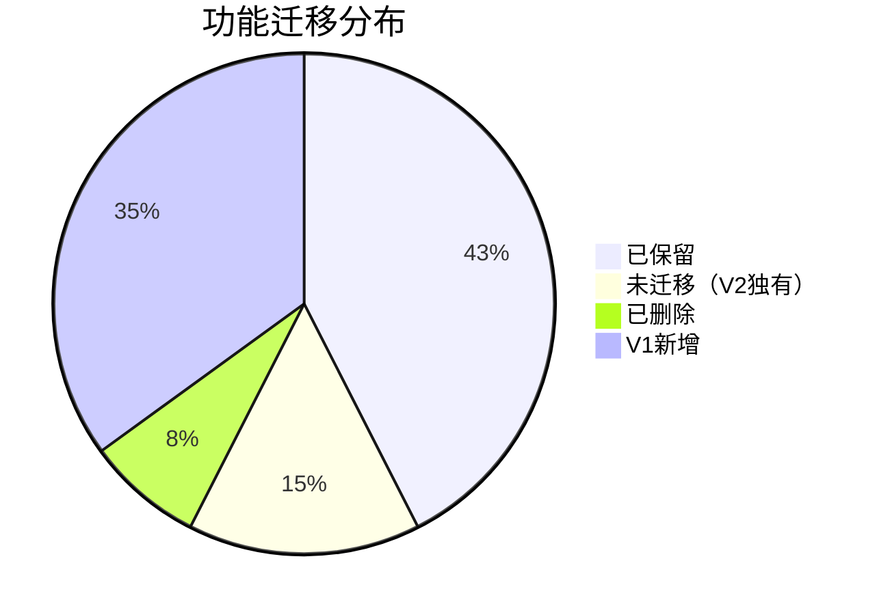
```mermaid
pie title 功能迁移分布
    "已保留" : 34
    "未迁移（V2独有）" : 12
    "已删除" : 6
    "V1新增" : 28
```

**已保留功能（34 项）完整清单**

| # | 功能 | V2 文件 | V1 文件 | 说明 |
|---|------|---------|---------|------|
| 1 | vLLM 引擎适配 | `engines/vllm_adapter.py` | `engines/vllm_adapter.py` | CLI 参数构建，推测解码，PD 分离 |
| 2 | vLLM-Ascend 引擎适配 | 同上（engine=vllm_ascend） | 同上 | CANN 环境变量，HCCL 配置 |
| 3 | SGLang 引擎适配 | `engines/sglang_adapter.py` | `engines/sglang_adapter.py` | 参数语义映射 |
| 4 | MindIE 引擎适配 | `engines/mindie_adapter.py` | `engines/mindie_adapter.py` | JSON 配置文件模式 |
| 5 | 多层配置加载 | `core/config_loader.py` | `core/config_loader.py` | 环境变量→JSON→用户参数 3 层合并 |
| 6 | 引擎自动选择 | `_auto_select_engine()` | `_auto_select_engine()` | 设备+模型→引擎映射 |
| 7 | 参数合并 | `_merge_*_params()` | `_merge_*_params()` | vLLM/SGLang/MindIE 各自的参数预处理 |
| 8 | TP 自动调整 | `_adjust_tensor_parallelism()` | 同 | 含 300I A2 检测 |
| 9 | 推测解码 | `_set_spec_decoding_config()` | 同 | 环境变量→配置注入 |
| 10 | 稀疏 KV | `_set_sparse_config()` | 同 | enable_sparse 标志 |
| 11 | QAT 量化 | `_build_qat_env_commands()` | 同 | QAT 环境变量链 |
| 12 | PD 分离 | `_build_pd_role_env_commands()` | 同 | P/D 角色环境变量 |
| 13 | Function Call | tool_call_parser 处理 | 同 | vLLM + SGLang |
| 14 | Ray 分布式 | `build_start_script()` ray 分支 | 同 | head/worker 协调 |
| 15 | DP 分布式 | `build_start_script()` dp 分支 | 同 | data-parallel 地址/端口 |
| 16 | DeepSeek FP8 | `_build_deepseek_fp8_env_commands()` | 同 | FP8 量化环境变量 |
| 17 | 910B 9362 补丁 | `_build_ascend910_9362_env_commands()` | 同 | Ascend 910C 环境变量注入 |
| 18 | HTTP 代理网关 | `proxy/gateway.py` | 同 | 10 个对外路径（/health 含 GET/HEAD） |
| 19 | 请求队列 | `proxy/queueing.py` | 同 | 并发限制 |
| 20 | 请求标签 | `proxy/tags.py` | 同 | 请求分类 |
| 21 | HTTP 客户端 | `proxy/http_client.py` | 同 | 引擎连接管理 |
| 22 | 健康检查 | `proxy/health.py` | `proxy/health_router.py` | 重命名 |
| 23 | 代理配置 | `proxy/settings.py` | `proxy/proxy_config.py` | 重命名 + pydantic-settings |
| 24 | RAG 二级推理 | `proxy/rag_acc/` | 同 | 100% 继承 |
| 25 | 噪声过滤 | `utils/noise_filter.py` | 同 | 日志过滤 |
| 26 | 文件工具 | `utils/file_utils.py` | 同 | JSON 加载、权限检查 |
| 27 | 环境工具 | `utils/env_utils.py` | 同 | IP 获取、环境变量读取 |
| 28 | 模型工具 | `utils/model_utils.py` | 同 | ModelIdentifier |
| 29 | 设备工具 | `utils/device_utils.py` | 同 | PCIe 检测（标记遗留） |
| 30 | 分布式配置 | `config/distributed_config.json` | 同 | 端口规划 |
| 31 | 引擎参数映射 | `config/engine_parameter_mapping.json` | 同 | 参数转换表 |
| 32 | 默认引擎配置 | `config/*_default.json` | 同 | 3 个引擎默认 JSON |
| 33 | 环境设置脚本 | `config/set_*_env.sh` | 同 | 引擎环境变量模板 |
| 34 | 进程管理 | `wings.py` (单体) | `main.py` (ManagedProc) | 重构为 supervisor |

**未迁移功能（12 项，V2 独有）**

| # | 功能 | V2 文件 | 原因 |
|---|------|---------|------|
| 1 | Transformers 内置推理服务 | `servers/transformers_server.py` | 引擎容器内运行 |
| 2 | HunyuanVideo 推理 | `servers/model/` | 特定模型实现 |
| 3 | QwenImage 推理 | `servers/model/` | 特定模型实现 |
| 4 | OOP 引擎适配器模式 | `engines/engine_adapter.py` (基类) | V1 用函数式 |
| 5 | 物理 GPU/NPU 探测 | `core/hardware_detect.py` (torch/pynvml) | V1 用环境变量 |
| 6 | 单体引擎管理 | `core/engine_manager.py` (subprocess.Popen) | V1 用脚本生成 |
| 7 | Benchmark 性能测试 | `benchmark/` | 独立工具，V2 保留 |
| 8 | wings_start.sh | `wings_start.sh` | 单体容器入口 |
| 9 | wings_stop.py | `wings_stop.py` | 单体容器停止 |
| 10 | wings_proxy.py | `wings_proxy.py` | 单体代理入口 |
| 11 | diffusers 自定义 op shim | `utils/fix_diffusers_custom_op_shim.py` | 模型特定 |
| 12 | function_call 测试 | `test/function_call.py` | 测试文件 |

> **说明**: Ascend 910 补丁功能在 V1 中通过 `vllm_adapter.py` 的 `_build_ascend910_9362_env_commands()` 实现（已保留 #17），V2 的独立模块 `utils/ascend910_patch.py` 提供的 wheel 热补丁能力由 Accel initContainer 方案替代。

**已从 V1 删除功能（6 项）**

| # | 功能 | 删除的 V1 文件/代码 | 删除原因 |
|---|------|---------------------|----------|
| 1 | Wings/Transformers 适配器 | `engines/wings_adapter.py` | 多模态引擎，V1 不支持 |
| 2 | xLLM 适配器 | `engines/xllm_adapter.py` | 华为昇腾原生引擎，不纳入解耦范围 |
| 3 | 多模态路径探测工具 | `utils/mmgm_utils.py` | HunyuanVideo 路径探测，多模态不支持 |
| 4 | 多模态 API 端点 | `gateway.py` 中 video/image 路由 | 文生视频/文生图代理路由 |
| 5 | 多模态模型类型 | `model_utils.py` 中 `_MMUM_MODELS` | mmum/mmgm 分类逻辑 |
| 6 | 多模态默认配置 | `*_default.json` 中 `mmum` 节 | 多模态引擎默认参数 |

**V1 新增功能（28 项）**

| # | 功能 | V1 文件 | 说明 |
|---|------|---------|------|
| 1 | Sidecar 架构 | `main.py` | 3 容器协作 |
| 2 | 脚本生成→共享卷 | `engines/*_adapter.py` → `/shared-volume/` | 解耦启动 |
| 3 | ManagedProc supervisor | `main.py` | 进程守护 + 崩溃保护 |
| 4 | PortPlan 端口规划 | `main.py` | 端口统一分配 |
| 5 | Health 独立服务 | `proxy/health_service.py` (port 19000) | 与代理分离 |
| 6 | pydantic-settings 配置 | `proxy/proxy_config.py` | 类型安全配置 |
| 7 | Accel initContainer | `wings-accel/Dockerfile`, `wings-accel/install.sh` | 补丁注入 |
| 8 | Accel 补丁执行 | `_ENGINE_PATCH_KEY_MAP` | 引擎无关补丁 |
| 9 | 环境变量硬件检测 | `WINGS_DEVICE/DEVICE`, `WINGS_DEVICE_COUNT/DEVICE_COUNT` | 替代 torch/pynvml |
| 10 | WINGS_SKIP_PID_CHECK | `proxy/proxy_config.py` | 无 PID 写入检查 |
| 11 | 细粒度超时配置 | `proxy/proxy_config.py` | HTTPX/STREAM/STATUS 多级超时 |
| 12 | K8s 部署清单 | `k8s/` (8 场景) | 完整 K8s 支持 |
| 13 | 架构文档 | `docs/` | 架构 + 部署指南 |
| 14 | 验证报告 | `docs/verify/` | 验证记录 |
| 15 | .env.example | `.env.example` | 环境变量模板 |
| 16 | requirements.txt | `requirements.txt` | 依赖清单 |
| 17 | Shell 日志文件 | `wings_start.sh` tee → `/var/log/wings/wings_start.log` | 5 副本滚动 |
| 18 | Worker 注册重试 | `_wait_and_distribute_to_workers()` | 3 轮 ×300s |
| 19 | FORCE_TOPK_TOPP 默认启用 | `gateway.py` | top_k/top_p 强制 |
| 20 | MAX_REQUEST_BYTES 20MB | `gateway.py` | 请求体上限 |
| 21 | MindIE 专用健康探针 | `health_router.py` | MindIE v2 兼容 |
| 22 | 懒加载 fastchat | `rag_acc/` | 可选依赖 |
| 23 | Qwen3NextForCausalLM 路由 | `config_loader.py` | 新模型 |
| 24 | DeepseekV32ForCausalLM 路由 | `config_loader.py` | 新模型 |
| 25 | configure_worker_logging | `proxy/speaker_logging.py` | 子进程日志 |
| 26 | nixl_port DP 配置 | `vllm_adapter.py` | NIXL 侧通道 |
| 27 | Shell 注入防护 | `vllm_adapter.py` | shlex.quote |
| 28 | dp_deployment vllm serve | `vllm_adapter.py` | 入口命令更新 |
3.1.2	类设计（可选）
不涉及
3.1.3	接口设计
不涉及（功能清单为静态分析产出，无接口）
3.1.4	数据结构设计（如不涉及写明不涉及即可）
不涉及

3.2	参数环境变量
【需求背景】
V2 到 V1 架构切换带来环境变量体系重大变化，需要完整梳理保留、新增、删除三类环境变量及其默认值和用途。
【需求价值】
为部署运维提供精确的环境变量参考手册，避免遗漏或误配导致启动失败。
【需求详情】
1)	保留约 80 个核心环境变量（引擎选择 + 模型 + 设备 + 分布式 + 特性开关 + 代理配置）。
2)	新增约 55 个环境变量（Accel + Health 端口 + 细粒度超时 + MindIE 长上下文 + Ascend 专用）。
3)	删除约 45 个 V2 独有环境变量（进程管理 + 内置服务器 + Benchmark + 多模态 + xLLM）。
3.2.1	实现设计
环境变量梳理方法：全量扫描 V2 与 V1 代码中的 `os.getenv()` / `os.environ` 调用，通过集合运算（交集/差集）分类。

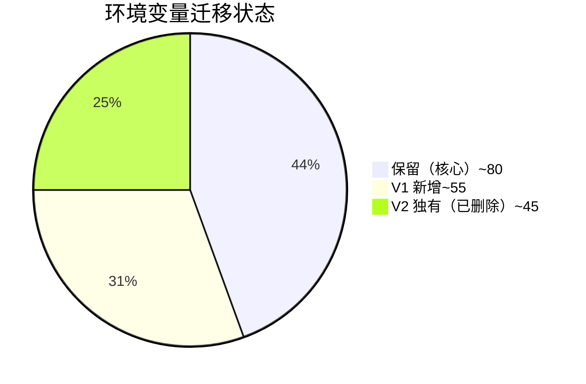
```mermaid
pie title 环境变量迁移状态
    "保留（核心）~80" : 80
    "V1 新增~55" : 55
    "V2 独有（已删除）~45" : 45
```

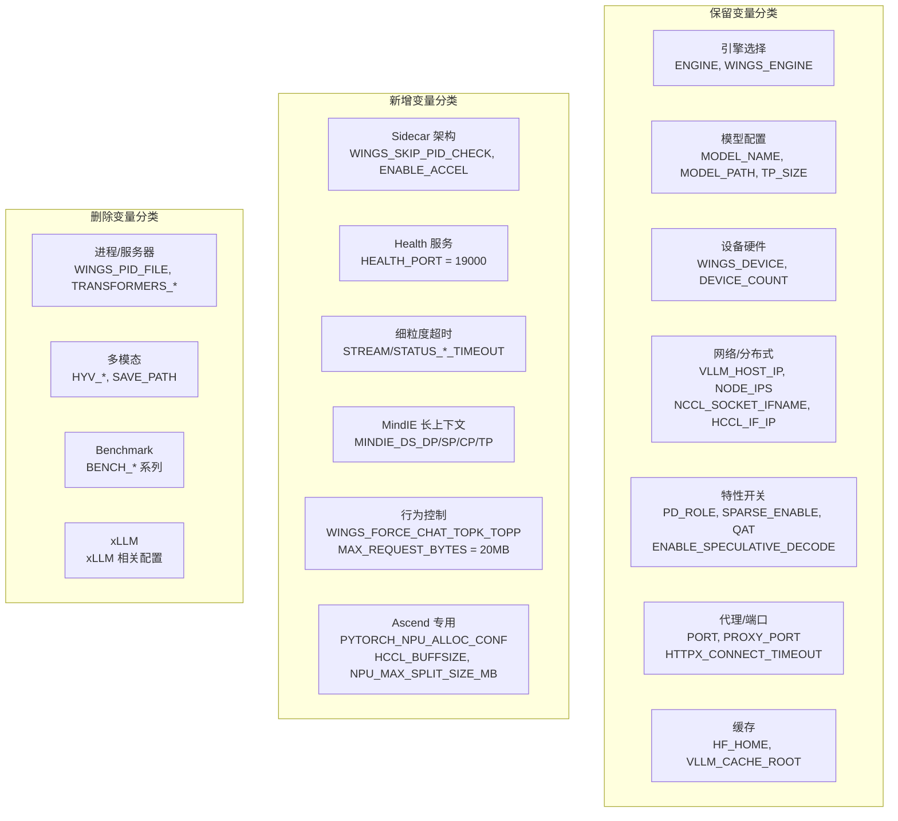
```mermaid
flowchart TD
    subgraph "保留变量分类"
        E1["引擎选择<br/>ENGINE, WINGS_ENGINE"]
        E2["模型配置<br/>MODEL_NAME, MODEL_PATH, TP_SIZE"]
        E3["设备硬件<br/>WINGS_DEVICE, DEVICE_COUNT"]
        E4["网络/分布式<br/>VLLM_HOST_IP, NODE_IPS<br/>NCCL_SOCKET_IFNAME, HCCL_IF_IP"]
        E5["特性开关<br/>PD_ROLE, SPARSE_ENABLE, QAT<br/>ENABLE_SPECULATIVE_DECODE"]
        E6["代理/端口<br/>PORT, PROXY_PORT<br/>HTTPX_CONNECT_TIMEOUT"]
        E7["缓存<br/>HF_HOME, VLLM_CACHE_ROOT"]
    end
    subgraph "新增变量分类"
        N1["Sidecar 架构<br/>WINGS_SKIP_PID_CHECK, ENABLE_ACCEL"]
        N2["Health 服务<br/>HEALTH_PORT = 19000"]
        N3["细粒度超时<br/>STREAM/STATUS_*_TIMEOUT"]
        N4["MindIE 长上下文<br/>MINDIE_DS_DP/SP/CP/TP"]
        N5["行为控制<br/>WINGS_FORCE_CHAT_TOPK_TOPP<br/>MAX_REQUEST_BYTES = 20MB"]
        N6["Ascend 专用<br/>PYTORCH_NPU_ALLOC_CONF<br/>HCCL_BUFFSIZE, NPU_MAX_SPLIT_SIZE_MB"]
    end
    subgraph "删除变量分类"
        D1["进程/服务器<br/>WINGS_PID_FILE, TRANSFORMERS_*"]
        D2["多模态<br/>HYV_*, SAVE_PATH"]
        D3["Benchmark<br/>BENCH_* 系列"]
        D4["xLLM<br/>xLLM 相关配置"]
    end
```

**保留环境变量（核心，约 80 个）**

| 类别 | 环境变量 | 用途 |
|------|----------|------|
| **引擎选择** | `ENGINE`, `WINGS_ENGINE` | 用户输入引擎 + 解析后的最终引擎 |
| **模型** | `MODEL_NAME`, `MODEL_PATH`, `MODEL_TYPE` | 模型标识 |
| **设备** | `WINGS_DEVICE`/`DEVICE`, `WINGS_DEVICE_COUNT`/`DEVICE_COUNT`, `WINGS_DEVICE_NAME` | 硬件类型/数量/型号 |
| **网络** | `VLLM_HOST_IP`, `POD_IP`, `NODE_IPS` | 节点通信 |
| **分布式** | `NCCL_SOCKET_IFNAME`, `HCCL_IF_IP`, `GLOO_SOCKET_IFNAME` | 通信接口 |
| **DP** | `VLLM_DP_RPC_PORT`, `VLLM_NIXL_SIDE_CHANNEL_PORT` | DP / NIXL 侧通道参数 |
| **Ray** | `RAY_PORT`, `RAY_HEAD_PORT` | Ray 集群 |
| **PD** | `PD_ROLE`, `PD_DECODE_XXX` | PD 分离 |
| **推测解码** | `ENABLE_SPECULATIVE_DECODE`, `SPECULATIVE_DECODE_MODEL_PATH` | 推测解码 |
| **稀疏 KV** | `SPARSE_ENABLE` | 稀疏模式 |
| **QAT** | `LMCACHE_QAT`, `LMCACHE_QAT_LOSS_LEVEL`, `LMCACHE_QAT_INSTANCE_NUM` | KVCache QAT 压缩 |
| **代理** | `PORT`, `PROXY_PORT`, `HTTPX_CONNECT_TIMEOUT` | 代理监听与连接配置 |
| **模型配置** | `TP_SIZE`, `GPU_MEMORY_UTILIZATION`, `MAX_MODEL_LEN` | 引擎参数 |
| **缓存** | `HF_HOME`, `VLLM_CACHE_ROOT` | 缓存路径 |

**V1 新增环境变量（约 55 个）**

| 类别 | 环境变量 | 默认值 | 用途 |
|------|----------|--------|------|
| **Accel** | `ENABLE_ACCEL` | `false` | Accel 补丁使能 |
| | `WINGS_ENGINE_PATCH_OPTIONS` | — | 补丁选项注入 |
| **端口** | `HEALTH_PORT`, `HEALTH_SERVICE_PORT` | `19000` | Health 服务端口 |
| | `VLLM_NIXL_SIDE_CHANNEL_PORT` | `12345` | NIXL 端口 |
| **超时** | `STREAM_BACKEND_CONNECT_TIMEOUT` | `20` | 流式后端连接超时 |
| | `STATUS_CONNECT_TIMEOUT` | `10` | 状态查询连接超时 |
| | `STATUS_READ_TIMEOUT` | `30` | 状态查询读取超时 |
| **硬件** | `GPU_USAGE_MODE` | `full` | GPU 用量模式 |
| | `NPU_MAX_SPLIT_SIZE_MB` | `256` | NPU 内存分割 |
| **MindIE** | `MINDIE_HEALTH_HOST`, `MINDIE_HEALTH_PORT` | `127.0.0.2`, `1026` | MindIE 健康探针 |
| | `MINDIE_LONG_CONTEXT_THRESHOLD`, `MINDIE_DS_DP/SP/CP/TP` | `8192`, `1/8/2/2` | US8 长上下文并行策略 |
| **行为** | `WINGS_SKIP_PID_CHECK` | `false` | 跳过 PID 检查 |
| | `WINGS_FORCE_CHAT_TOPK_TOPP` | `1` | 强制 top_k/top_p |
| | `MAX_REQUEST_BYTES` | `20MB` | 请求体上限 |
| **Ascend** | `PYTORCH_NPU_ALLOC_CONF` | `expandable_segments:True` | NPU 内存 |
| | `ASCEND_CUSTOM_OPP_PATH` | — | 自定义算子路径 |
| | `HCCL_BUFFSIZE` | `1024` | HCCL 缓冲 |
| | `RAY_EXPERIMENTAL_NOSET_ASCEND_RT_VISIBLE_DEVICES` | `1` | Ascend Ray |

**V2 独有环境变量（约 45 个，V1 中删除）**

| 类别 | 环境变量 | 原因 |
|------|----------|------|
| **进程** | `WINGS_PID_FILE` | V1 无 PID 文件 |
| **服务器** | `TRANSFORMERS_*` 系列 | 内置服务器不迁移 |
| **Benchmark** | `BENCH_*` 系列 | 测试工具不迁移 |
| **硬件** | `CUDA_VISIBLE_DEVICES` (torch 探测) | V1 用 DEVICE_COUNT |
| **分布式** | `WINGS_MASTER_*`, `WINGS_WORKER_*` | V1 重构为 ManagedProc |
| **多模态** | `HYV_*`, `SAVE_PATH` (mmgm 用途) | 多模态功能已从 V1 移除 |
| **xLLM** | xLLM 相关配置 | xLLM 适配器已从 V1 移除 |
3.2.2	类设计（可选）
不涉及
3.2.3	接口设计
不涉及（环境变量清单为静态分析产出）
3.2.4	数据结构设计（如不涉及写明不涉及即可）
不涉及

3.3	US1 统一对外引擎命令【继承】
【需求背景】
V2 通过 subprocess 直接启动引擎进程，V1 需改为脚本生成→共享卷传递模式，同时三层参数合并逻辑和引擎自动选择逻辑完全一致。
【需求价值】
参数语义零损失，仅改变启动传递方式（subprocess→bash 脚本），便于三容器解耦。
【需求详情】
1)	展示解耦前后的命令生成到启动的完整链路。
2)	三层参数合并（环境变量→JSON 默认→用户参数）完全一致。
3)	_auto_select_engine() 引擎自动选择逻辑完全一致。
4)	命令从 5 种引擎入口统一映射。
3.3.1	实现设计
**解耦前 (V2) 命令生成→启动链路**：

```
用户请求 → wings.py (入口)
         → config_loader.load_configs()
           → 环境变量 → JSON 默认 → engine_parameter_mapping → 参数合并
           → _auto_select_engine(): 设备+模型→引擎
           → _merge_*_params(): 引擎特定参数预处理
         → engine_manager.start_engine()
           → adapter = get_adapter(engine)  # OOP 基类派发
           → adapter.build_cmd(params)      # 构建命令列表
           → subprocess.Popen(cmd)          # 直接启动子进程
```

**关键代码** — V2 `engine_manager.py`:
```python
def start_engine(params):
    engine = params["engine"]
    adapter = _ADAPTERS[engine]          # 基类 EngineAdapter 的子类
    cmd = adapter.build_start_command(params)
    proc = subprocess.Popen(cmd, ...)    # 直接在本容器内启动
    return proc
```

**解耦后 (V1) 命令生成→脚本传递链路**：

```
K8s Pod 启动 → main.py (ManagedProc supervisor)
            → config_loader.load_configs()
              → 与 V2 相同的 3 层参数合并
              → _auto_select_engine(): 与 V2 一致
              → _merge_*_params(): 与 V2 一致
            → adapter.build_start_script(params)
              → 生成 bash 脚本字符串（含环境变量 + 启动命令）
              → 写入 /shared-volume/start_command.sh
            → 引擎容器检测到脚本 → bash start_command.sh
```

**关键代码** — V1 `main.py`:
```python
# 1. 配置加载
params = load_configs()  

# 2. 脚本生成
script = vllm_adapter.build_start_script(params)

# 3. 写入共享卷
with open("/shared-volume/start_command.sh", "w") as f:
    f.write(script)

# 4. 启动 proxy + health 子进程
proxy_proc = ManagedProc("proxy", ...)
health_proc = ManagedProc("health", ...)
```

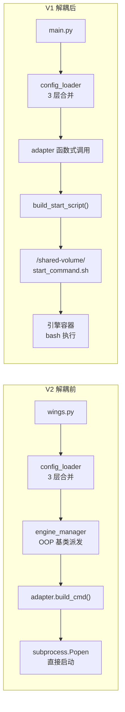
```mermaid
flowchart LR
    subgraph "V2 解耦前"
        A2["wings.py"] --> B2["config_loader<br/>3 层合并"]
        B2 --> C2["engine_manager<br/>OOP 基类派发"]
        C2 --> D2["adapter.build_cmd()"]
        D2 --> E2["subprocess.Popen<br/>直接启动"]
    end
    subgraph "V1 解耦后"
        A1["main.py"] --> B1["config_loader<br/>3 层合并"]
        B1 --> C1["adapter 函数式调用"]
        C1 --> D1["build_start_script()"]
        D1 --> E1["/shared-volume/<br/>start_command.sh"]
        E1 --> F1["引擎容器<br/>bash 执行"]
    end
```

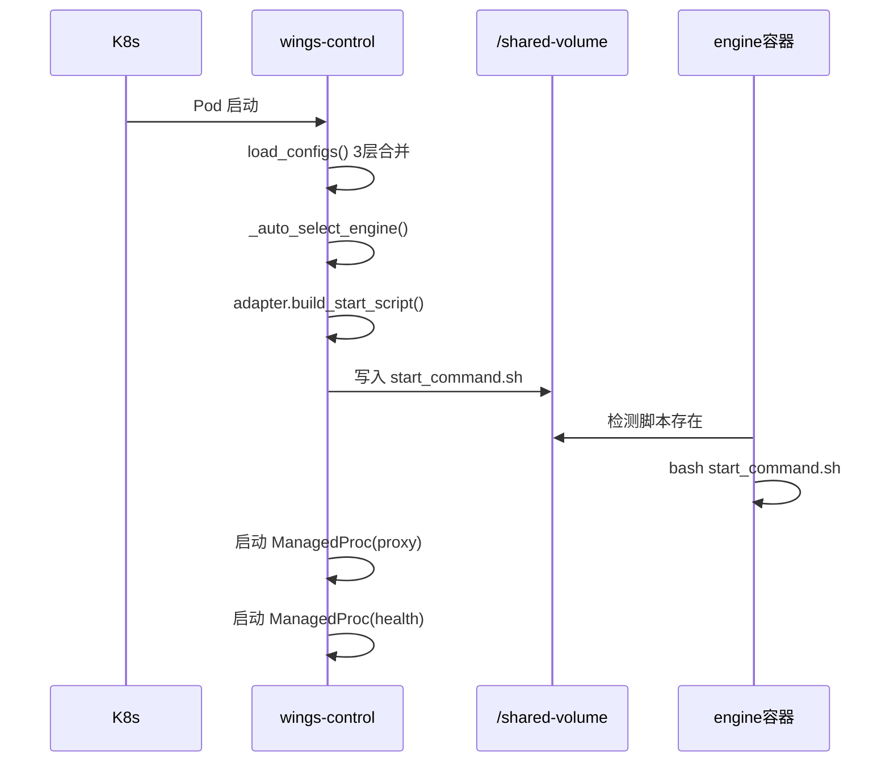
```mermaid
sequenceDiagram
    participant K as K8s
    participant C as wings-control
    participant SV as /shared-volume
    participant E as engine容器
    K->>C: Pod 启动
    C->>C: load_configs() 3层合并
    C->>C: _auto_select_engine()
    C->>C: adapter.build_start_script()
    C->>SV: 写入 start_command.sh
    E->>SV: 检测脚本存在
    E->>E: bash start_command.sh
    C->>C: 启动 ManagedProc(proxy)
    C->>C: 启动 ManagedProc(health)
```
3.3.2	类设计（可选）
V2 使用 OOP 引擎适配器模式（`EngineAdapter` 基类 + 子类），V1 改为函数式调用，不再有类继承体系。
3.3.3	接口设计
命令统一映射表：

| 引擎 | 入口命令 | 参数格式 |
|------|----------|----------|
| vllm | `python3 -m vllm.entrypoints.openai.api_server` | `--key value` |
| vllm (DP) | `vllm serve <model>` | `--key value` |
| vllm_ascend | 同 vllm（+ CANN 环境初始化） | `--key value` |
| sglang | `python3 -m sglang.launch_server` | `--key value` |
| mindie | `mindieservice_daemon` | JSON 配置文件 |
3.3.4	数据结构设计（如不涉及写明不涉及即可）
不涉及

3.4	US2 适配四个引擎【继承】
【需求背景】
四种引擎参数格式各异，需要展示 engine_config 字典如何精确转化为各引擎可识别的启动参数。
【需求价值】
V1 完全继承 V2 的参数拼接逻辑，确保引擎启动命令语义完全等价。
【需求详情】
1)	vLLM: 遍历 engine_config，按类型规则转 CLI 参数（字符串→`--key value`、布尔 True→`--key`、空字符串→跳过）。
2)	SGLang: 参数语义映射 + prefix_caching 反转逻辑。
3)	MindIE: JSON 模板 + 5 个 overrides dict merge-update。
4)	vLLM-Ascend: 与 vLLM 一致 + CANN 环境变量初始化。
3.4.1	实现设计
**vLLM 参数拼接**

核心函数: `_build_vllm_cmd_parts(params)` → 遍历 `engine_config` 字典，按规则转换为 CLI 参数

```python
engine_config = {
    "model": "/weights/Qwen2.5-72B",
    "host": "0.0.0.0",
    "port": 17000,
    "tensor_parallel_size": 4,
    "trust_remote_code": True,       # 布尔 True → --trust-remote-code
    "quantization": "",              # 空字符串 → 跳过
    "max_num_batched_tokens": 8192,
    "kv_transfer_config": '{"key": "val"}'  # JSON → 单引号包裹
}
# 输出: python3 -m vllm.entrypoints.openai.api_server \
#   --model /weights/Qwen2.5-72B --host 0.0.0.0 --port 17000 \
#   --tensor-parallel-size 4 --trust-remote-code \
#   --max-num-batched-tokens 8192 --kv-transfer-config '{"key": "val"}'
```

类型转换规则：

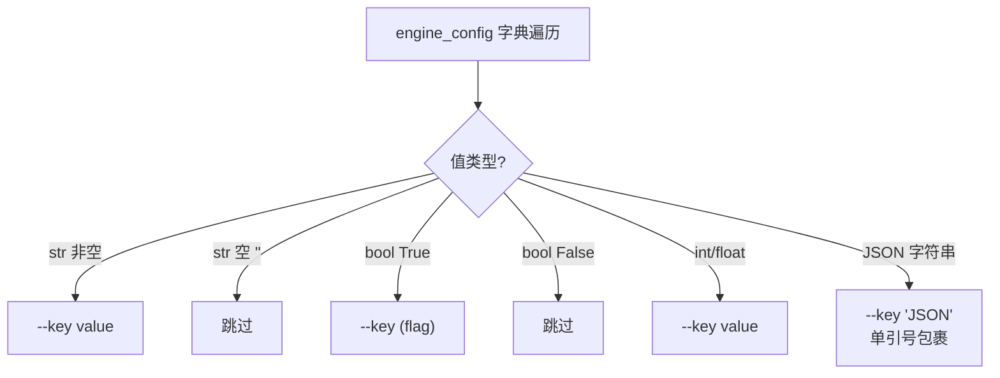
```mermaid
flowchart TD
    IN["engine_config 字典遍历"] --> T1{"值类型?"}
    T1 -->|"str 非空"| R1["--key value"]
    T1 -->|"str 空 ''"| R2["跳过"]
    T1 -->|"bool True"| R3["--key (flag)"]
    T1 -->|"bool False"| R4["跳过"]
    T1 -->|"int/float"| R5["--key value"]
    T1 -->|"JSON 字符串"| R6["--key 'JSON'<br/>单引号包裹"]
```

推测解码拼接:
```python
# 环境变量 ENABLE_SPECULATIVE_DECODE=true 时
# → _build_speculative_cmd() → --speculative-config '{...}'
# 输出: --speculative-config '{"model": "/draft", "method": "eagle3", ...}'
```

**SGLang 参数拼接**

核心函数: `_merge_sglang_params(params, ctx, engine_cmd_parameter)`

```python
# 输入参数名                → SGLang CLI 参数名
"context_length"            → "context-length"          # 使用 context_length
"enable_prefix_caching"=True → 移除 (SGLang 默认开启)
"enable_prefix_caching"=False→ --disable-radix-cache    # 语义反转!
"enable_torch_compile"=True → --enable-torch-compile
"enable_ep_moe"=True        → --ep-size <tp_size>       # EP=TP
"enable_tool_choice"=True   → (pop) + 校验 tool_call_parser 是否存在
```

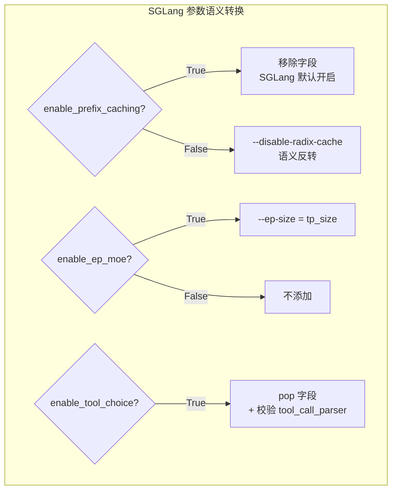
```mermaid
flowchart TD
    subgraph "SGLang 参数语义转换"
        PC{"enable_prefix_caching?"}
        PC -->|"True"| RM["移除字段<br/>SGLang 默认开启"]
        PC -->|"False"| DRC["--disable-radix-cache<br/>语义反转"]
        EP{"enable_ep_moe?"}
        EP -->|"True"| EPS["--ep-size = tp_size"]
        EP -->|"False"| NOP["不添加"]
        TC{"enable_tool_choice?"}
        TC -->|"True"| TCV["pop 字段<br/>+ 校验 tool_call_parser"]
    end
```

**MindIE 参数拼接**

特殊: MindIE 不使用 CLI 参数，而是生成 JSON 配置文件

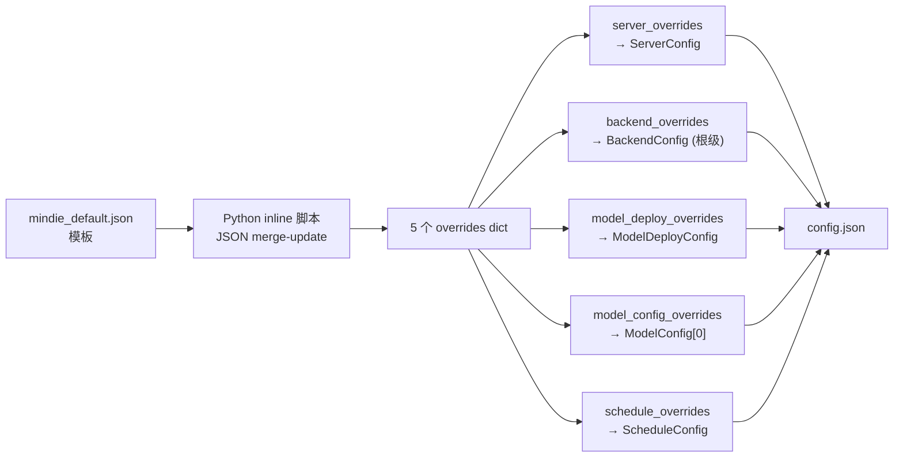
```mermaid
flowchart LR
    A["mindie_default.json<br/>模板"] --> B["Python inline 脚本<br/>JSON merge-update"]
    B --> C["5 个 overrides dict"]
    C --> C1["server_overrides<br/>→ ServerConfig"]
    C --> C2["backend_overrides<br/>→ BackendConfig (根级)"]
    C --> C3["model_deploy_overrides<br/>→ ModelDeployConfig"]
    C --> C4["model_config_overrides<br/>→ ModelConfig[0]"]
    C --> C5["schedule_overrides<br/>→ ScheduleConfig"]
    C1 --> D["config.json"]
    C2 --> D
    C3 --> D
    C4 --> D
    C5 --> D
```

```python
# V1 build_start_script():
# 1. 读取 mindie_default.json 模板
# 2. 覆写: model_path, host, port, tp_size 等
# 3. 写入 /shared-volume/mindie_config.json
# 4. 启动命令: mindieservice_daemon --config /shared-volume/mindie_config.json
```

overrides dict 结构：
```python
server_overrides        → ServerConfig                          # host, port, httpsEnabled
backend_overrides       → BackendConfig (根级)                   # interCommBackend
model_deploy_overrides  → BackendConfig.ModelDeployConfig        # maxSeqLen, npuDeviceIds
model_config_overrides  → BackendConfig.ModelDeployConfig.ModelConfig[0]  # modelName, worldSize, tp
schedule_overrides      → BackendConfig.ScheduleConfig           # maxBatchSize, maxIterTimes
```

**vLLM-Ascend 参数拼接**

与 vLLM 完全一致，额外添加 CANN 环境变量初始化：
```bash
export ASCEND_HOME_PATH=/usr/local/Ascend/ascend-toolkit/latest
source $ASCEND_HOME_PATH/bin/setenv.bash
export HCCL_IF_IP=$VLLM_HOST_IP
export HCCL_SOCKET_IFNAME=$(awk ...)
```

**四引擎参数转换总览**：

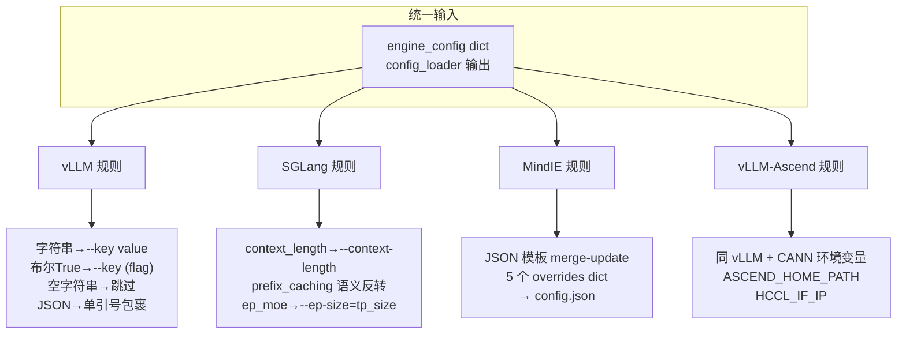
```mermaid
graph TD
    subgraph "统一输入"
        IN["engine_config dict<br/>config_loader 输出"]
    end
    IN --> VR["vLLM 规则"]
    IN --> SR["SGLang 规则"]
    IN --> MR["MindIE 规则"]
    IN --> AR["vLLM-Ascend 规则"]
    VR --> V1["字符串→--key value<br/>布尔True→--key (flag)<br/>空字符串→跳过<br/>JSON→单引号包裹"]
    SR --> S1["context_length→--context-length<br/>prefix_caching 语义反转<br/>ep_moe→--ep-size=tp_size"]
    MR --> M1["JSON 模板 merge-update<br/>5 个 overrides dict<br/>→ config.json"]
    AR --> A1["同 vLLM + CANN 环境变量<br/>ASCEND_HOME_PATH<br/>HCCL_IF_IP"]
```
3.4.2	类设计（可选）
不涉及（V1 为函数式设计，无 OOP 适配器基类）
3.4.3	接口设计
不涉及（参数拼接为内部逻辑，无对外接口）
3.4.4	数据结构设计（如不涉及写明不涉及即可）
- `engine_parameter_mapping.json`: 参数名映射表（V2 统一参数名 → 引擎特定参数名）
- `vllm_default.json` / `sglang_default.json` / `mindie_default.json`: 三引擎默认参数 JSON

3.5	US3 单机/分布式模式【继承】
【需求背景】
同一套代码需支持单机/Ray 分布式/DP 数据并行三种模式，V1 与 V2 核心逻辑完全一致，仅启动方式从 subprocess 改为脚本生成。
【需求价值】
用户只需设置 `DISTRIBUTED=true` + 节点 IP，自动完成角色判定和集群组建。
【需求详情】
1)	单机模式：TP=device_count → build_start_script → /shared-volume/。
2)	Ray 分布式：Head 启动 ray start --head，Worker 扫描 NODE_IPS 找到 Head 加入集群。
3)	DP 分布式：Rank-0/Rank-N 使用 `vllm serve` + --data-parallel-* 参数。
4)	DeepSeek V3/V32 + vllm_ascend 有 DP 特殊处理（dp_size=4, dp_size_local=2）。
3.5.1	实现设计
**分布式模式总览**：

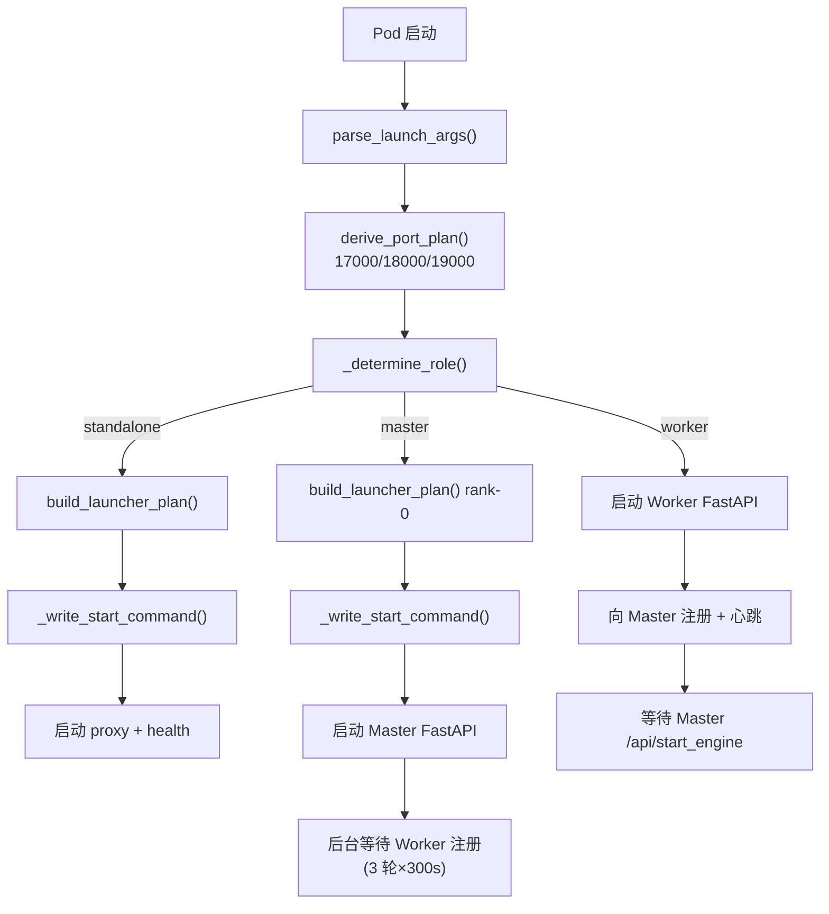
```mermaid
flowchart TD
    START["Pod 启动"] --> PARSE["parse_launch_args()"]
    PARSE --> PORT["derive_port_plan()<br/>17000/18000/19000"]
    PORT --> ROLE["_determine_role()"]
    ROLE -->|standalone| SA["build_launcher_plan()"]
    ROLE -->|master| MA["build_launcher_plan() rank-0"]
    ROLE -->|worker| WF["启动 Worker FastAPI"]
    SA --> SW["_write_start_command()"]
    MA --> MW["_write_start_command()"]
    WF --> REG["向 Master 注册 + 心跳"]
    SW --> SP["启动 proxy + health"]
    MW --> MF["启动 Master FastAPI"]
    MF --> WAIT["后台等待 Worker 注册<br/>(3 轮×300s)"]
    REG --> WRCV["等待 Master /api/start_engine"]
```

**单机模式**：
```
V2: config_loader → TP=device_count → engine_manager → subprocess.Popen
V1: config_loader → TP=device_count → adapter.build_start_script() → /shared-volume/
```

TP 设置逻辑（V1 = V2）:
```python
def _adjust_tensor_parallelism(params, device_count, tp_key, if_distributed=False):
    # 1. 300I A2 PCIe 卡: 强制 TP=4 (4 或 8 张)
    # 2. 默认 TP != device_count: warning + 强制 TP=device_count
    # 3. 其他: TP = device_count
```

**Ray 分布式 — Head 节点**：
```bash
# 1. 检测本节点 IP
export VLLM_HOST_IP=${POD_IP:-...}
# 2. 设置通信接口
export HCCL_IF_IP=$VLLM_HOST_IP
export HCCL_SOCKET_IFNAME=$(awk ...)
# 3. 启动 Ray Head
ray start --head --port=28020 --node-ip-address=$VLLM_HOST_IP --num-gpus=1
# 4. 等待所有 Worker 注册
for i in $(seq 1 60); do
  COUNT=$(python3 -c "import ray; ...")
  [ "$COUNT" -ge "2" ] && break
  sleep 5
done
# 5. 启动 vLLM
exec python3 -m vllm.entrypoints.openai.api_server ... --distributed-executor-backend ray
```

**Ray 分布式 — Worker 节点**：
```bash
# 1. 扫描 NODE_IPS 寻找 Ray Head
for ip in $(echo $NODE_IPS_LIST | tr ',' ' '); do
  if python3 -c "...connect(($ip, 28020))..."; then
    HEAD_IP=$ip; break 2
  fi
done
# 2. 加入 Ray 集群
exec ray start --address=$HEAD_IP:28020 --node-ip-address=$VLLM_HOST_IP --num-gpus=1 --block
```

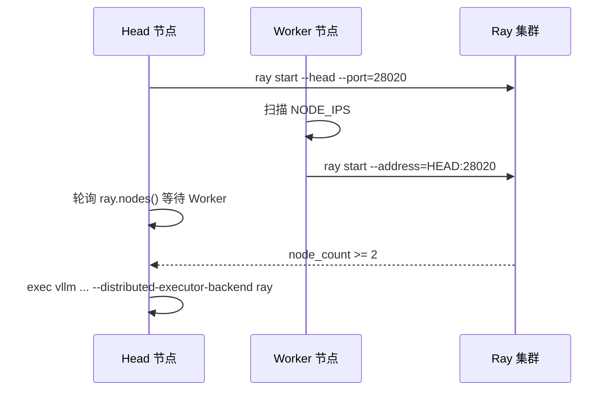
```mermaid
sequenceDiagram
    participant H as Head 节点
    participant W as Worker 节点
    participant R as Ray 集群
    H->>R: ray start --head --port=28020
    W->>W: 扫描 NODE_IPS
    W->>R: ray start --address=HEAD:28020
    H->>H: 轮询 ray.nodes() 等待 Worker
    R-->>H: node_count >= 2
    H->>H: exec vllm ... --distributed-executor-backend ray
```

**DP 分布式 (dp_deployment)**：
```bash
# 通信环境变量
export GLOO_SOCKET_IFNAME=eth0
export NCCL_SOCKET_IFNAME=eth0
export NCCL_IB_DISABLE=0
export NCCL_CUMEM_ENABLE=0

# Rank-0 (Head):
exec vllm serve /weights --data-parallel-address infer-0 \
  --data-parallel-rpc-port 13355 --data-parallel-size 2 \
  --data-parallel-size-local 1 --data-parallel-external-lb --data-parallel-rank 0

# Rank-N (Worker):
exec vllm serve /weights --data-parallel-address infer-0 \
  --data-parallel-rpc-port 13355 --data-parallel-size 2 \
  --data-parallel-size-local 1 --data-parallel-external-lb \
  --headless --data-parallel-start-rank N
```

**DeepSeek V3/V32 Ascend DP 特殊处理**：
```python
# DeepseekV3ForCausalLM / DeepseekV32ForCausalLM + vllm_ascend:
dp_size = "4"           # 固定 4 路 DP
dp_size_local = "2"     # 每节点 2 路
dp_start_rank = "2" if node_rank != 0 else "0"
```

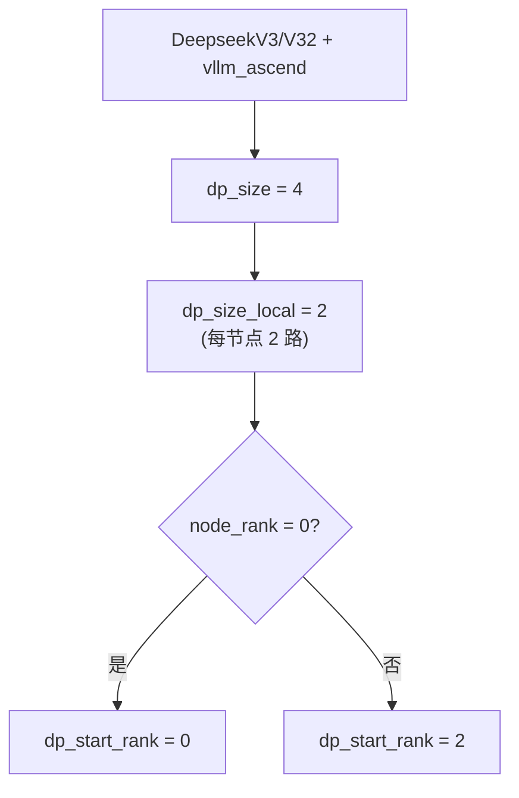
```mermaid
flowchart TD
    DS["DeepseekV3/V32 + vllm_ascend"] --> DP4["dp_size = 4"]
    DP4 --> LOCAL["dp_size_local = 2<br/>(每节点 2 路)"]
    LOCAL --> R0{"node_rank = 0?"}
    R0 -->|是| START0["dp_start_rank = 0"]
    R0 -->|否| START2["dp_start_rank = 2"]
```

**V1 vs V2 分布式差异**：

| 项 | V2 | V1 | 状态 |
|----|----|----|------|
| 进程启动 | subprocess.Popen | 脚本→共享卷 | ✅ 设计差异 |
| Ray 端口 | 28020 | 28020 | ✅ 一致 |
| DP 入口 | `vllm serve` | `vllm serve` | ✅ 一致（L3 修复后） |
| Triton NPU Patch | ✅ 有 | ✅ 有 | ✅ 一致 |
| 崩溃恢复 | ❌ 无 | ✅ 有（M5 新增） | V1 领先 |
| 环境变量注入 | 进程内 os.environ | bash export | ✅ 等价 |
3.5.2	类设计（可选）
不涉及
3.5.3	接口设计
分布式模式通过 Master/Worker HTTP API 协调：
- Worker → Master: `POST /api/register`（注册自身）
- Master → Worker: `POST /api/start_engine`（分发启动命令）
- Worker 心跳保活
3.5.4	数据结构设计（如不涉及写明不涉及即可）
不涉及

3.6	US4 统一服务化【继承+新增】
【需求背景】
Proxy 层需对外提供统一的 OpenAI 兼容 API，同时 V1 独立 Health 服务保障 K8s 探针高可用。
【需求价值】
继承全部 API 转发逻辑，新增 Health 独立服务（:19000）、细粒度超时、并发控制等 Sidecar 架构能力。
【需求详情】
1)	原有 10 个 API 路由的转发逻辑全部继承，对四引擎完全一致。
2)	Proxy 未注册路径不自动透传（无 catch-all fallback）。
3)	新增 Health 独立服务（:19000）与 Proxy（:18000）解耦。
4)	新增细粒度超时（STREAM/STATUS/CONNECT 独立配置）。
5)	新增 FORCE_TOPK_TOPP 默认启用、MAX_REQUEST_BYTES 20MB。
3.6.1	实现设计
**Proxy + Health 架构**：

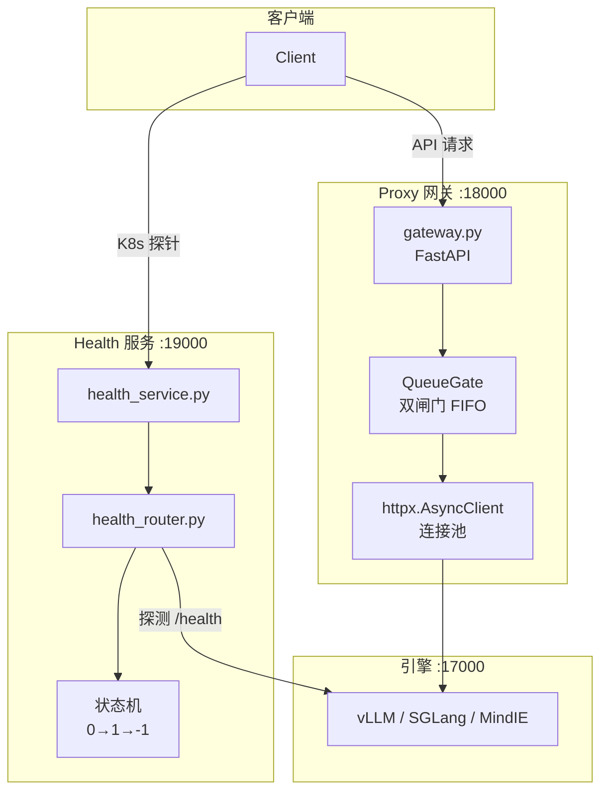
```mermaid
flowchart TD
    subgraph "客户端"
        C["Client"]
    end
    subgraph "Proxy 网关 :18000"
        GW["gateway.py<br/>FastAPI"]
        QG["QueueGate<br/>双闸门 FIFO"]
        HC["httpx.AsyncClient<br/>连接池"]
    end
    subgraph "Health 服务 :19000"
        HS["health_service.py"]
        HR["health_router.py"]
        SM["状态机<br/>0→1→-1"]
    end
    subgraph "引擎 :17000"
        ENG["vLLM / SGLang / MindIE"]
    end
    C -->|API 请求| GW
    GW --> QG
    QG --> HC
    HC --> ENG
    C -->|K8s 探针| HS
    HS --> HR
    HR -->|探测 /health| ENG
    HR --> SM
```

**请求处理流程**：

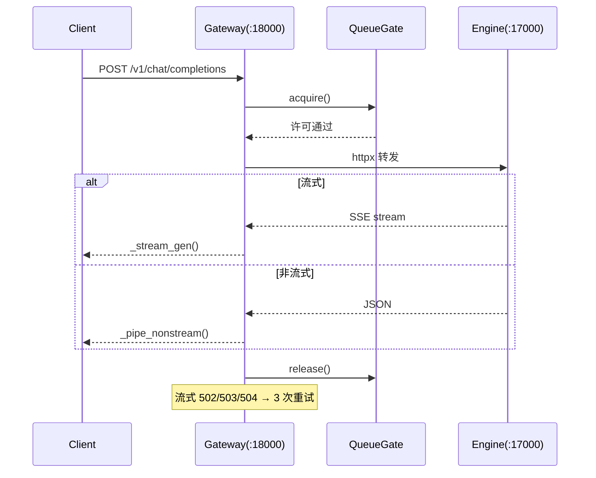
```mermaid
sequenceDiagram
    participant C as Client
    participant G as Gateway(:18000)
    participant Q as QueueGate
    participant E as Engine(:17000)
    C->>G: POST /v1/chat/completions
    G->>Q: acquire()
    Q-->>G: 许可通过
    G->>E: httpx 转发
    alt 流式
        E-->>G: SSE stream
        G-->>C: _stream_gen()
    else 非流式
        E-->>G: JSON
        G-->>C: _pipe_nonstream()
    end
    G->>Q: release()
    Note over G: 流式 502/503/504 → 3 次重试
```

**透传逻辑说明**：

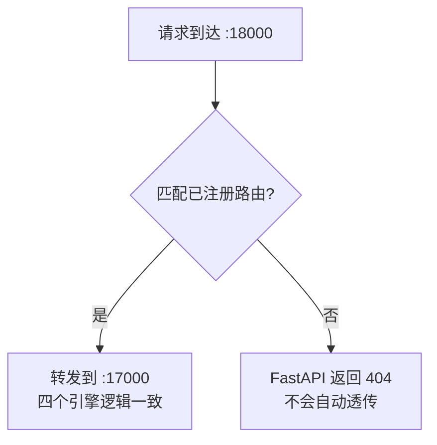
```mermaid
flowchart TD
    REQ["请求到达 :18000"] --> MATCH{"匹配已注册路由?"}
    MATCH -->|是| FWD["转发到 :17000<br/>四个引擎逻辑一致"]
    MATCH -->|否| NOT["FastAPI 返回 404<br/>不会自动透传"]
```

Proxy 网关: FastAPI + httpx.AsyncClient 转发，QueueGate 双闸门 FIFO 实现并发控制。

Health 独立服务: 端口 19000 独立 FastAPI 实例，定期探测引擎 `/health`，维护状态机（0=初始化 → 1=健康 → -1=异常）。MindIE 使用专用健康探针（`127.0.0.2:1026`）。

**V1 新增服务能力**：

| 新增功能 | 说明 |
|----------|------|
| Health 独立服务 | 端口 19000，与代理解耦 |
| MindIE 健康探针 | 专用 URL 路径探测（`127.0.0.2:1026`） |
| FORCE_TOPK_TOPP | 默认启用 top_k/top_p |
| MAX_REQUEST_BYTES | 20MB（支持多模态） |
| 细粒度超时 | STREAM/CONNECT/READ 独立配置 |
| WINGS_SKIP_PID_CHECK | 跳过 PID 文件检查 |

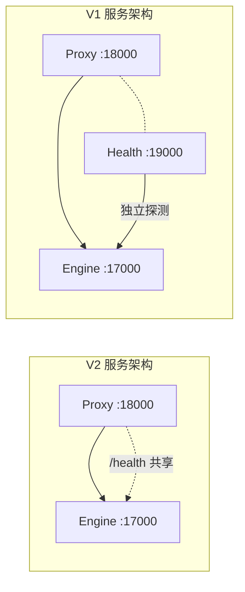
```mermaid
graph LR
    subgraph "V2 服务架构"
        P2["Proxy :18000"] --> E2["Engine :17000"]
        P2 -.->|"/health 共享"| E2
    end
    subgraph "V1 服务架构"
        P1["Proxy :18000"] --> E1["Engine :17000"]
        H1["Health :19000"] -->|"独立探测"| E1
        P1 -.- H1
    end
```
3.6.2	类设计（可选）
不涉及（FastAPI 路由函数式设计）
3.6.3	接口设计
**API 端点清单（全部继承）**：

| 路径 | 方法 | 功能 |
|------|------|------|
| `/v1/chat/completions` | POST | 对话补全 |
| `/v1/completions` | POST | 文本补全 |
| `/v1/responses` | POST | Responses API 兼容入口 |
| `/v1/rerank` | POST | 重排序 |
| `/v1/embeddings` | POST | 向量嵌入 |
| `/tokenize` | POST | 分词 |
| `/metrics` | GET | 指标透传 |
| `/health` | GET / HEAD | 健康检查 |
| `/v1/models` | GET | 模型列表 |
| `/v1/version` | GET | 版本信息 |

> 按路由定义数统计为 11 个，其中 `/health` 同时注册了 GET 和 HEAD。
> 多模态端点（video/image）已在代码清理中移除。

V1 新增: Health 独立服务端口 19000（GET /health），MindIE 健康探针（`127.0.0.2:1026`）。
3.6.4	数据结构设计（如不涉及写明不涉及即可）
不涉及

3.7	US5 Accel 使能逻辑【新增】
【需求背景】
Sidecar 架构下需要在不修改引擎镜像的前提下，通过 initContainer 动态注入加速补丁。
【需求价值】
解耦加速组件与引擎镜像，补丁可独立更新版本。
【需求详情】
1)	使能环境变量：ENABLE_ACCEL=true。
2)	initContainer `wings-accel` 拷贝 /accel/* 到 accel-volume。
3)	引擎容器执行 install.sh 安装 whl 包。
4)	控制容器通过 WINGS_ENGINE_PATCH_OPTIONS 注入引擎特定补丁选项。
3.7.1	实现设计
**三容器协作流程**：

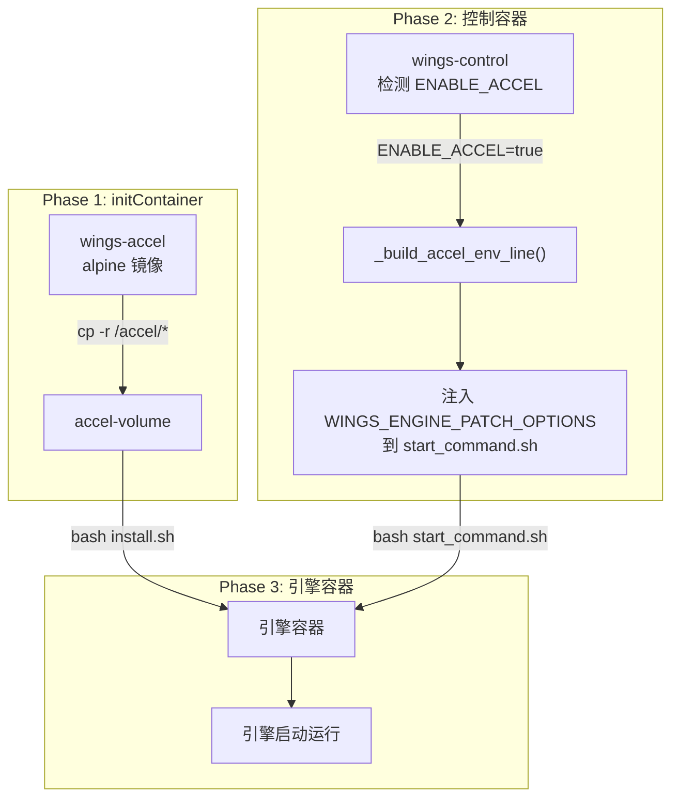
```mermaid
flowchart TB
    subgraph "Phase 1: initContainer"
        ACCEL["wings-accel<br/>alpine 镜像"]
        ACCEL -->|"cp -r /accel/*"| AV["accel-volume"]
    end
    subgraph "Phase 2: 控制容器"
        CTRL["wings-control<br/>检测 ENABLE_ACCEL"]
        CTRL -->|"ENABLE_ACCEL=true"| BUILD["_build_accel_env_line()"]
        BUILD --> INJECT["注入 WINGS_ENGINE_PATCH_OPTIONS<br/>到 start_command.sh"]
    end
    subgraph "Phase 3: 引擎容器"
        AV -->|"bash install.sh"| ENG["引擎容器"]
        INJECT -->|"bash start_command.sh"| ENG
        ENG --> RUN["引擎启动运行"]
    end
```

**Step 1: initContainer 拷贝**
```yaml
# k8s/deployment.yaml
initContainers:
  - name: wings-accel
    image: wings-accel:latest
    command: ["/bin/sh", "-c"]
    args: ["cp -r /accel/* /accel-volume/"]
    volumeMounts:
      - name: accel-volume
        mountPath: /accel-volume
```

`wings-accel` 容器包含:
- `supported_features.json`: 支持的特性声明
- `install.sh`: 安装入口
- `wings_engine_patch/install.sh`: 实际 whl 安装脚本
- `*.whl`: Python wheel 补丁包

**Step 2: 检测使能环境变量**
```python
# wings-control 容器中
ENABLE_ACCEL = os.getenv("ENABLE_ACCEL", "false").lower() == "true"
```

**Step 3: sidecar 注入补丁选项到 start_command.sh**
```python
# wings_entry.py 中的补丁注入逻辑
_ENGINE_PATCH_KEY_MAP = {
    "vllm": "vllm",
    "vllm_ascend": "vllm",
    "sglang": "sglang",
    "mindie": "mindie",
}
_DEFAULT_PATCH_FEATURES = ["test_patch"]

if settings.ENABLE_ACCEL:
    accel_preamble = _build_accel_env_line(engine)
    command = "#!/usr/bin/env bash\nset -euo pipefail\n" + accel_preamble + script_body
```

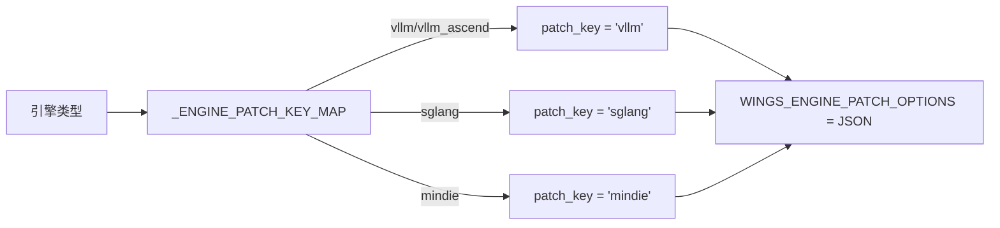
```mermaid
flowchart LR
    ENG_TYPE["引擎类型"] --> MAP["_ENGINE_PATCH_KEY_MAP"]
    MAP -->|"vllm/vllm_ascend"| PK1["patch_key = 'vllm'"]
    MAP -->|"sglang"| PK2["patch_key = 'sglang'"]
    MAP -->|"mindie"| PK3["patch_key = 'mindie'"]
    PK1 --> ENV["WINGS_ENGINE_PATCH_OPTIONS = JSON"]
    PK2 --> ENV
    PK3 --> ENV
```

**Step 4: 引擎容器执行安装脚本，再启动引擎**
```bash
cd /accel-volume && bash install.sh
cd /shared-volume && bash start_command.sh
```

> **当前实现备注**: `docs/deploy/deploy-accel.md` 和 `wings-accel/` 目录都以 `install.sh` 作为安装入口；当前 base `k8s/deployment.yaml` 示例里仍写着 `python install.py --accel`，与仓库实际文件还未完全收敛，部署前需要统一这一步。
3.7.2	类设计（可选）
不涉及
3.7.3	接口设计
不涉及（Accel 为容器间文件协作逻辑，无 API 接口）
3.7.4	数据结构设计（如不涉及写明不涉及即可）
- `supported_features.json`: 声明当前 Accel 包支持的特性列表（JSON array）
- `_ENGINE_PATCH_KEY_MAP`: Python dict，映射引擎名→补丁键名

3.8	US6 日志汇聚逻辑【重构】
【需求背景】
V2 单容器日志自然汇聚到 stdout，V1 三容器需重新设计日志格式、组件标签和噪声过滤机制。
【需求价值】
用户通过 `kubectl logs --all-containers -f` 即可统一查看所有容器日志，组件标签区分来源。
【需求详情】
1)	统一三容器日志格式：`%(asctime)s [%(levelname)s] [%(name)s] %(message)s`。
2)	组件标签：wings-launcher / wings-proxy / wings-health。
3)	噪声过滤：/health 探针、Prefill/Decode batch、pynvml 警告。
4)	kubectl logs --all-containers 查看方式。
3.8.1	实现设计
**V2 (wings) 原有日志逻辑**：

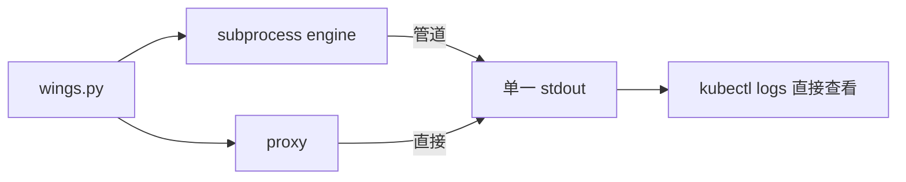
```mermaid
flowchart LR
    W["wings.py"] --> E["subprocess engine"]
    W --> P["proxy"]
    E -->|管道| OUT["单一 stdout"]
    P -->|直接| OUT
    OUT --> KL["kubectl logs 直接查看"]
```

**V1 (sidecar) 三容器日志流**：

```mermaid
flowchart TD
    subgraph "wings-control 容器"
        SH["wings_start.sh<br/>exec tee"] --> LOG["stdout + 日志文件"]
        MAIN["main.py launcher<br/>logger: wings-launcher"] --> LOG
        PROXY["ManagedProc proxy<br/>logger: wings-proxy"] --> LOG
        HEALTH["ManagedProc health<br/>logger: wings-health"] --> LOG
    end
    subgraph "engine 容器"
        CMD["bash start_command.sh"] --> ELOG["stdout/stderr"]
    end
    subgraph "wings-accel 容器"
        ECHO["echo 语句"] --> ALOG["stdout"]
    end
    LOG --> K["kubectl logs --all-containers -f"]
    ELOG --> K
    ALOG --> K
```

**统一日志格式**：
所有 Python 组件使用 `utils/log_config.py` 中定义的统一格式：
```
%(asctime)s [%(levelname)s] [%(name)s] %(message)s
```
输出示例：
```
2026-03-12 10:00:00 [INFO] [wings-launcher] 启动子进程 proxy: python -m uvicorn ...
2026-03-12 10:00:01 [INFO] [wings-proxy] Reason-Proxy is starting on 0.0.0.0:18000
2026-03-12 10:00:02 [WARNING] [wings-health] health_monitor_error: ...
```

**日志文件持久化**：
Shell 层面 `wings_start.sh` 通过 `exec > >(tee -a "$LOG_FILE") 2>&1` 将全部输出同时写入 `/var/log/wings/wings_start.log`（5 副本滚动），**但该路径未挂载持久卷，容器重启后丢失**。Python 层面**无** `RotatingFileHandler`，所有日志仅输出到 stderr。

**日志噪声过滤**：

```mermaid
flowchart LR
    RAW["原始日志"] --> NF["noise_filter.py"]
    NF -->|过滤| H["/health 探针"]
    NF -->|过滤| PD["Prefill/Decode batch"]
    NF -->|过滤| PN["pynvml 警告"]
    RAW --> SL["speaker_logging.py"]
    SL -->|过滤| MW["多 worker 重复"]
    SL -->|过滤| UA["uvicorn.access"]
    NF --> CLEAN["清洁日志"]
    SL --> CLEAN
```

| 模块 | 过滤内容 | 机制 |
|------|---------|------|
| `noise_filter.py` | `/health` 探针、`Prefill/Decode batch` 噪声、pynvml 警告 | logging.Filter + sys.stdout/stderr 包装 |
| `speaker_logging.py` | 多 worker 日志抑制、uvicorn.access、/health 出入站 | speaker 决策 + _DropByRegex Filter |

**kubectl 查看方式**：
```bash
# 查看全部容器日志（推荐）
kubectl logs <pod> --all-containers

# 实时跟踪
kubectl logs <pod> --all-containers -f

# 按容器查看
kubectl logs <pod> -c wings-control    # launcher + proxy + health
kubectl logs <pod> -c engine           # 推理引擎
kubectl logs <pod> -c wings-accel      # Accel 初始化（仅历史）
```

K8s 自动添加容器名前缀，结合统一的 `[%(name)s]` 组件标签，输出示例：
```
[wings-control] 2026-03-12 10:00:00 [INFO] [wings-launcher] start command written: /shared-volume/start_command.sh
[wings-control] 2026-03-12 10:00:01 [INFO] [wings-proxy] Reason-Proxy is starting on 0.0.0.0:18000
[engine]      INFO 03-12 10:00:02 api_server.py:xxx] vLLM engine started
[wings-control] 2026-03-12 10:00:03 [INFO] [wings-health] Health monitor loop enabled
```

**重构改动清单**：

| 文件 | 改动 |
|------|------|
| `utils/log_config.py` | **新建** — 统一格式常量 + `setup_root_logging()` |
| `main.py` | 改用 `setup_root_logging()` + `LOGGER_LAUNCHER`，移除冗余 `[launcher]` 前缀 |
| `proxy/proxy_config.py` | 改用 `setup_root_logging()` + `LOGGER_PROXY`，替换独立 `basicConfig` |
| `proxy/speaker_logging.py` | `_ensure_root_handler()` 使用统一格式 |
| `proxy/health_service.py` | 增加 `LOGGER_HEALTH` 独立 logger，替代共用 `C.logger` |
| `wings_start.sh` | 移除死代码 `LAUNCHER_LOG_FILE` / `WINGS_PROXY_LOG_FILE` |
3.8.2	类设计（可选）
不涉及
3.8.3	接口设计
不涉及（日志为基础设施层，无 API 接口）
3.8.4	数据结构设计（如不涉及写明不涉及即可）
不涉及

3.9	US7 RAG 二级推理【继承】
【需求背景】
RAG 二级推理完全在 proxy 服务层实现（HTTP 层），与引擎无关，100% 继承。
【需求价值】
零改动（唯一改动为 fastchat 懒加载），四个引擎均支持。
【需求详情】
1)	`is_rag_scenario()` 判断条件：内容 ≥ 2048 且文档块 ≥ 3。
2)	Map-Reduce 模式：分块→多次推理→合并→返回。
3)	8 个 RAG 文件与 V2 100% 一致。
4)	唯一改动：fastchat 从直接 import 改为 try/except 懒加载。
3.9.1	实现设计
**RAG 处理流程**:

```mermaid
flowchart TD
    REQ["请求进入 /v1/chat/completions"] --> DETECT{"is_rag_scenario()?<br/>内容 ≥ 2048 且 文档块 ≥ 3"}
    DETECT -->|是| MAP["Map: 文档分块 → 多次推理"]
    DETECT -->|否| FWD["普通转发 → Engine"]
    MAP --> REDUCE["Reduce: 合并结果 → combine 请求"]
    REDUCE --> STREAM["StreamCollector 流式返回"]
    FWD --> ENGINE["引擎 /v1/chat/completions"]
    STREAM --> RESP["返回客户端"]
    ENGINE --> RESP
```

**Map-Reduce 模式详解**：
1. `is_rag_scenario()`: 检测条件: `MIN_CONTENT_LENGTH=2048`, `MIN_DOC_BLOCKS=3`
2. Map 阶段: `document_processor.py` 分割长文档 → `prompt_manager.py` 构建分块 prompt → `request_handlers.py` 向引擎发送多次推理
3. Reduce 阶段: `stream_collector.py` 聚合所有分块推理结果，构建最终 combine 请求发给引擎
4. 流式返回: 最终结果通过 StreamCollector 流式返回客户端

**核心代码**:
```python
# gateway.py 中的 RAG 判断
if is_rag_scenario(request_body):
    # MIN_CONTENT_LENGTH = 2048
    # MIN_DOC_BLOCKS = 3
    # 满足条件 → 走 RAG 二级推理
    response = await rag_acc_chat(request_body, engine_url)
else:
    # 普通推理
    response = await forward_to_engine(request_body, engine_url)
```

**与引擎层的关系**:

```mermaid
flowchart LR
    RAG["RAG 模块<br/>(proxy 层)"] -->|"HTTP POST"| API["/v1/chat/completions"]
    API --> V["vLLM ✅"]
    API --> S["SGLang ✅"]
    API --> M["MindIE ✅"]
    API --> VA["vLLM-Ascend ✅"]
```

引擎无关性: RAG 模块通过 HTTP 调用引擎的 `/v1/chat/completions` API，不依赖任何引擎特定接口。四个引擎均支持。

**继承状态: 100% 继承**

| V2 文件 | V1 文件 | 状态 |
|---------|---------|------|
| `proxy/rag_acc/__init__.py` | `proxy/rag_acc/__init__.py` | ✅ 一致 |
| `proxy/rag_acc/rag_app.py` | 同 | ✅ 一致 |
| `proxy/rag_acc/document_processor.py` | 同 | ✅ 一致 |
| `proxy/rag_acc/prompt_manager.py` | 同 | ✅ 一致 |
| `proxy/rag_acc/stream_collector.py` | 同 | ✅ 一致 |
| `proxy/rag_acc/request_handlers.py` | 同 | ✅ 一致 |
| `proxy/rag_acc/non_blocking_queue.py` | 同 | ✅ 一致 |
| `proxy/rag_acc/extract_dify_info.py` | 同 | ✅ 一致 |

**V1 唯一改动**:
```python
# V2: import fastchat (直接)
# V1: try/except 懒加载 (fastchat 可选依赖)
try:
    from fastchat.conversation import get_conv_template
except ImportError:
    get_conv_template = None  # RAG 功能降级但不影响主流程
```
3.9.2	类设计（可选）
不涉及（函数式实现）
3.9.3	接口设计
复用 proxy 的 `/v1/chat/completions` 入口，内部判断 `is_rag_scenario()` 后路由到 RAG 分支，对外无额外接口。
3.9.4	数据结构设计（如不涉及写明不涉及即可）
不涉及

3.10	US8 MindIE 分布式 DeepSeek 满血模型长上下文支持【新增】
【需求背景】
MindIE 2×8 分布式场景下，DeepSeek 满血模型长上下文需要启用四维并行策略（dp/sp/cp/tp）。
【需求价值】
自动检测三条件（分布式 + DeepSeek 满血 + 长度超阈值），注入 dp/sp/cp/tp 到 MindIE config.json，用户无需手动修改配置。
【需求详情】
1)	当用户输入+输出长度超过阈值（默认 8192），自动触发长上下文策略。
2)	仅对 DeepSeek 满血模型（V3/V32 架构）+ MindIE 分布式场景生效。
3)	在 config.json 增加 dp=1, sp=8, cp=2, tp=2 字段。
4)	所有参数均可通过环境变量覆盖。
3.10.1	实现设计
**MindIE config.json 生成机制**：

V2 — 直接进程模式：
`mindie_adapter.py` 的 `_update_mindie_config()` 直接读取容器内 `/usr/local/Ascend/mindie/latest/mindie-service/conf/config.json`，原地修改后写回。

V1 — Sidecar 模式：
`mindie_adapter.py` 的 `build_start_script(params)` 生成 bash 脚本，内嵌 Python 代码通过 JSON merge-update 方式更新 config.json。更新数据分为 5 个 overrides dict：

```python
server_overrides        → ServerConfig
backend_overrides       → BackendConfig (根级)
model_deploy_overrides  → BackendConfig.ModelDeployConfig
model_config_overrides  → BackendConfig.ModelDeployConfig.ModelConfig[0]
schedule_overrides      → BackendConfig.ScheduleConfig
```

```mermaid
flowchart TD
    PARAMS["params 参数"] --> SO["server_overrides → ServerConfig"]
    PARAMS --> BO["backend_overrides → BackendConfig"]
    PARAMS --> MDO["model_deploy_overrides → ModelDeployConfig"]
    PARAMS --> MCO["model_config_overrides → ModelConfig[0]"]
    PARAMS --> SCO["schedule_overrides → ScheduleConfig"]
    SO --> CFG["config.json"]
    BO --> CFG
    MDO --> CFG
    MCO --> CFG
    SCO --> CFG
```

**触发条件**：

```mermaid
flowchart TD
    C1{"分布式模式?<br/>DISTRIBUTED=true"} -->|否| SKIP["使用默认配置"]
    C1 -->|是| C2{"DeepSeek 满血?<br/>V3/V32 架构"}
    C2 -->|否| SKIP
    C2 -->|是| C3{"总长度 > 8192?<br/>input + output"}
    C3 -->|否| SKIP
    C3 -->|是| INJECT["注入四维并行策略<br/>dp=1, sp=8, cp=2, tp=2"]
```

```python
is_long_context = (input_length + output_length) > 8192          # 阈值 8k (可配置)
is_deepseek_full = model_architecture in [
    "DeepseekV3ForCausalLM", "DeepseekV32ForCausalLM"
]
is_mindie_distributed = (engine == "mindie" and distributed == True)

should_enable = is_long_context and is_deepseek_full and is_mindie_distributed
```

**config_loader.py — 检测并注入 dp/sp/cp/tp**：

位置：`_merge_mindie_params()` 函数签名扩展为接收 `model_info` 参数

```python
# ── US8: DeepSeek 满血模型 2×8 分布式长上下文 dp/sp/cp/tp 策略 ─────────
_LONG_CTX_THRESHOLD = int(os.getenv("MINDIE_LONG_CONTEXT_THRESHOLD", "8192"))
model_architecture = getattr(model_info, "model_architecture", None) if model_info else None
total_seq_len = (engine_cmd_parameter.get("input_length") or 0) + \
                (engine_cmd_parameter.get("output_length") or 0)
if (ctx.get('distributed')
        and model_architecture in ["DeepseekV3ForCausalLM", "DeepseekV32ForCausalLM"]
        and total_seq_len > _LONG_CTX_THRESHOLD):
    params['dp'] = int(os.getenv("MINDIE_DS_DP", "1"))
    params['sp'] = int(os.getenv("MINDIE_DS_SP", "8"))
    params['cp'] = int(os.getenv("MINDIE_DS_CP", "2"))
    params['tp'] = int(os.getenv("MINDIE_DS_TP", "2"))
    logger.info(
        "[US8] DeepSeek long-context enabled (seq=%d > %d): "
        "dp=%d, sp=%d, cp=%d, tp=%d",
        total_seq_len, _LONG_CTX_THRESHOLD,
        params['dp'], params['sp'], params['cp'], params['tp'],
    )
```

**mindie_adapter.py — 透传到 ModelConfig[0]**：

```python
# US8: DeepSeek 满血模型分布式长上下文策略 (dp/sp/cp/tp)
if engine_config.get("sp") is not None:
    model_config_overrides["sp"] = engine_config["sp"]
if engine_config.get("cp") is not None:
    model_config_overrides["cp"] = engine_config["cp"]
# dp/tp: 非 MOE 模型时从 US8 注入，MOE 模型由上方逻辑处理
if engine_config.get("dp") is not None and not engine_config.get("isMOE", False):
    model_config_overrides["dp"] = engine_config["dp"]
if engine_config.get("tp") is not None and not engine_config.get("isMOE", False):
    model_config_overrides["tp"] = engine_config["tp"]
```

**配置流转图**：

```mermaid
flowchart LR
    subgraph "输入"
        IL["INPUT_LENGTH"]
        OL["OUTPUT_LENGTH"]
        MN["MODEL_NAME"]
        DI["DISTRIBUTED=true"]
    end
    subgraph "_merge_mindie_params()"
        CHECK["检测三条件<br/>分布式 + 满血 + 长度"]
        CHECK -->|满足| SET["注入 dp/sp/cp/tp"]
    end
    subgraph "mindie_adapter"
        MCO["model_config_overrides"]
    end
    subgraph "config.json"
        MC["ModelConfig[0]<br/>dp=1, sp=8, cp=2, tp=2"]
    end
    IL --> CHECK
    OL --> CHECK
    MN --> CHECK
    DI --> CHECK
    SET --> MCO
    MCO --> MC
```
3.10.2	类设计（可选）
不涉及
3.10.3	接口设计
**可配置环境变量**：

| 环境变量 | 默认值 | 说明 |
|----------|--------|------|
| `MINDIE_LONG_CONTEXT_THRESHOLD` | `8192` | 长上下文触发阈值（input+output 总长） |
| `MINDIE_DS_DP` | `1` | dp 并行度 |
| `MINDIE_DS_SP` | `8` | sp 并行度 |
| `MINDIE_DS_CP` | `2` | cp 并行度 |
| `MINDIE_DS_TP` | `2` | tp 并行度 |

不涉及 API 接口（配置注入为内部逻辑，通过 config.json 传递给 MindIE 引擎）。
3.10.4	数据结构设计（如不涉及写明不涉及即可）
最终生成的 config.json 片段：
```json
{
  "BackendConfig": {
    "ModelDeployConfig": {
      "maxSeqLen": 16384,
      "ModelConfig": [{
        "modelName": "DeepSeek-R1",
        "modelWeightPath": "/weights/DeepSeek-R1",
        "worldSize": 8,
        "dp": 1,
        "sp": 8,
        "cp": 2,
        "tp": 2,
        "trustRemoteCode": true
      }]
    }
  }
}
```
