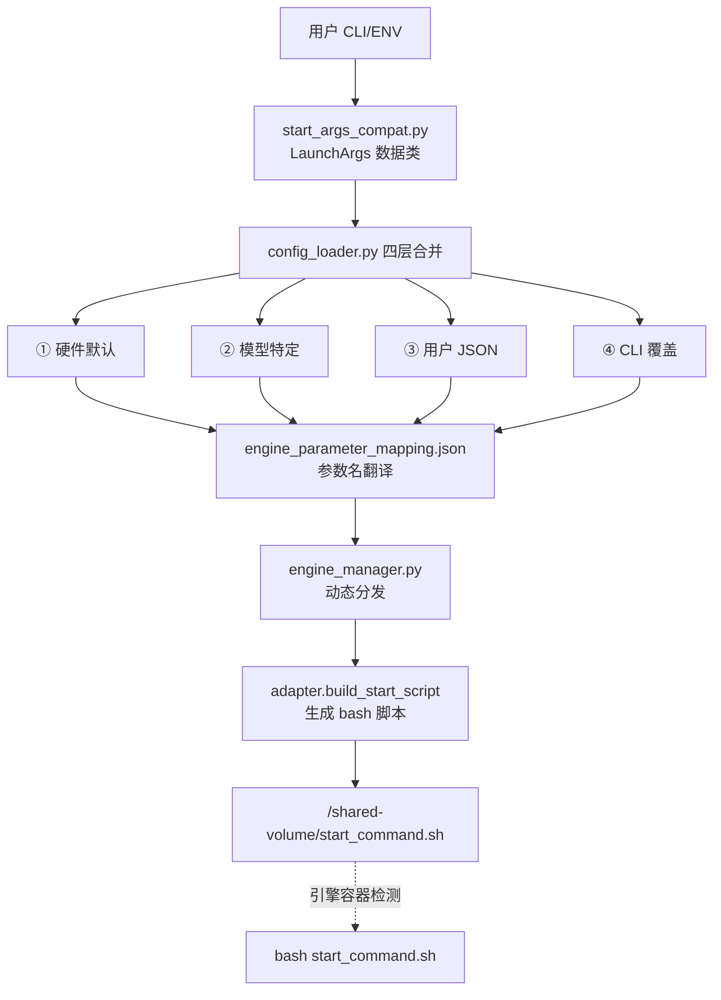

# Wings-Control Sidecar 反串讲报告

> 日期：2026-03-12
> 对照 untalking.md 中定义的 US1-US8 + 功能迁移 + 参数环境变量

---

## 0	功能迁移总览
【需求背景】
wings 单体架构将控制逻辑与引擎运行耦合在同一容器中，无法独立升级、无法适配 K8s 原生调度。需要将控制层剥离为 Sidecar，引擎运行交由独立容器。
【需求价值】
明确迁移清单，确保功能完整继承、无遗漏、无冗余。
【需求详情】
从 wings 单体 → wings-control Sidecar 控制层，核心变化：wings.py 一个文件干所有事 → main.py 只负责「生成脚本 + 托管 proxy/health」，引擎启动由脚本通过共享卷传递给引擎容器执行。

### 0.1	迁移模块对照表

| 模块 | 迁移状态 | 说明 |
|------|---------|------|
| config_loader | 继承+增强 | 新增 US8 长上下文、xllm、PCIe 卡检测 |
| engine_manager | 继承 | 新增别名映射 + importlib 动态导入 |
| hardware_detect | 简化 | 不再依赖 pynvml/torch，纯环境变量驱动 |
| engines/ (5个适配器) | 继承 | 删除基类 engine_adapter.py，各适配器独立 |
| proxy/gateway | 继承+拆分 | health 独立为单独进程(:19000) |
| rag_acc/ | 继承 | 从 proxy 子目录提升为 app 顶级模块 |
| distributed/ | 继承 | 改为脚本生成模式，不再直接管理引擎进程 |
| **servers/** | **删除** | transformers/hunyuanvideo/qwenimage server 移入引擎容器 |
| **benchmark/** | **删除** | 性能测试不属于控制层 |
| **test/** | **删除** | 单测从控制层移出 |

### 0.2	已保留功能（34 项）

| # | 功能 | V2 文件 | V1 文件 | 说明 |
|---|------|---------|---------|------|
| 1 | vLLM 引擎适配 | `engines/vllm_adapter.py` | 同 | CLI 参数构建，推测解码，PD 分离 |
| 2 | vLLM-Ascend 引擎适配 | 同上（engine=vllm_ascend） | 同 | CANN 环境变量，HCCL 配置 |
| 3 | SGLang 引擎适配 | `engines/sglang_adapter.py` | 同 | 参数语义映射 |
| 4 | MindIE 引擎适配 | `engines/mindie_adapter.py` | 同 | JSON 配置文件模式 |
| 5 | 多层配置加载 | `core/config_loader.py` | 同 | 环境变量→JSON→用户参数 3 层合并 |
| 6 | 引擎自动选择 | `_auto_select_engine()` | 同 | 设备+模型→引擎映射 |
| 7-17 | 参数合并/TP调整/推测解码/稀疏KV/QAT/PD分离/FunctionCall/Ray/DP/FP8/910B补丁 | — | — | 逻辑一致 |
| 18-23 | HTTP代理/请求队列/标签/客户端/健康检查/配置 | `proxy/` | 同 | 重命名部分文件 |
| 24 | RAG 二级推理 | `proxy/rag_acc/` | 同 | 100% 继承 |
| 25-33 | 噪声过滤/文件工具/环境工具/模型工具/设备工具/分布式配置/参数映射/默认配置/环境脚本 | — | — | 完整保留 |
| 34 | 进程管理 | `wings.py` (单体) | `main.py` (ManagedProc) | 重构为 supervisor |

### 0.3	未迁移功能（12 项，V2 独有）

| # | 功能 | 原因 |
|---|------|------|
| 1 | Transformers 内置推理 | 引擎容器内运行 |
| 2 | HunyuanVideo/QwenImage 推理 | 特定模型实现 |
| 3 | OOP 引擎适配器基类 | V1 用函数式 |
| 4 | 物理 GPU/NPU 探测 (torch/pynvml) | V1 用环境变量 |
| 5 | 单体引擎管理 (subprocess.Popen) | V1 用脚本生成 |
| 6 | Benchmark 性能测试 | 独立工具 |
| 7-12 | wings_start/stop/proxy、diffusers shim、测试等 | 单体容器专属 |

### 0.4	V1 新增功能（28 项，关键项）

| # | 功能 | 说明 |
|---|------|------|
| 1 | Sidecar 架构 | 3 容器协作 |
| 2 | 脚本生成→共享卷 | 解耦启动 |
| 3 | ManagedProc supervisor | 进程守护 + 崩溃保护 |
| 4 | Health 独立服务(:19000) | 与代理分离 |
| 5 | Accel initContainer | 补丁注入 |
| 6 | 环境变量硬件检测 | 替代 torch/pynvml |
| 7 | K8s 部署清单 (8 场景) | 完整 K8s 支持 |
| 8 | 细粒度超时配置 | STREAM/CONNECT/READ 独立 |

### 0.5	类设计（可选）
不涉及
### 0.6	接口设计
不涉及
### 0.7	数据结构设计
不涉及

---

## 1	参数/环境变量对比
【需求背景】
wings 单体通过 pynvml/torch 自动探测硬件信息，Sidecar 架构下控制容器不含 GPU 驱动，需要改为环境变量注入。同时需要梳理新增、继承、删除的环境变量清单。
【需求价值】
为部署和运维提供完整的环境变量参考，避免遗漏或冲突。
【需求详情】
环境变量分为三类——

1. **Sidecar 架构变量**（新增）
   - `SHARED_VOLUME_PATH`, `START_COMMAND_FILENAME` — 跨容器通信
   - `WINGS_SKIP_PID_CHECK` — 跳过引擎 PID 检查（引擎在别的容器）

2. **引擎/模型变量**（继承，约 80 个）
   - `ENGINE`, `MODEL_PATH`, `TP_SIZE`, `MAX_MODEL_LEN`, `DTYPE`, `QUANTIZATION`
   - 通过 `start_args_compat.py` 同时支持 CLI 参数和环境变量两种传入方式

3. **特性开关变量**（继承+新增）
   - 继承：`ENABLE_RAG_ACC`、`PD_ROLE`, `ENABLE_SPECULATIVE_DECODE`, `SPARSE_ENABLE`
   - 新增：`ENABLE_ACCEL`, `WINGS_ENGINE_PATCH_OPTIONS`, `MINDIE_LONG_CONTEXT_THRESHOLD`

### 1.1	实现设计

**V1 新增环境变量（关键项）**：

| 环境变量 | 默认值 | 用途 |
|----------|--------|------|
| `ENABLE_ACCEL` | `false` | Accel 补丁使能 |
| `WINGS_ENGINE_PATCH_OPTIONS` | — | 补丁选项 JSON |
| `HEALTH_PORT` | `19000` | Health 独立端口 |
| `WINGS_SKIP_PID_CHECK` | `false` | 跳过 PID 检查 |
| `STREAM_BACKEND_CONNECT_TIMEOUT` | `20` | 流式连接超时 |
| `MINDIE_LONG_CONTEXT_THRESHOLD` | `8192` | US8 长上下文阈值 |
| `MINDIE_DS_DP/SP/CP/TP` | `1/8/2/2` | US8 并行策略 |

**V2 独有环境变量（已删除，约 45 个）**：
`WINGS_PID_FILE`、`TRANSFORMERS_*` 系列、`BENCH_*` 系列、`HYV_*`、xLLM 相关 — 因功能未迁移而删除。

**关键区别**：老 wings 通过硬件探测（pynvml）自动获取设备信息 → 新 wings-control 通过 `WINGS_DEVICE`/`DEVICE`、`WINGS_DEVICE_COUNT`/`DEVICE_COUNT`、`WINGS_DEVICE_NAME` 环境变量注入，适配 K8s 资源声明模式。

### 1.2	类设计（可选）
不涉及
### 1.3	接口设计
不涉及
### 1.4	数据结构设计
不涉及

---

## 3.1	统一对外引擎命令【继承】
【需求背景】
用户面对 vLLM/SGLang/MindIE/vLLM-Ascend 四个引擎时，每个引擎的启动参数名称和格式各不相同，增加使用门槛。
【需求价值】
提供统一的参数入口，用户只需一套参数即可驱动任意引擎。
【需求详情】
展示解耦前后的命令生成到启动的逻辑，对比老 wings 单体模式与新 Sidecar 模式的完整链路。

### 3.1.1	实现设计

> 新增部分：共享卷逻辑，同时指出

#### MaaS 层面
1. 上层需要 `--engine` 参数强制传入
2. 上层分配资源 `/shared-volume` 目录，需要提前分配

#### wings-control 层面

**解耦前**（老 wings）：wings.py 单文件 → 直接 subprocess 拉引擎 → 参数硬编码在各引擎 adapter 中。

```python
# V2 engine_manager.py — 直接进程启动
def start_engine(params):
    engine = params["engine"]
    adapter = _ADAPTERS[engine]          # 基类 EngineAdapter 的子类
    cmd = adapter.build_start_command(params)
    proc = subprocess.Popen(cmd, ...)    # 直接在本容器内启动
    return proc
```

**解耦后**（wings-control）：



```python
# V1 main.py — 脚本生成 + 共享卷传递
# 1. 配置加载
params = load_configs()

# 2. 脚本生成
script = vllm_adapter.build_start_script(params)

# 3. 写入共享卷
with open("/shared-volume/start_command.sh", "w") as f:
    f.write(script)

# 4. 启动 proxy + health 子进程
proxy_proc = ManagedProc("proxy", ...)
health_proc = ManagedProc("health", ...)
```

**命令统一映射表**：

| 引擎 | 入口命令 | 参数格式 |
|------|----------|----------|
| vllm | `python3 -m vllm.entrypoints.openai.api_server` | `--key value` |
| vllm (DP) | `vllm serve <model>` | `--key value` |
| vllm_ascend | 同 vllm（+ CANN 环境初始化） | `--key value` |
| sglang | `python3 -m sglang.launch_server` | `--key value` |
| mindie | `mindieservice_daemon` | JSON 配置文件 |

**反串讲关键点**：
- `engine_parameter_mapping.json` 是翻译字典，空字符串值表示"该引擎不支持此参数，跳过"
- 引擎自动选择：`vllm` 在昇腾硬件上自动升级为 `vllm_ascend`
- V1 使用 `shlex.quote()` 防止 Shell 注入（H1 安全修复）

### 3.1.2	类设计（可选）
不涉及
### 3.1.3	接口设计
不涉及
### 3.1.4	数据结构设计
不涉及

---

## 3.2	适配四个引擎，包括命令生成和特性拼接【继承】
【需求背景】
需要同时支持 vLLM、SGLang、MindIE、vLLM-Ascend（实际还有 xllm、wings 共 6 个），每个引擎的启动方式差异大。
【需求价值】
统一适配器接口，新引擎只需实现一个 `build_start_script()` 方法。
【需求详情】
列举特定场景中，参数拼接的逻辑。包括各引擎的参数映射规则、布尔值处理、语义反转等。

### 3.2.1	实现设计

**适配器统一契约**：每个 adapter 实现 `build_start_script(params) → str`，返回 bash 脚本体。

**参数拼接逻辑对比**：

| 场景 | vLLM | SGLang | MindIE |
|------|------|--------|--------|
| GPU 显存占比 | `--gpu-memory-utilization 0.9` | `--mem-fraction-static 0.9` | config.json: `npu_memory_fraction: 0.9` |
| 前缀缓存 | `--enable-prefix-caching` | 默认开启，`False`→`--disable-radix-cache` | 不支持(跳过) |
| 量化 | `--quantization awq` | `--quantization awq` | config.json: `quantization: awq` |
| 分布式 | Ray / DP CLI 参数 | CLI 参数 | JSON 配置 |

**vLLM 参数拼接示例**：

```python
engine_config = {
    "model": "/weights/Qwen2.5-72B",
    "tensor_parallel_size": 4,
    "trust_remote_code": True,       # 布尔 True → --trust-remote-code
    "quantization": "",              # 空字符串 → 跳过
    "kv_transfer_config": '{"k":"v"}'  # JSON → 单引号包裹
}
# 输出: python3 -m vllm... --model /weights/Qwen2.5-72B \
#   --tensor-parallel-size 4 --trust-remote-code \
#   --kv-transfer-config '{"k":"v"}'
```

**SGLang 参数语义映射**：

```python
"context_length"             → "context-length"        # 使用 context_length
"enable_prefix_caching"=True → 移除 (默认开启)
"enable_prefix_caching"=False→ --disable-radix-cache   # 语义反转
"enable_ep_moe"=True         → --ep-size <tp_size>     # EP=TP
```

**MindIE 特殊处理**：不用 CLI 参数，adapter 生成 inline Python 脚本来 merge-update config.json。

**引擎别名机制**：`vllm_ascend` 不是独立 adapter 文件，复用 `vllm_adapter.py`，内部通过设备判断切换 HCCL/NCCL、昇腾 toolkit sourcing。

### 3.2.2	类设计（可选）
不涉及
### 3.2.3	接口设计
不涉及
### 3.2.4	数据结构设计
不涉及

---

## 3.3	单机/分布式【继承】
【需求背景】
同一套代码需要同时支持单机单卡、单机多卡、多机多卡场景，且两种模式的用户接口应保持一致。
【需求价值】
用户只需设置 `DISTRIBUTED=true` + 节点 IP，其余逻辑自动处理。
【需求详情】
讲解单机和分布式的实现逻辑，两者保持一致。

### 3.3.1	实现设计

**角色判定逻辑**（`main.py._determine_role()`）：
```
DISTRIBUTED=false                      → standalone
DISTRIBUTED=true + 本机IP==MASTER_IP   → master
DISTRIBUTED=true + 本机IP!=MASTER_IP   → worker
```

**单机模式**：
```
config_loader → TP=device_count → adapter.build_start_script()
  → 写 /shared-volume/start_command.sh → 启动 proxy + health → 完成
```

**分布式模式 — Master 流程**：
1. 生成 rank-0 脚本 → 写共享卷
2. 启动 Master FastAPI（注册/调度服务）
3. 启动 proxy(:18000) + health(:19000)
4. 后台线程等待所有 worker 注册（`/api/nodes/register`）
5. 向每个 worker 分发带 `nnodes/node_rank/head_node_addr` 的启动命令

**分布式模式 — Worker 流程**：
1. 启动 Worker FastAPI
2. 自动向 Master 注册 + 心跳
3. 收到启动命令 → `build_launcher_plan()` → 写本地共享卷
4. 引擎容器检测到脚本 → 执行

**Ray 分布式 — Head 节点**：
```bash
ray start --head --port=28020 --node-ip-address=$VLLM_HOST_IP --num-gpus=1
# 等待 Worker 注册
for i in $(seq 1 60); do
  COUNT=$(python3 -c "import ray; ...")
  [ "$COUNT" -ge "2" ] && break; sleep 5
done
exec python3 -m vllm... --distributed-executor-backend ray
```

**Ray 分布式 — Worker 节点**：
```bash
# 扫描 NODE_IPS 寻找 Ray Head
exec ray start --address=$HEAD_IP:28020 --node-ip-address=$VLLM_HOST_IP --num-gpus=1 --block
```

**DP 分布式**：
```bash
# Rank-0 (Head):
exec vllm serve /weights --data-parallel-address infer-0 \
  --data-parallel-rpc-port 13355 --data-parallel-size 2 --data-parallel-rank 0
# Rank-N (Worker):
exec vllm serve /weights --data-parallel-address infer-0 \
  --headless --data-parallel-start-rank N
```

**一致性保证**：两者都走 `build_launcher_plan()` → 写 `start_command.sh` 的统一流程，区别仅在于 master 多了注册/分发协调层。

**反串讲关键点**：
- `NODE_IPS` 支持 DNS 名（K8s StatefulSet），内部做 DNS→IP 解析
- Worker 健康端口偏移 +1（19001），避免 hostNetwork 端口冲突

### 3.3.2	类设计（可选）
不涉及
### 3.3.3	接口设计
不涉及
### 3.3.4	数据结构设计
不涉及

---

## 3.4	统一服务化【继承+新增】
【需求背景】
需要对外暴露统一的 OpenAI 兼容 API，屏蔽后端引擎差异；同时需要明确 proxy 中未注册的接口是否会自动透传到引擎端。
【需求价值】
用户对接单一端口(:18000)，无需关心后端是哪个引擎。
【需求详情】
原有转发继承；如果在 proxy 中没有发现对应的 api，直接透传引擎端，是否需要校验，四个引擎的逻辑是否不同。

### 3.4.1	实现设计

**Proxy 架构**：
```
用户 → :18000 proxy(FastAPI) → :17000 引擎后端
                ↑
         :19000 health(独立进程)
```

**API 端点清单（14 个对外路径，全部继承）**：

| 路径 | 方法 | 功能 |
|------|------|------|
| `/v1/chat/completions` | POST | 对话补全 |
| `/v1/completions` | POST | 文本补全 |
| `/v1/responses` | POST | Responses API 兼容 |
| `/v1/rerank` | POST | 重排序 |
| `/v1/embeddings` | POST | 向量嵌入 |
| `/tokenize` | POST | 分词 |
| `/metrics` | GET | 指标透传 |
| `/health` | GET/HEAD | 健康检查 |
| `/v1/models` | GET | 模型列表 |
| `/v1/version` | GET | 版本信息 |

**透传策略**：
- 已注册路由 → proxy 处理（添加观测 header、队列控制、重试）
- 未注册路由 → **不会自动透传**，当前实现没有 catch-all fallback，直接由 FastAPI 返回 404

**四个引擎的已注册接口转发逻辑是否不同**：
已注册接口的转发逻辑**完全相同**，proxy 不区分引擎类型。Chat/Completion/Responses 走 `_forward_stream()` / `_forward_nonstream()`，差异不在 proxy，而在后端 engine 是否实现这些路径。

**新增部分**：

| 功能 | 说明 |
|------|------|
| Health 独立服务 | 端口 19000，与代理解耦，K8s 探针不受 proxy 负载影响 |
| MindIE 健康探针 | 专用 URL 路径探测 |
| FORCE_TOPK_TOPP | 默认启用 top_k/top_p |
| MAX_REQUEST_BYTES | 20MB 请求体上限 |
| 细粒度超时 | STREAM/CONNECT/READ 独立配置 |

### 3.4.2	类设计（可选）
不涉及
### 3.4.3	接口设计
同上 API 端点清单。
### 3.4.4	数据结构设计
不涉及

---

## 3.5	Accel 使能逻辑【新增】
【需求背景】
需要在不修改引擎镜像的前提下，动态注入加速补丁（如算子优化 whl 包）。
【需求价值】
解耦加速组件与引擎镜像，补丁可独立更新。
【需求详情】
使能的环境变量 → 补丁的 cp → 补丁安装 → 补丁执行，四个步骤完整流程。

### 3.5.1	实现设计

**三容器协作流程**：
```
┌─────────────────┐    ┌─────────────────┐    ┌─────────────────┐
│  wings-accel    │    │  wings-control   │    │  engine         │
│  (initContainer)│    │  (sidecar)       │    │  (推理容器)      │
│                 │    │                  │    │                 │
│  1. 拷贝 /accel │───►│  2. 检测 ENABLE  │    │                 │
│     到 accel-   │    │     _ACCEL       │    │  4. 执行安装    │
│     volume      │    │  3. 注入 PATCH   │───►│     install.sh  │
│                 │    │     OPTIONS      │    │     + 启动脚本  │
└─────────────────┘    └─────────────────┘    └─────────────────┘
        │                      │                      │
        └──────── accel-volume ─────────── shared-volume ──┘
```

**四个步骤**：

| 步骤 | 执行者 | 动作 |
|------|--------|------|
| ①使能环境变量 | 用户 | `ENABLE_ACCEL=true` |
| ②补丁文件拷贝 | initContainer (accel-init) | `cp -r /accel/* /accel-volume/` |
| ③补丁安装 | 引擎容器启动脚本 | `cd /accel-volume && bash install.sh` |
| ④补丁执行 | wings_entry.py | 注入 `export WINGS_ENGINE_PATCH_OPTIONS='{...}'` 到 start_command.sh |

**引擎到补丁键的映射**：
```python
_ENGINE_PATCH_KEY_MAP = {
    "vllm": "vllm",
    "vllm_ascend": "vllm",
    "sglang": "sglang",
    "mindie": "mindie",
}
```

**用户可覆盖**：通过 `WINGS_ENGINE_PATCH_OPTIONS` 环境变量（JSON 格式）自定义补丁列表。

### 3.5.2	类设计（可选）
不涉及
### 3.5.3	接口设计
不涉及
### 3.5.4	数据结构设计
不涉及

---

## 3.6	日志汇聚逻辑【重构】
【需求背景】
Sidecar 架构下有三个容器（initContainer + 控制容器 + 引擎容器），日志分散在各自 stdout，用户需要 `kubectl logs` 统一查看。
【需求价值】
用户可以通过 kubectl logs -f 统一查看到所有容器的日志，无需逐一查看。
【需求详情】
重述原有 wings 的日志逻辑；除了原本的 wings.proxy 之外，都需要重构，基本逻辑就是三个 container 的日志都汇聚在一起。

### 3.6.1	实现设计

**老 wings 逻辑**：
单进程模型，wings.py 直接 subprocess 启动引擎，引擎日志通过 stdout 管道自然汇聚到 wings 进程输出中。

**重构后逻辑**：
**不做跨容器日志搬运**，依赖 K8s 原生容器日志机制：
```bash
kubectl logs <pod> -c wings-control    # 控制层（launcher + proxy + health）
kubectl logs <pod> -c vllm-engine      # 引擎日志
kubectl logs <pod> --all-containers    # 全部（推荐）
```

**三容器日志流**：
```
wings-control 容器:
├── wings_start.sh      → exec tee → stdout + /var/log/wings/wings_start.log
├── main.py (launcher)  → logger: wings-launcher
├── ManagedProc(proxy)  → logger: wings-proxy
└── ManagedProc(health) → logger: wings-health

engine 容器:
└── bash start_command.sh → stdout/stderr → kubectl logs -c engine

wings-accel (initContainer):
└── echo 语句 → stdout → kubectl logs -c wings-accel（仅历史）
```

**日志噪声控制**：

| 模块 | 过滤内容 | 机制 |
|------|---------|------|
| `noise_filter.py` | `/health` 探针、batch 噪声、pynvml 警告 | logging.Filter + stdout/stderr 包装 |
| `speaker_logging.py` | 多 worker 日志抑制 | speaker 决策 + PID-hash 选择，可通过 `NOISE_FILTER_DISABLE=1` 关闭 |

### 3.6.2	类设计（可选）
不涉及
### 3.6.3	接口设计
不涉及
### 3.6.4	数据结构设计
不涉及

---

## 3.7	RAG 二级推理【继承】
【需求背景】
RAG 场景下长文档推理需要 Map-Reduce 分块并行策略，提升长上下文处理效率。
【需求价值】
直接复用，无需改动，因为 RAG 在服务层（proxy），与引擎层无关。
【需求详情】
由于在服务层，直接复用，跟引擎层无关。8 个文件 100% 继承。

### 3.7.1	实现设计

**继承状态**：8 个文件完全一致——`rag_app.py`, `document_processor.py`, `prompt_manager.py`, `stream_collector.py`, `request_handlers.py`, `non_blocking_queue.py`, `extract_dify_info.py`, `__init__.py`

**触发条件**（`ENABLE_RAG_ACC=true`，proxy 内表现为 `RAG_ACC_ENABLED=true`）：
1. 请求包含 `<|doc_start|>` / `<|doc_end|>` 标签
2. 文本长度 ≥ 2048 字符
3. 文档块数量 ≥ 3

**处理流程**：
```
请求 → 检测 RAG 模式
  ├─ 非 RAG → 正常透传到引擎
  └─ RAG →
       ├─ Map: 文档分块 → 并行发送到引擎推理
       ├─ Reduce: 合并各块结果 → 发送 combine 请求
       └─ Stream: 通过 StreamCollector 流式返回
```

**跳过机制**：请求体包含 `/no_rag_acc` 即可强制跳过。

**引擎无关性**：RAG 模块通过 HTTP 调用 `/v1/chat/completions` API，不依赖任何引擎特定接口。四个引擎均支持。

**V1 唯一改动**：fastchat 改为 try/except 懒加载（可选依赖）。

### 3.7.2	类设计（可选）
不涉及
### 3.7.3	接口设计
不涉及
### 3.7.4	数据结构设计
不涉及

---

## 3.8	MindIE 分布式场景下 DeepSeek 满血模型长上下文支持【新增】
【需求背景】
DeepSeek 满血模型在 MindIE 分布式场景下，当用户输入输出长度超过阈值（8k），需要在 config.json 增加 co 和 sp 字段来实现长上下文支持。
【需求价值】
自动检测并注入长上下文配置，用户无需手动修改 MindIE config.json。
【需求详情】
当用户输入输出长度和超过阈值(8k)，在 config.json 增加 dp/sp/cp/tp 字段，来实现 2×8 分布式场景下的长上下文支持。

### 3.8.1	实现设计

**触发条件（三个同时满足）**：
1. `DISTRIBUTED=true`（分布式模式）
2. 模型架构 = `DeepseekV3ForCausalLM` 或 `DeepseekV32ForCausalLM`
3. `input_length + output_length` > `MINDIE_LONG_CONTEXT_THRESHOLD`（默认 8192）

**注入参数（四维并行策略）**：

| 参数 | 环境变量 | 默认值 | 含义 |
|------|---------|--------|------|
| dp | `MINDIE_DS_DP` | 1 | 数据并行 |
| sp | `MINDIE_DS_SP` | 8 | 序列并行 |
| cp | `MINDIE_DS_CP` | 2 | 上下文并行 |
| tp | `MINDIE_DS_TP` | 2 | 张量并行 |

**配置流转**：
```
用户输入                      config_loader                     adapter                    MindIE config.json
──────────                    ─────────────                     ───────                    ──────────────────
INPUT_LENGTH  ─┐
OUTPUT_LENGTH  ─┤─ _merge_mindie_params() ─► params['dp']=1 ─► model_config_overrides ─► ModelConfig[0].dp=1
MODEL_NAME     ─┤       ↓                    params['sp']=8 ─► model_config_overrides ─► ModelConfig[0].sp=8
DISTRIBUTED    ─┘   检测条件:                 params['cp']=2 ─► model_config_overrides ─► ModelConfig[0].cp=2
                    total > 8192              params['tp']=2 ─► model_config_overrides ─► ModelConfig[0].tp=2
                    && DeepSeek 架构
                    && distributed
```

**注入方式**：通过 `_merge_mindie_params()` 在 `config_loader.py` 中将参数写入，再由 `mindie_adapter.py` 的 inline-Python merge 机制写入 MindIE config.json。`multiNodesInferEnabled` 对单个 daemon 设为 `false`，跨节点协调由上层 `ms_coordinator/ms_controller` 处理。

### 3.8.2	类设计（可选）
不涉及
### 3.8.3	接口设计
不涉及
### 3.8.4	数据结构设计
不涉及
