# Wings-Control Sidecar 反串讲资料（优化版）

> 文档范式参考：需求背景 → 实现设计 → 接口设计 → 数据结构设计
> 对应 untalking.md 中 US1-US8 + 功能迁移 + 参数环境变量
> 生成时间：2026-03-12 19:36 | 基于 untalking-analysis.md + untalking.md 内容汇编
> 优化说明：第 0、1 章节聚焦“继承 / 未继承（不再迁移）”，新增项只在必要处带过，不单独展开。

---

## 0. 功能迁移总览

### 反串讲要点

**这一章重点回答两个问题**：

1. 老 wings 的哪些核心控制能力，在 wings-control Sidecar 中被继承下来了。
2. 哪些能力没有继承，或者明确不再放在控制层里。

**结论先行**：V1 继承的是控制面的主干能力，包括配置加载、引擎选择与适配、代理转发、RAG、单机/分布式协同；没有继承的是多模态能力、内置 server、benchmark/test 以及部分只服务于单体架构的实现。

### 继承下来的主干能力

| 模块/能力 | 结论 | 说明 |
|------|------|------|
| `config_loader` | 继承 | 配置合并主链保留，仍然是启动配置的核心入口 |
| `engine_manager` | 继承 | 引擎分发逻辑保留，继续承担 adapter 选择职责 |
| `hardware_detect` | 继承但简化 | 设备信息仍然需要，只是获取方式从运行时探测改成环境变量注入 |
| `engines/vllm_adapter.py` | 继承 | vLLM 适配能力保留，仍是核心引擎入口之一 |
| `engines/sglang_adapter.py` | 继承 | SGLang 参数映射与脚本拼接能力保留 |
| `engines/mindie_adapter.py` | 继承 | MindIE 的 JSON 配置生成与下发能力保留 |
| `vllm_ascend` | 继承 | 继续复用 `vllm_adapter`，不是单独新增一套适配器 |
| `proxy/gateway` | 继承 | 对外统一代理能力保留，只是 health 从网关里拆出 |
| `rag_acc/` | 完整继承 | 与引擎层天然解耦，基本可以直接复用 |
| `distributed/` | 继承 | 单机 / 分布式协同能力保留，只是启动方式改成脚本分发 |

### 没有继承 / 不再迁移到控制层的能力

| 模块/能力 | 结论 | 原因 |
|------|------|------|
| `servers/` | 不继承 | 内置推理 server 迁到引擎容器，已经不属于控制层职责 |
| `engines/wings_adapter.py` | 不继承 | 多模态引擎不在本期 sidecar 范围内 |
| `engines/xllm_adapter.py` | 不继承 | xLLM 不纳入本次解耦范围 |
| `utils/mmgm_utils.py` | 不继承 | 服务于多模态路径探测，随着多模态退出控制层而退出 |
| `gateway.py` 中 `video/image` 路由 | 不继承 | 文生图 / 文生视频接口不保留在当前控制层 |
| `model_utils.py` 中 `_MMUM_MODELS` | 不继承 | 多模态模型分类逻辑不再需要 |
| `*_default.json` 中 `mmum` 节 | 不继承 | 多模态默认配置不再随控制层迁移 |
| `benchmark/` | 不继承 | 性能测试不是 sidecar 控制面的职责 |
| `test/` | 不继承 | 单测目录不作为控制层交付内容保留 |

### 继承边界的核心变化

**要强调的是：继承的是能力，不是原来的进程形态。**

老 wings 里，`wings.py` 一个进程负责“加载配置 + 拉起引擎 + 托管代理”；到 sidecar 之后，这些控制职责仍然存在，但引擎不再由当前容器直接 `subprocess.Popen()` 拉起，而是生成 `start_command.sh`，通过共享卷交给引擎容器执行。

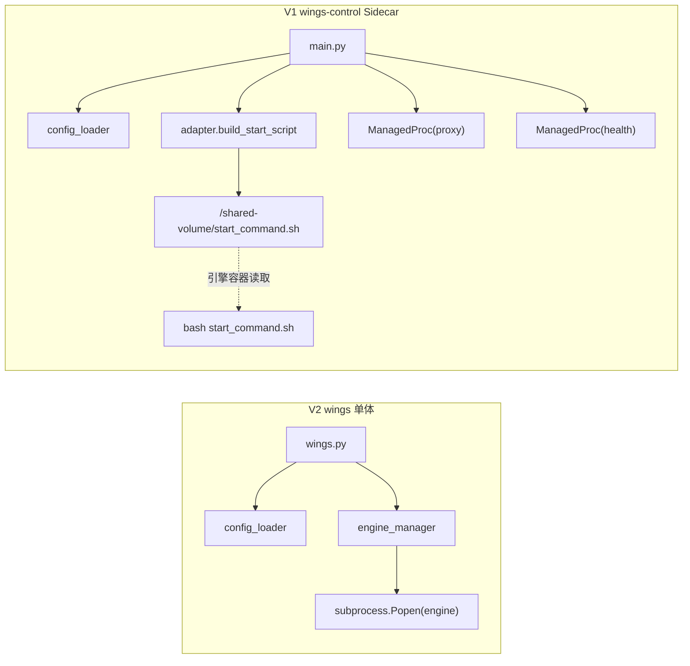

---

## 1. 参数/环境变量对比

### 反串讲要点

**这一章只看两件事**：

1. 哪些环境变量体系从 V2 继承到了 V1。
2. 哪些变量没有继承，或者因为职责边界变化而退出控制层。

**结论先行**：引擎选择、模型、设备、网络、分布式、代理等核心变量整体保留；未继承的主要是单体架构专用变量、内置 server 变量、多模态变量和 xLLM 相关变量。新增变量不是本章重点，只在必要处点到。

### 继承下来的核心变量

| 类别 | 代表变量 | 说明 |
|------|----------|------|
| 引擎选择 | `ENGINE`, `WINGS_ENGINE` | 引擎选择入口保留，仍然由统一配置链路解析 |
| 模型 | `MODEL_NAME`, `MODEL_PATH`, `MODEL_TYPE` | 模型标识、路径、类型等核心变量继续保留 |
| 设备 | `WINGS_DEVICE`/`DEVICE`, `WINGS_DEVICE_COUNT`/`DEVICE_COUNT`, `WINGS_DEVICE_NAME` | 设备类型、数量、型号仍是核心输入，只是来源改了 |
| 网络 | `VLLM_HOST_IP`, `POD_IP`, `NODE_IPS` | 节点通信与地址编排变量继续保留 |
| 分布式通信 | `NCCL_SOCKET_IFNAME`, `HCCL_IF_IP`, `GLOO_SOCKET_IFNAME` | 集群通信接口变量继续保留 |
| DP / NIXL | `VLLM_DP_RPC_PORT`, `VLLM_NIXL_SIDE_CHANNEL_PORT` | 数据并行与侧通道配置继续保留 |
| Ray | `RAY_PORT`, `RAY_HEAD_PORT` | Ray 集群相关变量继续保留 |
| PD | `PD_ROLE`, `PD_DECODE_XXX` | PD 分离能力对应变量继续保留 |
| 代理 | `PORT`, `PROXY_PORT`, `HTTPX_CONNECT_TIMEOUT` | 代理监听与后端连接配置继续保留 |

这些变量的传入方式也延续了原来的统一思路：既可以走 CLI，也可以走环境变量，最后仍由 `start_args_compat.py` + `config_loader.py` 做归一处理。

### 没有继承 / 不再保留的变量

| 类别 | 变量 | 原因 |
|------|------|------|
| 进程 | `WINGS_PID_FILE` | sidecar 之后不再以单体容器 PID 文件作为主控制手段 |
| 内置服务器 | `TRANSFORMERS_*` 系列 | 内置 server 不再属于控制层 |
| 多模态 | `HYV_*`, `SAVE_PATH` | 多模态能力没有迁到当前控制层 |
| xLLM | xLLM 相关配置 | xLLM 适配器未进入当前交付范围 |

### 变量继承方式的变化

| 主题 | V2 | V1 |
|------|----|----|
| 设备信息获取 | 通过 `pynvml` / `torch` 运行时探测 | 通过 `WINGS_DEVICE`、`DEVICE_COUNT`、`WINGS_DEVICE_NAME` 等环境变量注入 |
| 引擎启动参数下发 | 本容器直接拼命令并拉起进程 | 先生成脚本，再通过共享卷下发给引擎容器 |
| 进程校验方式 | 可依赖本容器内 PID / 子进程关系 | 跨容器后不再以 PID 文件为主要边界 |

像 `SHARED_VOLUME_PATH`、`START_COMMAND_FILENAME`、`WINGS_SKIP_PID_CHECK` 这类变量，属于 sidecar 架构补充变量；它们是 V1 为了承接新架构增加的支撑项，但不是“从 V2 继承下来”的主线，所以这里不展开。

---

## US1 统一对外引擎命令【继承+新增】

### 1.1 需求背景
用户面对 vLLM/SGLang/MindIE/vLLM-Ascend 四个引擎时，每个引擎的启动参数名称和格式各不相同，增加使用门槛。

### 1.2 实现设计（解耦前后对比）
> 新增部分：共享卷逻辑，同时指出

#### Mass层面
1. 上层需要--engine参数强制传入
2. 上层分配资源/shared-volume目录，需要提前分配。

#### wings-control层面
**解耦前**（老 wings）：wings.py 单文件 → 直接 subprocess 拉引擎 → 参数硬编码在各引擎 adapter 中。

```python
# V2 engine_manager.py — 动态加载 adapter 并在本容器内直接启动引擎
def start_engine_service(params):
    engine_name = params["engine"]
    adapter_module = importlib.import_module(  # 动态导入 adapter 模块
        f"wings.engines.{engine_name}_adapter"
    )
    adapter_module.start_engine(params)        # adapter 内部调用 subprocess.Popen
```

**解耦后**（wings-control）：

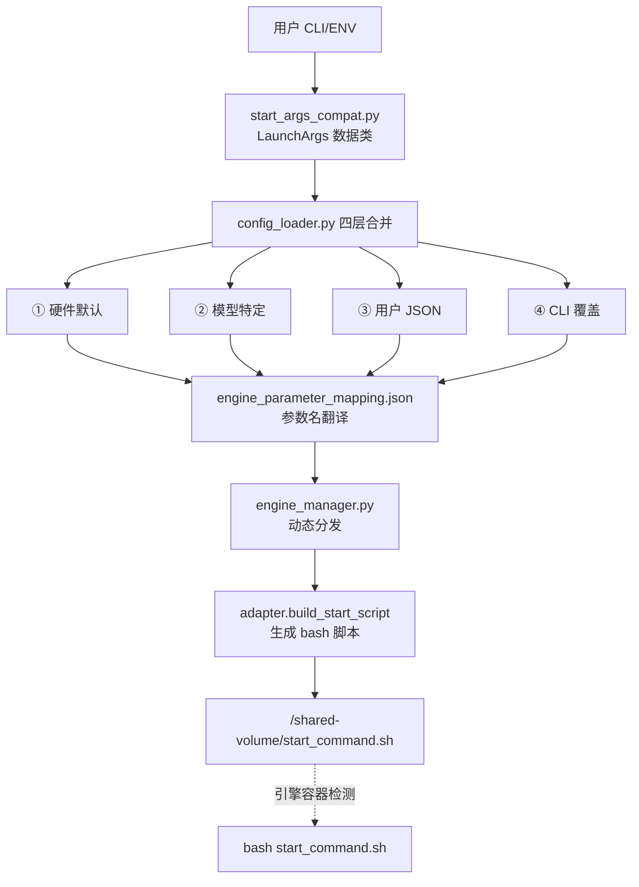

```python
# V1 main.py — 脚本生成 + 共享卷传递（简化示意）
# 1. 解析 CLI 参数
launch_args = parse_known_args(sys.argv)       # → LaunchArgs dataclass

# 2. 配置合并 + 脚本生成（build_launcher_plan 内部调用链）:
#    load_and_merge_configs() → engine_manager.start_engine_service()
#    → adapter.build_start_script(params)
launcher_plan = build_launcher_plan(launch_args, port_plan)

# 3. 写入共享卷
_write_start_command(launcher_plan.command)
#    → safe_write_file("/shared-volume/start_command.sh", script)

# 4. 启动 proxy + health 子进程
procs = _build_processes(port_plan)
# → [ManagedProc("proxy", ...), ManagedProc("health", ...)]
```

**命令统一映射表**：

| 引擎 | 入口命令 | 参数格式 |
|------|----------|----------|
| vllm | `python3 -m vllm.entrypoints.openai.api_server` | `--key value` |
| vllm (DP) | `vllm serve <model>` | `--key value` |
| vllm_ascend | 同 vllm（+ CANN 环境初始化） | `--key value` |
| sglang | `python3 -m sglang.launch_server`（V2 用 `python`） | `--key value` |
| mindie | `./bin/mindieservice_daemon` | JSON 配置文件 |

**反串讲关键点**：
- `engine_parameter_mapping.json` 是翻译字典，空字符串值表示"该引擎不支持此参数，跳过"
- 引擎自动选择：`vllm` 在昇腾硬件上自动升级为 `vllm_ascend`
- V1 使用 `shlex.quote()` 防止 Shell 注入（H1 安全修复）

### 1.3 接口设计

| 接口 | 说明 |
|------|------|
| `start_args_compat.py` CLI 入口 | `--engine`, `--model-path`, `--tp-size` 等统一参数 |
| 环境变量入口 | `ENGINE`, `MODEL_PATH`, `TP_SIZE` 等，等效于 CLI 参数 |
| `engine_parameter_mapping.json` | 统一参数名 → 各引擎原生参数名的翻译字典 |
| `/shared-volume/start_command.sh` | 输出产物：生成的 bash 启动脚本 |

### 1.4 数据结构设计

| 数据结构 | 描述 |
|----------|------|
| `LaunchArgs` | dataclass，承载用户输入的全部启动参数 |
| `engine_config: dict` | 四层合并后的引擎配置字典，按 key-value 传递给 adapter |
| `engine_parameter_mapping.json` | 翻译字典结构：`{统一参数名: {vllm: 原生名, sglang: 原生名, ...}}` |

---

## US2 适配四个引擎【继承】

### 2.1 需求背景
需要同时支持 vLLM、SGLang、MindIE、vLLM-Ascend 四个引擎，每个引擎的启动方式差异大。

### 2.2 实现设计（参数拼接逻辑）


#### wings-ctrol层面
**适配器统一契约**：每个 adapter 实现 `build_start_script(params) → str`，返回 bash 脚本体。

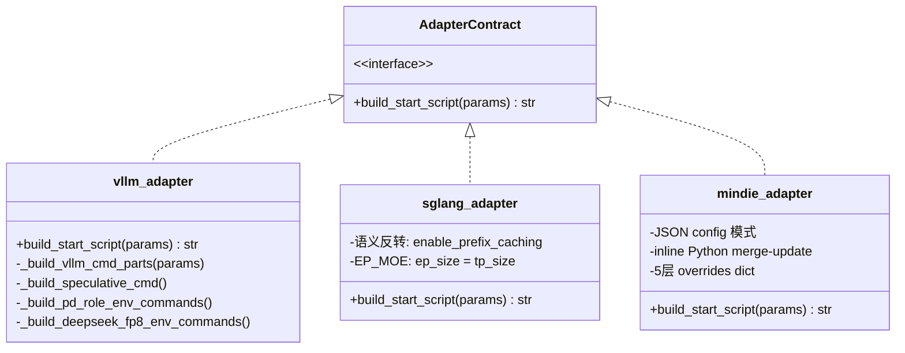

**特定场景参数拼接示例**：

| 场景 | vLLM | SGLang | MindIE |
|------|------|--------|--------|
| GPU 显存占比 | `--gpu-memory-utilization 0.9` | `--mem-fraction-static 0.9` | config.json: `npu_memory_fraction: 0.9` |
| 前缀缓存 | `--enable-prefix-caching` | `--enable-radix-cache` | 不支持(跳过) |
| 量化 | `--quantization awq` | `--quantization awq` | config.json: `quantization: awq` |

**vLLM 参数拼接核心**：

```python
engine_config = {
    "model": "/weights/Qwen2.5-72B",
    "host": "0.0.0.0",
    "port": 17000,
    "tensor_parallel_size": 4,
    "trust_remote_code": True,       # 布尔 True → --trust-remote-code
    "quantization": "",              # 空字符串 → 跳过
    "kv_transfer_config": '{"key": "val"}'  # JSON → 单引号包裹
}
# 输出: python3 -m vllm.entrypoints.openai.api_server \
#   --model /weights/Qwen2.5-72B --host 0.0.0.0 --port 17000 \
#   --tensor-parallel-size 4 --trust-remote-code \
#   --kv-transfer-config '{"key": "val"}'
```

**SGLang 语义反转处理**：

```python
# 输入参数名                → SGLang CLI 参数名
"context_length"            → "context-length"          # 使用 context_length
"enable_prefix_caching"=True → 移除 (SGLang 默认开启)
"enable_prefix_caching"=False→ --disable-radix-cache    # 语义反转
"enable_torch_compile"=True → --enable-torch-compile
"enable_ep_moe"=True        → --ep-size <tp_size>       # EP=TP
```

**MindIE 特殊处理** — 不用 CLI 参数，通过 adapter 生成 inline Python 脚本来 merge-update config.json：

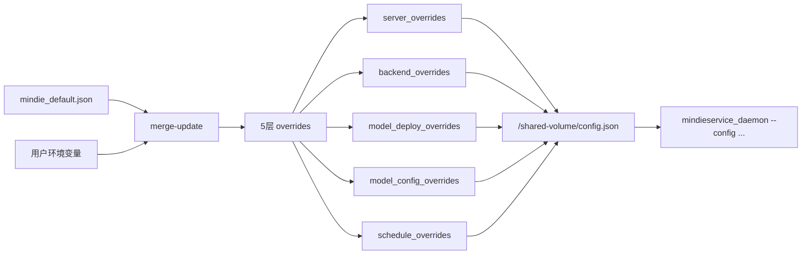

**引擎别名机制**：`vllm_ascend` 不是独立 adapter 文件，复用 `vllm_adapter.py`，内部通过设备判断切换 HCCL/NCCL、昇腾 toolkit sourcing。

**反串讲关键点**：
- 布尔参数 `True` → 仅 flag（`--trust-remote-code`），`False` → 跳过
- 空字符串 → 跳过（不生成参数）
- JSON 类型值 → 单引号包裹防止 bash 解析
- MindIE 的 5 层 overrides 映射到 config.json 不同层级

### 2.3 接口设计

| 接口 | 引擎 | 说明 |
|------|------|------|
| `build_start_script(params) → str` | 全部 | 统一适配器方法，返回 bash 脚本字符串 |
| `_build_vllm_cmd_parts(params)` | vLLM | 遍历 engine_config 生成 CLI 参数列表 |
| `_merge_sglang_params(params, ctx, ecp)` | SGLang | 语义反转 + 参数重命名 |
| inline Python merge-update | MindIE | JSON merge-update config.json |

### 2.4 数据结构设计

| 数据结构 | 描述 |
|----------|------|
| `engine_config: dict` | 各引擎的最终配置字典 |
| MindIE 5 层 overrides | `server_overrides`, `backend_overrides`, `model_deploy_overrides`, `model_config_overrides`, `schedule_overrides` |
| `_ENGINE_PATCH_KEY_MAP` | 引擎名 → 补丁键映射字典 |

---

## US3 单机/分布式【继承】

### 3.1 需求背景
同一套代码需要同时支持单机单卡、单机多卡、多机多卡场景，且两种模式的用户接口应保持一致。

### 3.2 实现设计（逻辑一致性）

#### wings-ctrol层面

**角色判定**（`main.py._determine_role()`）：

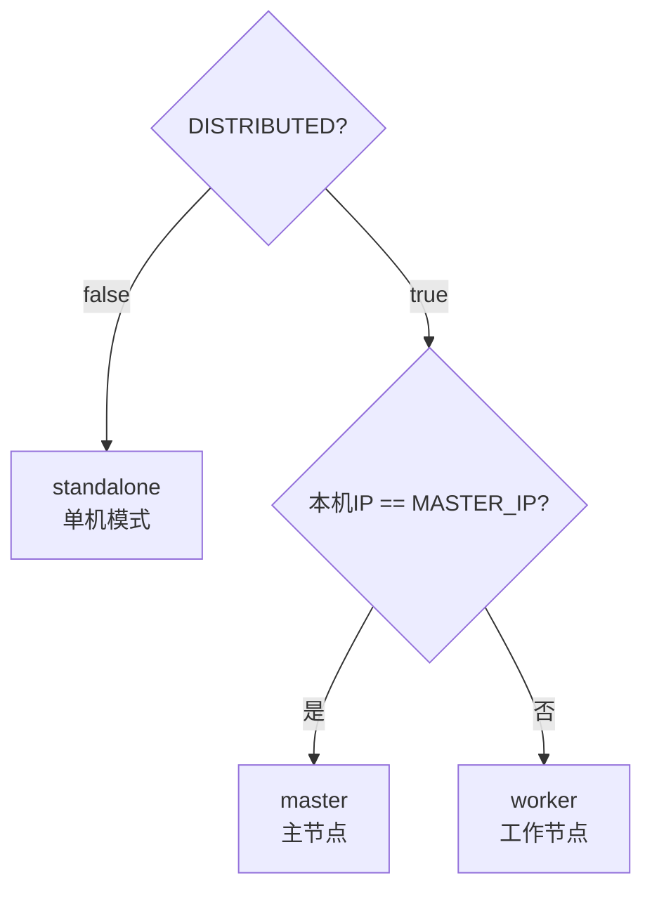

**单机模式**：
- `build_launcher_plan()` → 写 `start_command.sh` → 启动 proxy + health → 完成

**分布式模式**：

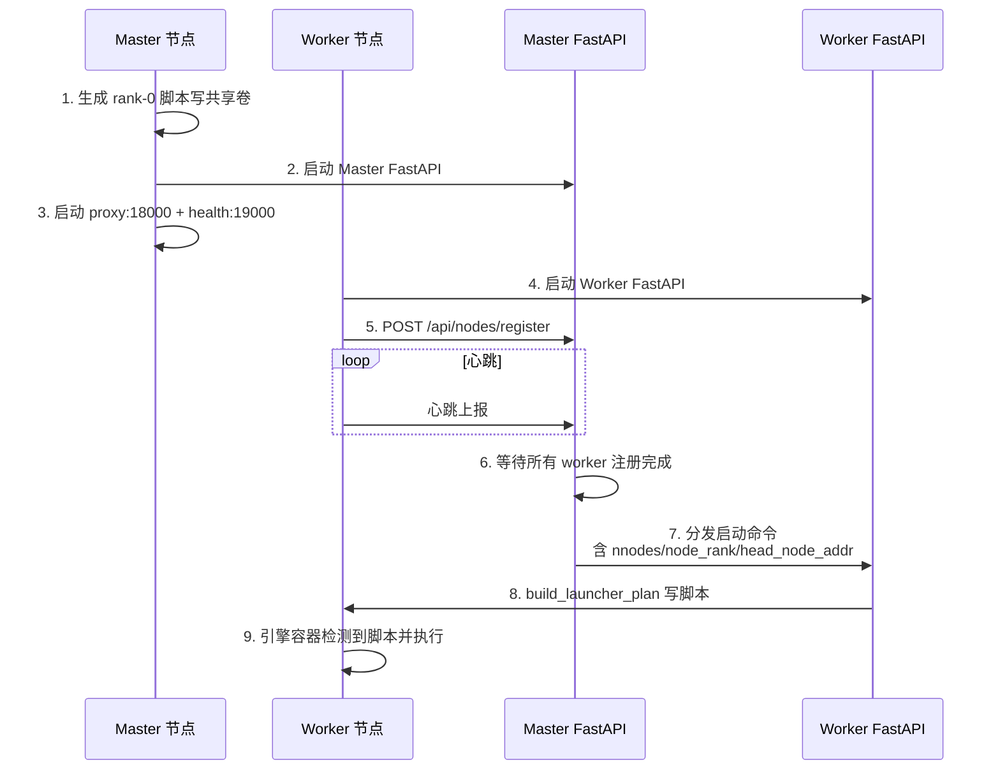

**两者一致性**：都走 `build_launcher_plan()` → 写 `start_command.sh` 的统一流程，区别仅在于 master 多了注册/分发协调层。

**TP 设置逻辑（V1 = V2）**：

```python
def _adjust_tensor_parallelism(params, device_count, tp_key, if_distributed=False):
    # 1. 300I A2 PCIe 卡: 强制 TP=4 (4 或 8 张)
    # 2. 默认 TP != device_count: warning + 强制 TP=device_count
    # 3. 其他: TP = device_count
```

**Ray 分布式启动流程**：

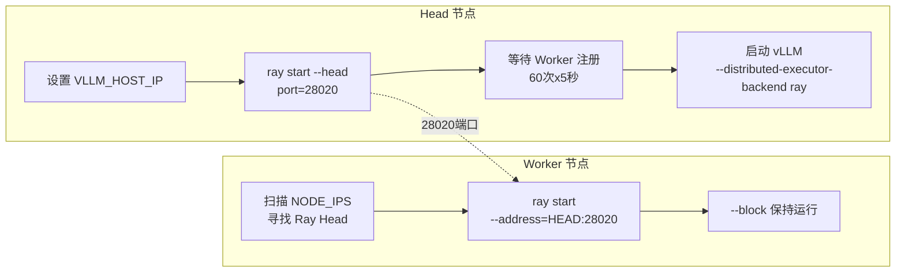

**DP 分布式 (dp_deployment)**：

```bash
# Rank-0 (Head):
exec vllm serve /weights --data-parallel-address infer-0 \
  --data-parallel-rpc-port 13355 --data-parallel-size 2 \
  --data-parallel-size-local 1 --data-parallel-external-lb --data-parallel-rank 0

# Rank-N (Worker):
exec vllm serve /weights --data-parallel-address infer-0 \
  --data-parallel-rpc-port 13355 --data-parallel-size 2 \
  --data-parallel-size-local 1 --data-parallel-external-lb \
  --headless --data-parallel-start-rank N
```

**DeepSeek V3/V32 Ascend DP 特殊处理**：
```python
# DeepseekV3ForCausalLM / DeepseekV32ForCausalLM + vllm_ascend:
dp_size = "4"           # 固定 4 路 DP
dp_size_local = "2"     # 每节点 2 路
dp_start_rank = "2" if node_rank != 0 else "0"
```

**V1 vs V2 分布式差异**：

| 项 | V2 | V1 | 状态 |
|----|----|----|------|
| 进程启动 | subprocess.Popen | 脚本→共享卷 | ✅ 设计差异 |
| Ray 端口 | 28020 | 28020 | ✅ 一致 |
| DP 入口 | `vllm serve` | `vllm serve` | ✅ 一致 |
| Triton NPU Patch | ✅ 有 | ✅ 有 | ✅ 一致 |
| 崩溃恢复 | 无 | ✅ 有（M5 新增） | V1 领先 |

**反串讲关键点**：
- `NODE_IPS` 支持 DNS 名（K8s StatefulSet），内部做 DNS→IP 解析
- Worker 健康端口偏移 +1（19001），避免 hostNetwork 端口冲突
- Worker 注册重试：3 轮 × 300s

### 3.3 接口设计

| 接口 | 说明 |
|------|------|
| `_determine_role()` | 返回 `standalone` / `master` / `worker` |
| `POST /api/nodes/register` | Worker → Master 注册接口 |
| `POST /api/nodes/{id}/start` | Master → Worker 分发启动命令 |
| 心跳接口 | Worker 定期向 Master 上报存活状态 |
| `/shared-volume/start_command.sh` | 统一的脚本传递通道（单机/分布式共用） |

### 3.4 数据结构设计

| 数据结构 | 描述 |
|----------|------|
| `PortPlan` | 端口统一规划：proxy=18000, engine=17000, health=19000, ray=28020 |
| `NODE_IPS` | 逗号分隔的节点 IP/DNS 列表 |
| Worker 注册信息 | `{node_ip, node_rank, status, last_heartbeat}` |

---

## US4 统一服务化【继承+新增】

### 4.1 需求背景
需要对外暴露统一的 OpenAI 兼容 API，屏蔽后端引擎差异；同时要回答一个实现问题：proxy 中未注册的接口，当前到底会不会自动透传到引擎端。

### 4.2 实现设计

#### wings-ctrol层面
**Proxy 架构**（继承）：

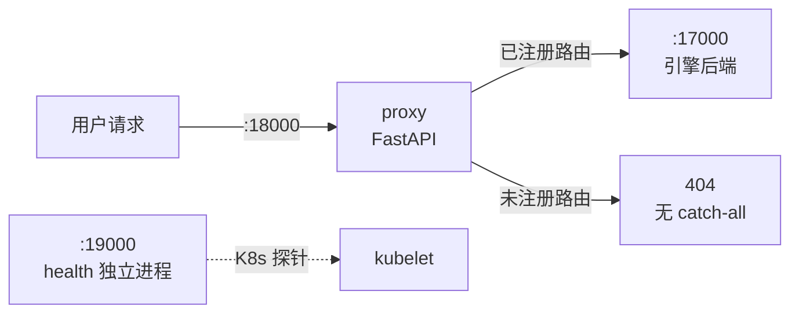

**API 端点清单（11 个对外路径，全部继承）**：

| 路径 | 方法 | 功能 |
|------|------|------|
| `/v1/chat/completions` | POST | 对话补全 |
| `/v1/completions` | POST | 文本补全 |
| `/v1/responses` | POST | Responses API 兼容入口 |
| `/v1/rerank` | POST | 重排序 |
| `/v1/embeddings` | POST | 向量嵌入 |
| `/tokenize` | POST | 分词 |
| `/metrics` | GET | 指标透传 |
| `/health` | GET / HEAD | 健康检查 |
| `/v1/models` | GET | 模型列表 |
| `/v1/version` | GET | 版本信息 |

> 多模态端点（video/image）已在代码清理中移除

**路由策略**：
- 已注册路由 → proxy 处理（添加观测 header、队列控制、重试）
- 未注册路由 → **不会自动透传**，当前实现没有 catch-all fallback，直接由 FastAPI 返回 404

**四个引擎的已注册接口转发逻辑是否不同**：
- 已注册接口的转发逻辑**完全相同**，proxy 不区分引擎类型
- Chat/Completion/Responses 走 `_forward_stream()` / `_forward_nonstream()`
- 真正的差异不在 proxy，而在后端 engine 是否实现这些路径

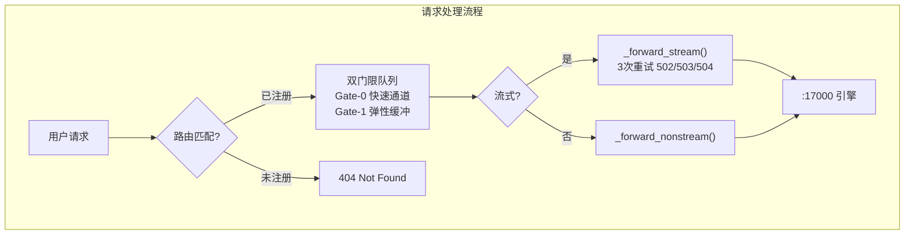

**新增部分**：

| 新增能力 | 说明 |
|------|------|
| Health 独立服务 | 端口 19000，与代理解耦，K8s 探针不受 proxy 负载影响 |
| MindIE 健康探针 | 专用 URL 路径探测（MindIE v2 兼容） |
| 双门限队列 | Gate-0 快速通道 + Gate-1 弹性缓冲 |
| 流式请求重试 | 3 次（仅 502/503/504）|
| FORCE_TOPK_TOPP | 默认启用 top_k/top_p |
| MAX_REQUEST_BYTES | 20MB 请求体上限 |
| 细粒度超时 | STREAM/CONNECT/READ 独立配置 |
| WINGS_SKIP_PID_CHECK | 跳过 PID 文件检查 |

**反串讲关键点**：
- proxy 不区分引擎类型，所有已注册路径的转发逻辑**完全相同**
- 未注册路径返回 404，**不会**自动透传
- Health 从 proxy 拆分为独立进程，确保 K8s livenessProbe 不受请求堆积影响

### 4.3 接口设计

**Proxy 对外接口（:18000）**：

| 路径 | 方法 | 转发目标 |
|------|------|----------|
| `/v1/chat/completions` | POST | `:17000` 引擎，支持流式/非流式 |
| `/v1/completions` | POST | `:17000` 引擎 |
| `/v1/responses` | POST | `:17000` 引擎 |
| `/v1/models` | GET | `:17000` 引擎 |
| `/v1/embeddings` | POST | `:17000` 引擎 |
| `/v1/rerank` | POST | `:17000` 引擎 |
| `/tokenize` | POST | `:17000` 引擎 |
| `/metrics` | GET | `:17000` 引擎 |
| `/health` | GET/HEAD | 本地健康状态 |
| `/v1/version` | GET | 版本信息 |

**Health 独立服务（:19000）**：

| 路径 | 方法 | 说明 |
|------|------|------|
| `/health` | GET | K8s livenessProbe / readinessProbe |

### 4.4 数据结构设计

| 数据结构 | 描述 |
|----------|------|
| `ProxyConfig` (pydantic-settings) | 代理配置：端口、超时、队列深度等 |
| 双门限队列 | Gate-0 快速通道 + Gate-1 弹性缓冲，控制并发请求数 |
| 请求标签 `tags.py` | 请求分类标签（用于观测和路由决策） |

---

## US5 Accel 使能逻辑【新增】

### 5.1 需求背景
需要在不修改引擎镜像的前提下，动态注入加速补丁（如算子优化 whl 包）。

### 5.2 实现设计

#### Maas层面


#### wings-accel层面

#### wings-control层面
**三容器协作流程**：

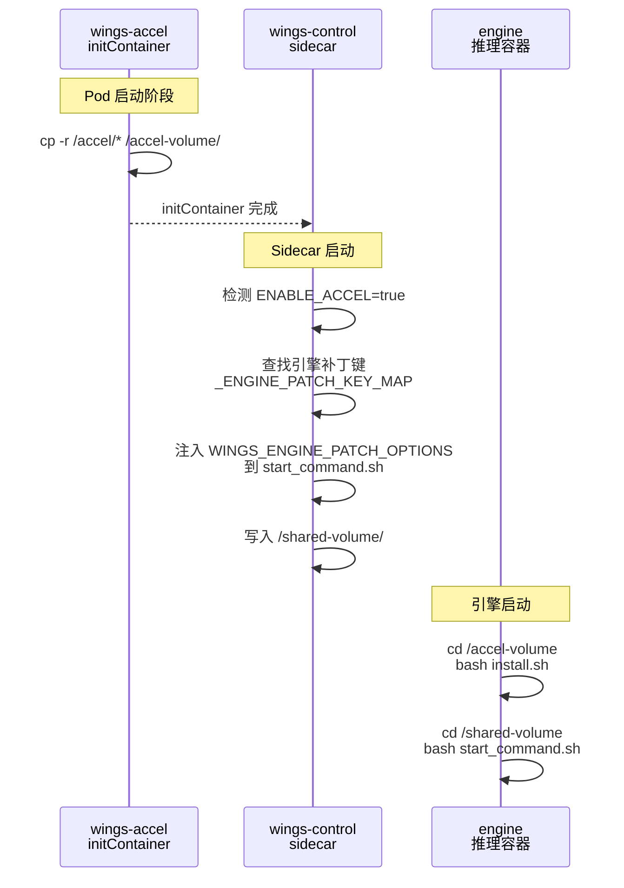

**四个步骤**：

| 步骤 | 执行者 | 动作 |
|------|--------|------|
| ①使能环境变量 | 用户 | `ENABLE_ACCEL=true` |
| ②补丁文件拷贝 | initContainer (wings-accel) | Alpine 镜像将 `/accel/*` 整体拷贝到 `accel-volume` |
| ③补丁安装 | 引擎容器启动脚本 | `cd /accel-volume && bash install.sh` |
| ④补丁执行 | wings_entry.py | 注入 `export WINGS_ENGINE_PATCH_OPTIONS='{"vllm":["test_patch"]}'` 到 start_command.sh |

**引擎到补丁键的映射**：

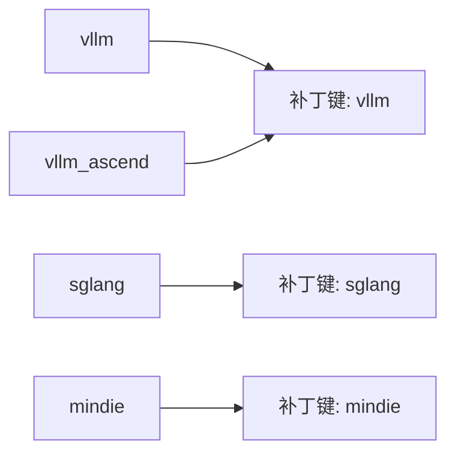

**K8s 部署清单示例**：

```yaml
# k8s/deployment.yaml
initContainers:
  - name: wings-accel
    image: wings-accel:latest
    command: ["/bin/sh", "-c"]
    args: ["cp -r /accel/* /accel-volume/"]
    volumeMounts:
      - name: accel-volume
        mountPath: /accel-volume
```

**用户可覆盖**：通过 `WINGS_ENGINE_PATCH_OPTIONS` 环境变量（JSON 格式）自定义补丁列表。

**反串讲关键点**：
- initContainer 是 Alpine 轻量镜像，只负责文件拷贝
- 补丁安装（install.sh）在引擎容器内执行，确保依赖环境正确
- `_ENGINE_PATCH_KEY_MAP` 保证 `vllm` 和 `vllm_ascend` 共用同一套补丁

### 5.3 接口设计

| 接口 | 说明 |
|------|------|
| `ENABLE_ACCEL` 环境变量 | 用户使能开关，`true` / `false` |
| `WINGS_ENGINE_PATCH_OPTIONS` 环境变量 | JSON 格式，用户自定义补丁列表覆盖 |
| `install.sh` | Accel 补丁安装入口脚本，在引擎容器内执行 |
| K8s `initContainers` 定义 | `wings-accel` 容器声明（image、volumeMounts） |

### 5.4 数据结构设计

| 数据结构 | 描述 |
|----------|------|
| `_ENGINE_PATCH_KEY_MAP` | `{"vllm": "vllm", "vllm_ascend": "vllm", "sglang": "sglang", "mindie": "mindie"}` |
| `_DEFAULT_PATCH_FEATURES` | `["test_patch"]`，默认补丁列表 |
| `supported_features.json` | Accel 包自带的特性声明文件 |
| `accel-volume` | K8s emptyDir，initContainer → 引擎容器的补丁传递通道 |

---

## US6 日志汇聚逻辑【重构】

### 6.1 需求背景
Sidecar 架构下有三个容器（initContainer + 控制容器 + 引擎容器），日志分散在各自 stdout，用户需要 `kubectl logs` 统一查看。

### 6.2 实现设计

**老 wings 逻辑**：单进程模型，wings.py 直接 subprocess 启动引擎，引擎日志通过 stdout 管道自然汇聚到 wings 进程输出中。

**重构后逻辑**：**不做跨容器日志搬运**，依赖 K8s 原生容器日志机制：

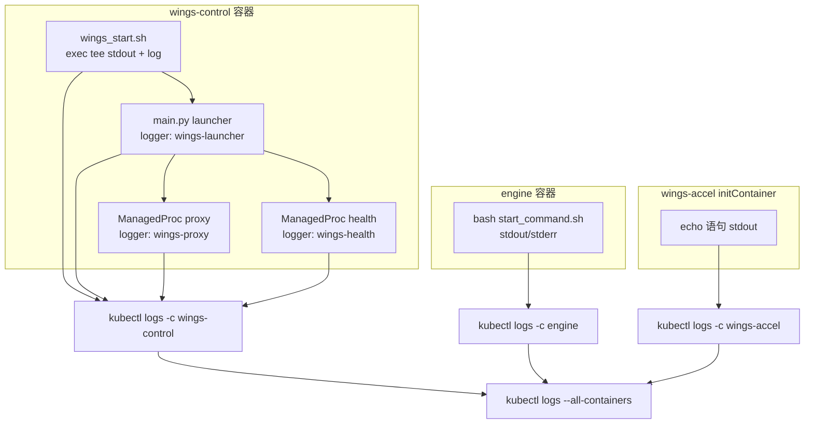

**统一日志格式**（`utils/log_config.py`）：

所有 Python 组件使用统一格式：
```
%(asctime)s [%(levelname)s] [%(name)s] %(message)s
```

输出示例：
```
2026-03-12 10:00:00 [INFO] [wings-launcher] start command written: /shared-volume/start_command.sh
2026-03-12 10:00:01 [INFO] [wings-proxy] Reason-Proxy is starting on 0.0.0.0:18000
2026-03-12 10:00:02 [WARNING] [wings-health] health_monitor_error: ...
```

**`kubectl logs --all-containers` 查看效果**：

K8s 自动添加容器名前缀，结合统一的 `[%(name)s]` 组件标签：
```
[wings-control] 2026-03-12 10:00:00 [INFO] [wings-launcher] start command written
[wings-control] 2026-03-12 10:00:01 [INFO] [wings-proxy] Reason-Proxy is starting
[engine]        INFO 03-12 10:00:02 api_server.py:xxx] vLLM engine started
[wings-control] 2026-03-12 10:00:03 [INFO] [wings-health] Health monitor loop enabled
```

**日志噪声过滤**：

| 模块 | 过滤内容 | 机制 |
|------|---------|------|
| `noise_filter.py` | `/health` 探针、`Prefill/Decode batch` 噪声、pynvml 警告 | logging.Filter + sys.stdout/stderr 包装 |
| `speaker_logging.py` | 多 worker 日志抑制、uvicorn.access、/health 出入站 | speaker 决策 + _DropByRegex Filter |

**日志文件持久化**：

Shell 层面 `wings_start.sh` 通过 `exec > >(tee -a "$LOG_FILE") 2>&1` 将全部输出
同时写入 `/var/log/wings/wings_start.log`（5 副本滚动），**但该路径未挂载持久卷，
容器重启后丢失**。Python 层面**无** `RotatingFileHandler`，所有日志仅输出到 stderr。

**重构改动清单**：

| 文件 | 改动 |
|------|------|
| `utils/log_config.py` | **新建** — 统一格式常量 + `setup_root_logging()` |
| `main.py` | 改用 `setup_root_logging()` + `LOGGER_LAUNCHER`，移除冗余 `[launcher]` 前缀 |
| `proxy/proxy_config.py` | 改用 `setup_root_logging()` + `LOGGER_PROXY`，替换独立 `basicConfig` |
| `proxy/speaker_logging.py` | `_ensure_root_handler()` 使用统一格式 |
| `proxy/health_service.py` | 增加 `LOGGER_HEALTH` 独立 logger，替代共用 `C.logger` |
| `wings_start.sh` | 移除死代码 `LAUNCHER_LOG_FILE` / `WINGS_PROXY_LOG_FILE` |

**反串讲关键点**：
- 不做跨容器日志搬运，利用 K8s 原生 `--all-containers` 能力
- Python 层无 `RotatingFileHandler`，所有日志仅输出到 stderr
- Shell 层 `wings_start.sh` 通过 `exec > >(tee -a "$LOG_FILE") 2>&1` 写入容器内文件（5 副本滚动），但未挂载持久卷

### 6.3 接口设计

| 接口 | 说明 |
|------|------|
| `kubectl logs <pod> -c wings-control` | 查看控制层日志（launcher + proxy + health） |
| `kubectl logs <pod> -c engine` | 查看引擎日志 |
| `kubectl logs <pod> --all-containers` | 查看全部容器日志 |
| `kubectl logs <pod> --all-containers -f` | 实时跟踪全部日志 |
| `NOISE_FILTER_DISABLE=1` | 关闭噪声过滤 |
| `LOG_INFO_SPEAKERS` | 控制多 worker 场景下哪些 worker 输出 INFO 日志 |

### 6.4 数据结构设计

| 数据结构 | 描述 |
|----------|------|
| `LOG_FORMAT` | `"%(asctime)s [%(levelname)s] [%(name)s] %(message)s"` |
| `LOGGER_LAUNCHER` | logger name = `"wings-launcher"` |
| `LOGGER_PROXY` | logger name = `"wings-proxy"` |
| `LOGGER_HEALTH` | logger name = `"wings-health"` |
| `setup_root_logging()` | 统一初始化 root logger 格式和 handler |

---

## US7 RAG 二级推理【继承】

### 7.1 需求背景
RAG 场景下长文档推理需要 Map-Reduce 分块并行策略，提升长上下文处理效率。

### 7.2 实现设计

**触发条件**（`ENABLE_RAG_ACC=true` 时）：
1. 请求包含 `<|doc_start|>` / `<|doc_end|>` 标签
2. 文本长度 ≥ 2048 字符
3. 文档块数量 ≥ 3

**处理流程**：

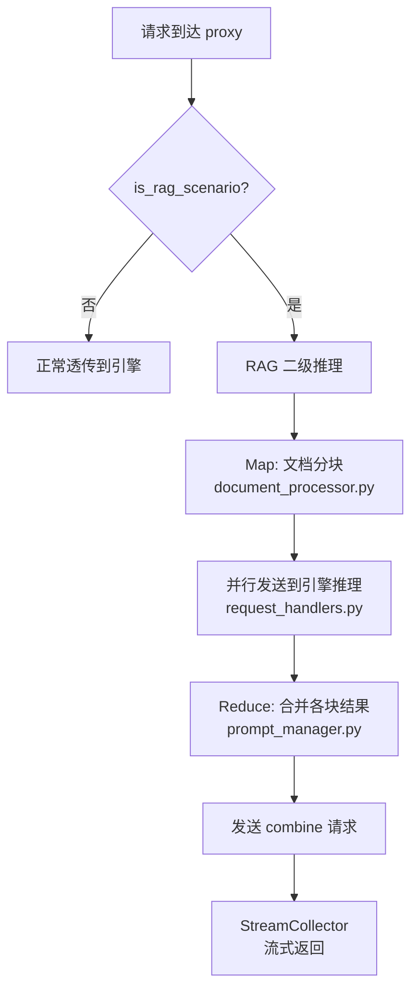

**继承状态**: 100% 继承，8 个文件完全一致：

| V2 文件 | V1 文件 | 状态 |
|---------|---------|------|
| `proxy/rag_acc/rag_app.py` | 同 | ✅ 一致 |
| `proxy/rag_acc/document_processor.py` | 同 | ✅ 一致 |
| `proxy/rag_acc/prompt_manager.py` | 同 | ✅ 一致 |
| `proxy/rag_acc/stream_collector.py` | 同 | ✅ 一致 |
| `proxy/rag_acc/request_handlers.py` | 同 | ✅ 一致 |
| `proxy/rag_acc/non_blocking_queue.py` | 同 | ✅ 一致 |
| `proxy/rag_acc/extract_dify_info.py` | 同 | ✅ 一致 |

**与引擎层的关系**：

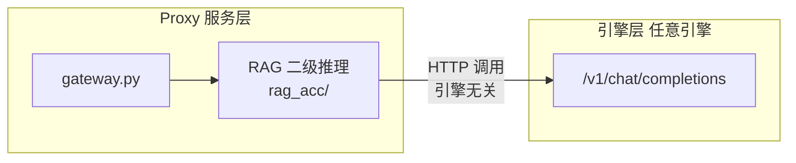

**引擎无关性**: RAG 模块通过 HTTP 调用引擎的 `/v1/chat/completions` API，不依赖任何引擎特定接口。四个引擎均支持。

**跳过机制**：请求体包含 `/no_rag_acc` 即可强制跳过。

**V1 唯一改动**：
```python
# V2: import fastchat (直接)
# V1: try/except 懒加载 (fastchat 可选依赖)
try:
    from fastchat.conversation import get_conv_template
except ImportError:
    get_conv_template = None  # RAG 功能降级但不影响主流程
```

**反串讲关键点**：
- RAG 在 proxy 服务层实现，与引擎层完全解耦
- 100% 继承，仅 fastchat 改为懒加载
- 通过 HTTP 调用引擎 API，四个引擎通用

### 7.3 接口设计

| 接口 | 说明 |
|------|------|
| `ENABLE_RAG_ACC=true` | 使能开关（proxy 内转为 `RAG_ACC_ENABLED`） |
| `POST /v1/chat/completions` | RAG 请求入口（与普通请求共用路径） |
| `<\|doc_start\|>` / `<\|doc_end\|>` 标签 | 请求体内文档分块标记 |
| `/no_rag_acc` | 请求体内强制跳过 RAG 的标记 |
| `MIN_CONTENT_LENGTH = 2048` | 触发 RAG 的最小文本长度 |
| `MIN_DOC_BLOCKS = 3` | 触发 RAG 的最小文档块数 |

### 7.4 数据结构设计

| 数据结构 | 描述 |
|----------|------|
| `document_processor.py` | 文档分块器，按标签切分长文档 |
| `prompt_manager.py` | Map-Reduce prompt 构建器 |
| `stream_collector.py` | 流式结果聚合器 |
| `non_blocking_queue.py` | 非阻塞请求队列 |

---

## US8 MindIE 分布式长上下文【新增】

### 8.1 需求背景
DeepSeek 满血模型在 MindIE 分布式场景下，当输入输出总长度超过阈值时，需要启用四维并行策略支持长上下文。

### 8.2 实现设计

**触发条件**（三个同时满足）：

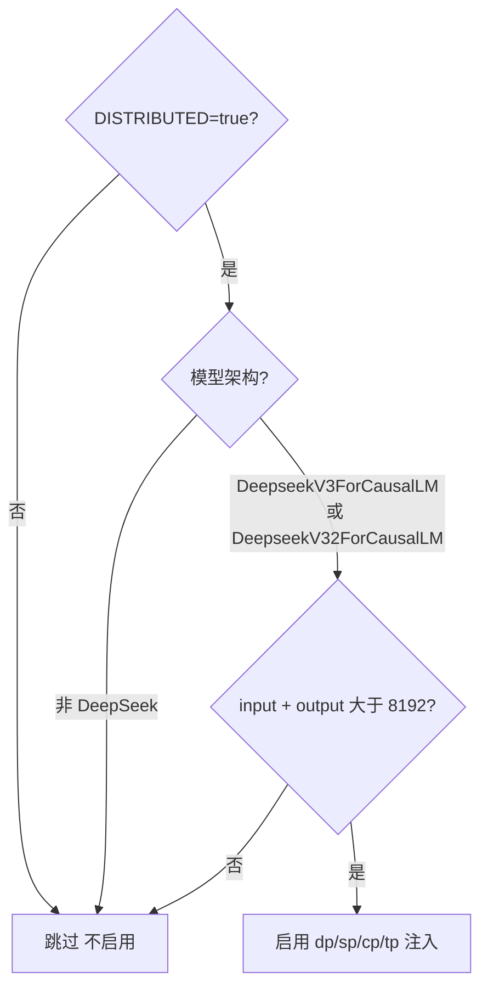

**注入参数**（四维并行策略）：

| 参数 | 环境变量 | 默认值 | 含义 |
|------|---------|--------|------|
| dp | `MINDIE_DS_DP` | 1 | 数据并行 |
| sp | `MINDIE_DS_SP` | 8 | 序列并行 |
| cp | `MINDIE_DS_CP` | 2 | 上下文并行 |
| tp | `MINDIE_DS_TP` | 2 | 张量并行 |

**配置流转图**：

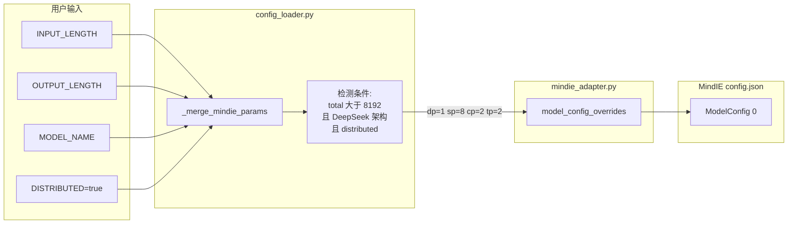

**注入方式**：通过 `_merge_mindie_params()` 在 `config_loader.py` 中将参数写入，再由 `mindie_adapter.py` 透传到 MindIE 的 config.json（走 adapter 的 inline-Python merge 机制）。

**已实现的代码**：

```python
# config_loader.py — _merge_mindie_params()
_LONG_CTX_THRESHOLD = int(os.getenv("MINDIE_LONG_CONTEXT_THRESHOLD", "8192"))

if (ctx.get('distributed')
        and model_architecture in ["DeepseekV3ForCausalLM", "DeepseekV32ForCausalLM"]
        and total_seq_len > _LONG_CTX_THRESHOLD):
    params['dp'] = int(os.getenv("MINDIE_DS_DP", "1"))
    params['sp'] = int(os.getenv("MINDIE_DS_SP", "8"))
    params['cp'] = int(os.getenv("MINDIE_DS_CP", "2"))
    params['tp'] = int(os.getenv("MINDIE_DS_TP", "2"))
```

```python
# mindie_adapter.py — 透传到 ModelConfig[0]
if engine_config.get("sp") is not None:
    model_config_overrides["sp"] = engine_config["sp"]
if engine_config.get("cp") is not None:
    model_config_overrides["cp"] = engine_config["cp"]
# dp/tp: 非 MOE 模型时从 US8 注入
if engine_config.get("dp") is not None and not engine_config.get("isMOE", False):
    model_config_overrides["dp"] = engine_config["dp"]
```

**最终生成的 config.json 片段**：

```json
{
  "BackendConfig": {
    "ModelDeployConfig": {
      "maxSeqLen": 16384,
      "ModelConfig": [{
        "modelName": "DeepSeek-R1",
        "modelWeightPath": "/weights/DeepSeek-R1",
        "worldSize": 8,
        "dp": 1,
        "sp": 8,
        "cp": 2,
        "tp": 2,
        "trustRemoteCode": true
      }]
    }
  }
}
```

**注意**：`multiNodesInferEnabled` 对单个 daemon 实例设为 `false`，跨节点协调由上层 `ms_coordinator/ms_controller` 处理。

**反串讲关键点**：
- 阈值 8192 可通过 `MINDIE_LONG_CONTEXT_THRESHOLD` 环境变量调整
- 四维并行参数均可通过环境变量覆盖
- 仅影响 MindIE 引擎的 config.json，对 vLLM/SGLang 透明
- MOE 模型有独立的 dp/tp 逻辑，US8 不会覆盖

### 8.3 接口设计

| 接口 | 说明 |
|------|------|
| `MINDIE_LONG_CONTEXT_THRESHOLD` | 长上下文触发阈值，默认 `8192` |
| `MINDIE_DS_DP` / `MINDIE_DS_SP` / `MINDIE_DS_CP` / `MINDIE_DS_TP` | 四维并行参数环境变量，默认 `1/8/2/2` |
| `INPUT_LENGTH` + `OUTPUT_LENGTH` | 序列总长度来源 |
| `config.json` → `ModelConfig[0]` | 注入目标：MindIE 引擎配置文件 |

### 8.4 数据结构设计

| 数据结构 | 描述 |
|----------|------|
| `_LONG_CTX_THRESHOLD` | 长上下文阈值，默认 8192 |
| `model_config_overrides` | 注入 dp/sp/cp/tp 的 dict，透传到 MindIE config.json |
| MindIE config.json 目标路径 | `BackendConfig.ModelDeployConfig.ModelConfig[0]` |
