> 遗留
> 1。accel使能逻辑，完备
> 2.日志汇聚逻辑，以方便打屏，同时保存本地静态日志
> 3.页面json传参逻辑:指定开关和引擎字段后，允许命令直接转换，跳过wingscontral的参数解析逻辑，直接透传给引擎，这里透传的只局限于引擎参数，
> 目录结构，调整。ST场景下，ray的版本。


## US1 统一对外引擎命令【继承+新增】

### 1.1 需求背景
用户面对 vLLM/SGLang/MindIE/vLLM-Ascend 四个引擎时，每个引擎的启动参数名称和格式各不相同，增加使用门槛。

> 页面传参逻辑，json全部透传

### 1.2 实现设计
#### wings-control层面
**解耦前**（老 wings）：wings.py 单文件 → 直接 subprocess 拉引擎 → 参数硬编码在各引擎 adapter 中。

```python
# old engine_manager.py — 动态加载 adapter 并在本容器内直接启动引擎
def start_engine_service(params):
    engine_name = params["engine"]
    adapter_module = importlib.import_module(  # 动态导入 adapter 模块
        f"wings.engines.{engine_name}_adapter"
    )
    adapter_module.start_engine(params)        # adapter 内部调用 subprocess.Popen
```

**解耦后**（wings-control）：

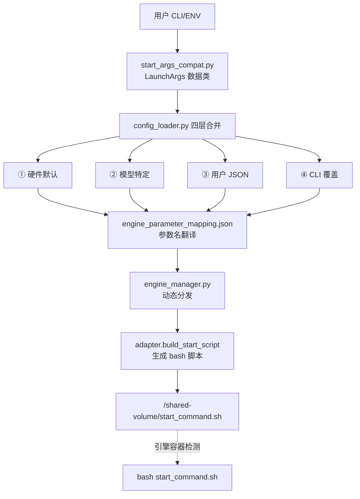

```python
# 解耦版本 main.py — 脚本生成 + 共享卷传递（简化示意）
# 1. 解析 CLI 参数
launch_args = parse_known_args(sys.argv)       # → LaunchArgs dataclass

# 2. 配置合并 + 脚本生成（build_launcher_plan 内部调用链）:
#    load_and_merge_configs() → engine_manager.start_engine_service()
#    → adapter.build_start_script(params)
launcher_plan = build_launcher_plan(launch_args, port_plan)

# 3. 写入共享卷
_write_start_command(launcher_plan.command)
#    → safe_write_file("/shared-volume/start_command.sh", script)

# 4. 启动 proxy + health 子进程
procs = _build_processes(port_plan)
# → [ManagedProc("proxy", ...), ManagedProc("health", ...)]
```

**命令统一映射表**：

| 引擎 | 入口命令 | 参数格式 |
|------|----------|----------|
| vllm | `python3 -m vllm.entrypoints.openai.api_server` | `--key value` |
| vllm (DP) | `vllm serve <model>` | `--key value` |
| vllm_ascend | 同 vllm（+ CANN 环境初始化） | `--key value` |
| sglang | `python3 -m sglang.launch_server`（老版本 用 `python`） | `--key value` |
| mindie | `./bin/mindieservice_daemon` | JSON 配置文件 |

#### Mass层面

1. **上层需要--engine参数强制传入**

   ```shell
   bash /app/wings_start.sh \
       # 必填项
       --engine vllm \
       --model-name DeepSeek-R1-Distill-Qwen-1.5B \
       --model-path /models/DeepSeek-R1-Distill-Qwen-1.5B \
       --device-count 1 \
       --trust-remote-code
   ```

2. **针对wings-control的Containers，分配/shared-volume目录，同时继承老版本containers所有特性。**

   ```yaml
    - name: wings-control
             volumeMounts:
               - name: shared-volume
                 mountPath: /shared-volume
   
           
   ```

### 1.3 接口设计

| 接口 | 说明 |
|------|------|
| `start_args_compat.py` CLI 入口 | `--engine`, `--model-path`, `--tp-size` 等统一参数 |
| 环境变量入口 | `ENGINE`, `MODEL_PATH`, `TP_SIZE` 等，等效于 CLI 参数 |
| `engine_parameter_mapping.json` | 统一参数名 → 各引擎原生参数名的翻译字典 |
| `/shared-volume/start_command.sh` | 输出产物：生成的 bash 启动脚本 |

### 1.4 数据结构设计

与解耦前保持一致

---

## US2 适配四个引擎【继承】

### 2.1 需求背景
需要同时支持 vLLM、SGLang、MindIE、vLLM-Ascend 四个引擎，每个引擎的启动方式差异大。

### 2.2 实现设计（参数拼接逻辑）


#### wings-ctrol层面
**适配器统一契约**：每个 adapter 实现 `build_start_script(params) → str`，返回 bash 脚本体。

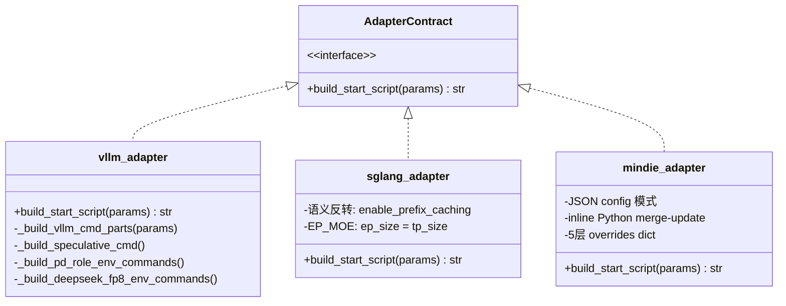

**特定场景参数拼接示例**：

| 场景 | vLLM | SGLang | MindIE |
|------|------|--------|--------|
| GPU 显存占比 | `--gpu-memory-utilization 0.9` | `--mem-fraction-static 0.9` | config.json: `npu_memory_fraction: 0.9` |
| 前缀缓存 | `--enable-prefix-caching` | `--enable-radix-cache` | 不支持(跳过) |
| 量化 | `--quantization awq` | `--quantization awq` | config.json: `quantization: awq` |

**vLLM 参数拼接核心**：

```python
engine_config = {
    "model": "/weights/Qwen2.5-72B",
    "host": "0.0.0.0",
    "port": 17000,
    "tensor_parallel_size": 4,
    "trust_remote_code": True,       # 布尔 True → --trust-remote-code
    "quantization": "",              # 空字符串 → 跳过
    "kv_transfer_config": '{"key": "val"}'  # JSON → 单引号包裹
}
# 输出: python3 -m vllm.entrypoints.openai.api_server \
#   --model /weights/Qwen2.5-72B --host 0.0.0.0 --port 17000 \
#   --tensor-parallel-size 4 --trust-remote-code \
#   --kv-transfer-config '{"key": "val"}'
```

**SGLang 语义反转处理**：

```python
# 输入参数名                → SGLang CLI 参数名
"context_length"            → "context-length"          # 使用 context_length
"enable_prefix_caching"=True → 移除 (SGLang 默认开启)
"enable_prefix_caching"=False→ --disable-radix-cache    # 语义反转
"enable_torch_compile"=True → --enable-torch-compile
"enable_ep_moe"=True        → --ep-size <tp_size>       # EP=TP
```

**MindIE 特殊处理** — 不用 CLI 参数，通过 adapter 生成 inline Python 脚本来 merge-update config.json：

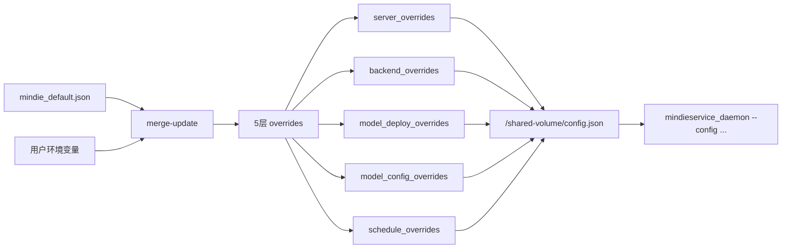

### 2.3 接口设计

与解耦前保持一致

### 2.4 数据结构设计

与解耦前保持一致

---

## US3 单机/分布式【继承】

### 3.1 需求背景
同一套代码需要同时支持单机单卡、单机多卡、多机多卡场景，且两种模式的用户接口应保持一致。

### 3.2 实现设计（逻辑一致性）

#### wings-ctrol层面

**角色判定**（`main.py._determine_role()`）：

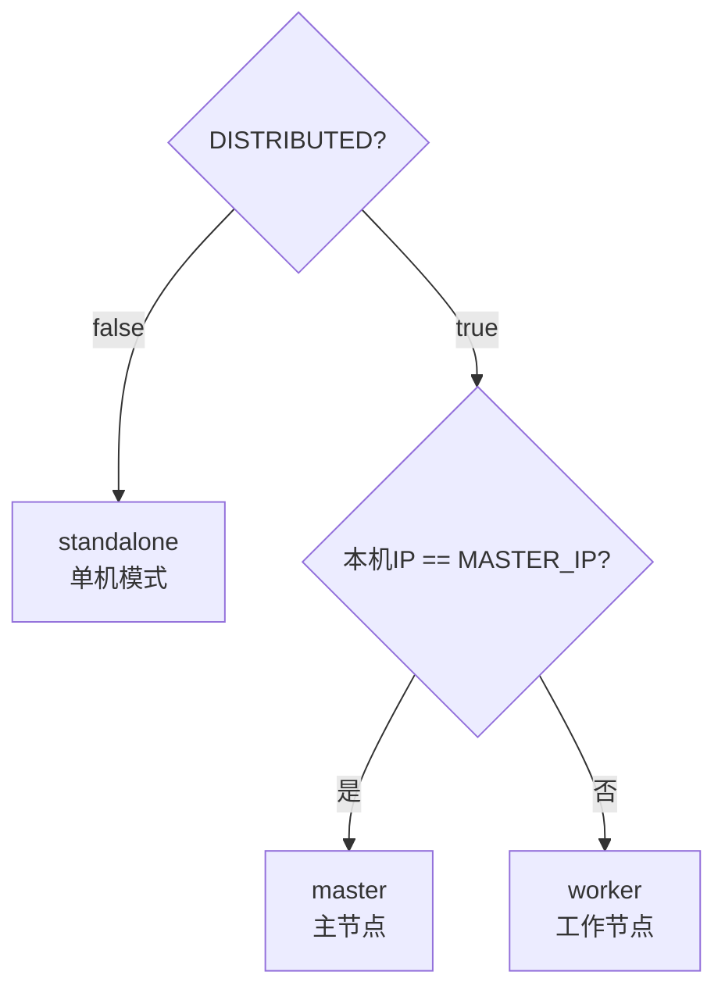

**单机模式**：

- `build_launcher_plan()` → 写 `start_command.sh` → 启动 proxy + health → 完成

**分布式模式**：

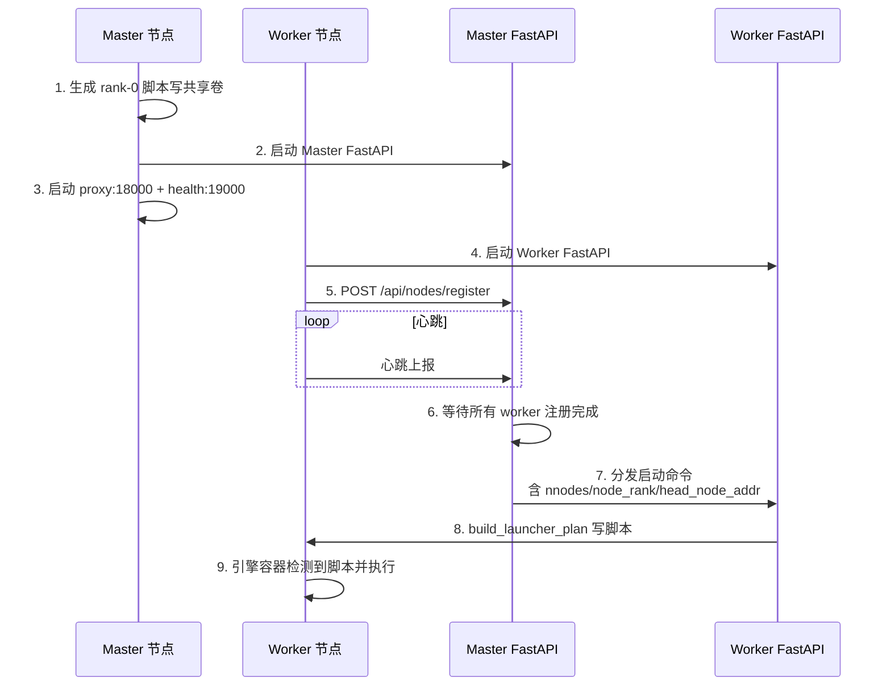

**两者一致性**：都走 `build_launcher_plan()` → 写 `start_command.sh` 的统一流程，区别仅在于 master 多了注册/分发协调层。

**TP 设置逻辑（解耦版本 = 老版本）**：

```python
def _adjust_tensor_parallelism(params, device_count, tp_key, if_distributed=False):
    # 1. 300I A2 PCIe 卡: 强制 TP=4 (4 或 8 张)
    # 2. 默认 TP != device_count: warning + 强制 TP=device_count
    # 3. 其他: TP = device_count
```

**Ray 分布式启动流程**：

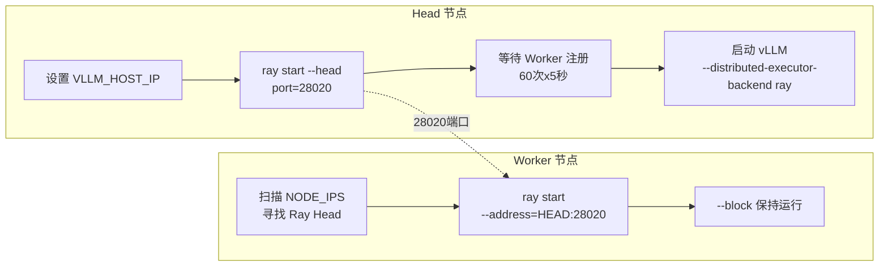

**DP 分布式 (dp_deployment)**：

```bash
# Rank-0 (Head):
exec vllm serve /weights --data-parallel-address infer-0 \
  --data-parallel-rpc-port 13355 --data-parallel-size 2 \
  --data-parallel-size-local 1 --data-parallel-external-lb --data-parallel-rank 0

# Rank-N (Worker):
exec vllm serve /weights --data-parallel-address infer-0 \
  --data-parallel-rpc-port 13355 --data-parallel-size 2 \
  --data-parallel-size-local 1 --data-parallel-external-lb \
  --headless --data-parallel-start-rank N
```

**DeepSeek V3/V32 Ascend DP 特殊处理**：
```python
# DeepseekV3ForCausalLM / DeepseekV32ForCausalLM + vllm_ascend:
dp_size = "4"           # 固定 4 路 DP
dp_size_local = "2"     # 每节点 2 路
dp_start_rank = "2" if node_rank != 0 else "0"
```

**解耦版本 vs 老版本 分布式差异**：

| 项 | 老版本 | 解耦版本 | 状态 |
|----|----|----|------|
| 进程启动 | subprocess.Popen | 脚本→共享卷 | ✅ 设计差异 |
| Ray 端口 | 28020 | 28020 | ✅ 一致 |
| DP 入口 | `vllm serve` | `vllm serve` | ✅ 一致 |
| Triton NPU Patch | ✅ 有 | ✅ 有 | ✅ 一致 |
| 崩溃恢复 | 无 | ✅ 有（M5 新增） | 解耦版本 领先 |

### 3.3 接口设计

与解耦前保持一致

### 3.4 数据结构设计

与解耦前保持一致

---

## US4 统一服务化【继承】

### 4.1 需求背景
需要对外暴露统一的 OpenAI 兼容 API，屏蔽后端引擎差异。

### 4.2 实现设计

#### wings-control层面
**Proxy 架构**（继承）：

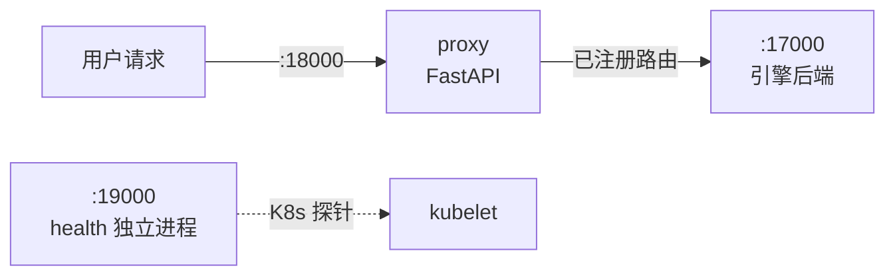

**API 端点清单（11 个对外路径，全部继承）**：

| 路径 | 方法 | 功能 |
|------|------|------|
| `/v1/chat/completions` | POST | 对话补全 |
| `/v1/completions` | POST | 文本补全 |
| `/v1/responses` | POST | Responses API 兼容入口 |
| `/v1/rerank` | POST | 重排序 |
| `/v1/embeddings` | POST | 向量嵌入 |
| `/tokenize` | POST | 分词 |
| **`/metrics`** | **GET** | **指标透传** |
| `/health` | GET / HEAD | 健康检查 |
| `/v1/models` | GET | 模型列表 |
| `/v1/version` | GET | 版本信息 |

> 多模态端点（video/image）已在代码清理中移除

### 4.3 接口设计

除了metrics接口外，与解耦前保持一致

### 4.4 数据结构设计

与解耦前保持一致

---

## US5 Accel 使能逻辑【新增】

### 5.1 需求背景
需要在不修改引擎镜像的前提下，动态注入加速补丁（如算子优化 whl 包）。

### 5.2 实现设计

**三容器协作流程**：

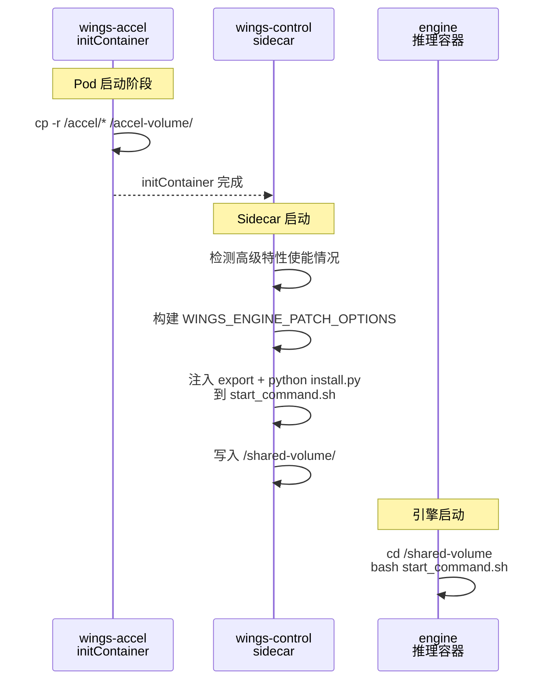

**四个步骤**：

| 步骤 | 执行者 | 动作 |
|------|--------|------|
| ①使能加速特性 | MaaS 用户 | 页面勾选高级特性开关（推测解码、稀疏 KV 等），下发 `ENABLE_ACCEL=true` |
| ②补丁文件拷贝 | initContainer (wings-accel) | Alpine 镜像将 `/accel/*` 整体拷贝到 `accel-volume` 共享卷（Pod 启动前完成） |
| ③环境变量注入 | wings-control (wings_entry.py) | 根据引擎类型、版本和已使能的高级特性，自动构建并注入 `WINGS_ENGINE_PATCH_OPTIONS` 到 `start_command.sh` |
| ④补丁安装+引擎启动 | engine 容器 | 执行 `start_command.sh`：先 `python install.py --features "$WINGS_ENGINE_PATCH_OPTIONS"` 安装补丁，再启动推理引擎 |

#### Maas层面

**1. 传递环境变量**

MaaS 页面下发 YAML 时需传递以下参数：

| 参数 | 说明 | 示例 |
|------|------|------|
| `ENGINE_VERSION` | 引擎版本号，同时决定 `wings-accel` initContainer 镜像标签 | `0.12.0` |
| 高级特性开关 | 页面上的特性勾选项，对应 `start_args_compat.py` 中的布尔参数 | 见下表 |

MaaS 页面**不直接传递** `WINGS_ENGINE_PATCH_OPTIONS`，该值由 wings-control 内部根据以下信息自动构建：
- `--engine`（引擎类型）→ 确定 patch key
- `ENGINE_VERSION`（引擎版本）→ 填入 version 字段
- 页面高级特性开关 → 确定要激活的 features 列表

**高级特性（需补丁）**

以下 5 个高级特性需要通过 wings-accel 打补丁：

| 高级特性（需补丁） | 环境变量 | 对应 features 名称 |
|-------------------|---------|-------------------|
| 推测解码 | `ENABLE_SPECULATIVE_DECODE` | `speculative_decode` |
| 稀疏 KV Cache | `ENABLE_SPARSE` | `sparse_kv` |
| LMCache 卸载 | `LMCACHE_OFFLOAD` | `lmcache_offload` |
| 软件 FP8 量化 | `ENABLE_SOFT_FP8` | `soft_fp8` |
| 软件 FP4 量化 | `ENABLE_SOFT_FP4` | `soft_fp4` |

**`WINGS_ENGINE_PATCH_OPTIONS` 格式**

JSON 字符串，结构为 `{引擎名: {version: 版本号, features: [补丁名称列表]}}`：

```json
{
  "vllm": {
    "version": "0.12.rc1",
    "features": ["speculative_decode", "sparse_kv"]
  }
}
```

完整构建示例：
- 用户选择引擎 `vllm`，MaaS 传入 `ENGINE_VERSION=0.12.rc1`
- 页面勾选了「推测解码」和「稀疏 KV」两个高级特性
- wings-control 检测到 `ENABLE_SPECULATIVE_DECODE=true` 和 `ENABLE_SPARSE=true`
- 从 `supported_features.json` 校验该版本支持这两个补丁
- 最终注入到 `start_command.sh`：

```bash
export WINGS_ENGINE_PATCH_OPTIONS='{"vllm":{"version":"0.12.rc1","features":["speculative_decode","sparse_kv"]}}'
```

若用户只勾选了基础特性（如 RAG 加速、前缀缓存），则不需要 Accel——`WINGS_ENGINE_PATCH_OPTIONS` 不注入。

**2. 页面下发 YAML 时，三个 container 各自的 args**

**① wings-accel initContainer**（cp 操作：将补丁文件复制到共享卷）：

```yaml
initContainers:
- name: wings-accel
  image: wings-accel:${ENGINE_VERSION}   # MaaS 按引擎版本替换
  imagePullPolicy: IfNotPresent
  command: ["/bin/sh", "-c"]
  args:
  - |
    echo '[wings-accel] Copying accel files to /accel-volume...'
    cp -r /accel/* /accel-volume/
    echo '[wings-accel] Accel files ready.'
  volumeMounts:
  - name: accel-volume
    mountPath: /accel-volume
```

**② wings-control sidecar**（生成 start_command.sh，注入补丁安装和环境变量）：

```yaml
containers:
- name: wings-control
  image: wings-control:latest
  imagePullPolicy: IfNotPresent
  env:
  - name: ENABLE_ACCEL
    value: "true"
  - name: ENGINE_VERSION
    value: "${ENGINE_VERSION}"
  # 高级特性开关（按需下发）
  - name: ENABLE_SPECULATIVE_DECODE
    value: "true"
  - name: ENABLE_SPARSE
    value: "true"
  volumeMounts:
  - name: shared-volume
    mountPath: /shared-volume
  - name: accel-volume
    mountPath: /accel-volume
```

**③ engine 容器**（等待 start_command.sh，执行即可；install.py 已由 wings-control 内嵌到 start_command.sh 头部）：

```yaml
command: ["/bin/sh", "-c"]
args:
- |
  echo '[engine] Waiting for start_command.sh from wings-control...'
  while [ ! -f /shared-volume/start_command.sh ]; do sleep 2; done
  echo '[engine] start_command.sh found! Executing.'
  cd /shared-volume && bash start_command.sh
volumeMounts:
- name: shared-volume
  mountPath: /shared-volume
- name: accel-volume
  mountPath: /accel-volume
```

> **说明**：wings-control 在 `ENABLE_ACCEL=true` 且有高级特性使能时，会在生成的 `start_command.sh` 头部自动插入：
>
> ```bash
> export WINGS_ENGINE_PATCH_OPTIONS='{"vllm":{"version":"0.12.rc1","features":["speculative_decode","sparse_kv"]}}'
> if [ -f "/accel-volume/install.py" ]; then
>  python /accel-volume/install.py --features "$WINGS_ENGINE_PATCH_OPTIONS"
> fi
> ```
>
> 引擎容器只需挂载 `accel-volume` 并执行 `start_command.sh`，无需感知 ENABLE_ACCEL 开关。

#### wings-control层面

wings-control 在 Accel 使能场景下承担三个职责：

**① 构建特性环境变量**

`wings_entry.py` 中的 `_build_accel_env_line(engine)` 根据引擎类型、版本和已使能的高级特性自动构建 `WINGS_ENGINE_PATCH_OPTIONS`：

```python
# 引擎名到 patch key 的映射（vllm_ascend 复用 vllm 的补丁体系）
_ENGINE_PATCH_KEY_MAP = {
    "vllm": "vllm",
    "vllm_ascend": "vllm",
    "sglang": "sglang",
    "mindie": "mindie",
}

# 高级特性开关 → features 名称映射
_FEATURE_SWITCH_MAP = {
    "ENABLE_SPECULATIVE_DECODE": "speculative_decode",
    "ENABLE_SPARSE": "sparse_kv",
    "LMCACHE_OFFLOAD": "lmcache_offload",
    "ENABLE_SOFT_FP8": "soft_fp8",
    "ENABLE_SOFT_FP4": "soft_fp4",
}
```

构建逻辑：

1. 遍历 `_FEATURE_SWITCH_MAP`，收集所有已使能（`=true`）的高级特性对应的 features 名称
2. 若无任何高级特性使能，`WINGS_ENGINE_PATCH_OPTIONS` 不注入
3. 否则，组装 `{patch_key: {"version": ENGINE_VERSION, "features": [...]}}` 并导出
4. 用户也可通过 `WINGS_ENGINE_PATCH_OPTIONS` 环境变量直接传入自定义值（JSON 格式校验，非法则回退）

输出示例：`export WINGS_ENGINE_PATCH_OPTIONS='{"vllm":{"version":"0.12.rc1","features":["speculative_decode","sparse_kv"]}}'`

**② 注入补丁安装脚本调用**

当 `settings.ENABLE_ACCEL=True` 且至少一个高级特性使能时（由 `settings.py` 中的 `ENABLE_ACCEL` 环境变量驱动），`build_launcher_plan()` 在 `start_command.sh` 头部注入：

```bash
#!/usr/bin/env bash
set -euo pipefail
# --- wings-accel: install patches ---
export WINGS_ENGINE_PATCH_OPTIONS='{"vllm":{"version":"0.12.rc1","features":["speculative_decode","sparse_kv"]}}'
if [ -f "/accel-volume/install.py" ]; then
    echo '[wings-accel] Installing patches from /accel-volume...'
    python /accel-volume/install.py --features "$WINGS_ENGINE_PATCH_OPTIONS"
    echo '[wings-accel] Patch installation complete.'
else
    echo '[wings-accel] WARNING: /accel-volume/install.py not found, skipping patch install.'
fi
# --- 以下为引擎启动命令 ---
python3 -m vllm.entrypoints.openai.api_server ...
```

注入位于 `accel_preamble`，插入顺序：`shebang` → `set -euo pipefail` → `export WINGS_ENGINE_PATCH_OPTIONS` → `python install.py --features` → `adapter 生成的引擎命令`。

若 `ENABLE_ACCEL=true` 但无高级特性使能，则 `accel_preamble` 为空，不注入任何内容。

**③ 引擎启动命令不变**

引擎的启动命令由 `adapter.build_start_script(params)` 生成，Accel 不改变引擎命令本身，仅在其前方追加补丁安装和环境变量。引擎在运行时通过读取 `WINGS_ENGINE_PATCH_OPTIONS` 环境变量决定激活哪些补丁功能。

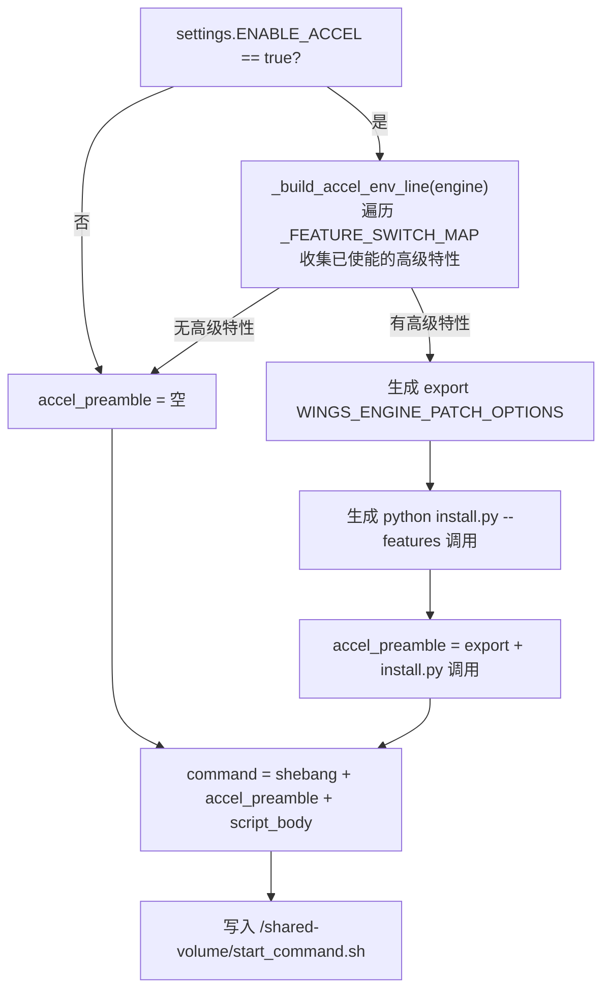

#### wings-accel层面

wings-accel 是一个轻量级 Alpine initContainer 镜像，职责是将补丁文件传递到共享卷。

**目录结构**：

```
wings-accel/
├── Dockerfile                  # Alpine 3.18 基础镜像，WORKDIR=/accel
├── build-accel-image.sh        # 构建脚本 → wings-accel:<TAG>
├── install.py                  # 补丁安装入口（Python），接收 --features JSON 参数
├── install.sh                  # 旧安装入口（保留向后兼容）
├── supported_features.json     # 特性声明（引擎→版本→补丁列表）
└── wings_engine_patch/
    └── install.sh              # 底层安装：pip install *.whl
```

**① 保证特性脚本可用**

- `Dockerfile` 中显式 `chmod +x` `install.py` 和两个 `install.sh`，确保运行时有执行权限

- `supported_features.json` 声明每个引擎版本支持的补丁列表，供验证和管理使用：

  ```json
  {
    "vllm":   { "0.12.0": ["speculative_decode", "sparse_kv", "lmcache_offload", "soft_fp8", "soft_fp4"] },
    "sglang": { "0.4.0":  ["speculative_decode", "sparse_kv"] },
    "mindie": { "1.0.0":  ["speculative_decode"] }
  }
  ```

**② 安装链路**

initContainer 阶段（K8s Pod 启动时）：

```
/accel/* → cp -r → /accel-volume/   （initContainer 完成后退出）
```

引擎容器阶段（执行 `start_command.sh` 时）：

```
python /accel-volume/install.py --features "$WINGS_ENGINE_PATCH_OPTIONS"
  → 解析 JSON：提取 engine/version/features
  → 校验 supported_features.json
  → pip install wings_engine_patch/*.whl   （在引擎容器的 Python 环境中安装补丁）
```

**③ 清晰报错**

- `install.py` 在 `start_command.sh` 中包裹在 `if [ -f ... ]` 检测里——若 initContainer 未运行或 `accel-volume` 未挂载，输出 WARNING 日志而不是直接 crash
- `install.py` 解析 `--features` JSON 失败时，输出 ERROR 并以非 0 退出码终止
- `install.py` 校验 `supported_features.json`，不支持的特性输出 WARNING（不阻断安装）
- `pip install *.whl` 若失败，由 `set -euo pipefail` 捕获，引擎启动中止并在容器日志中输出详细错误信息
- 构建脚本 `build-accel-image.sh` 在 Dockerfile 缺失时立即 `exit 1` 并提示 `错误: wings-accel/Dockerfile 不存在`

### 5.3 接口设计

| 接口 | 说明 |
|------|------|
| 加速特性环境变量 | 5 个高级特性开关，`true` / `false` |
| `WINGS_ENGINE_PATCH_OPTIONS` 环境变量 | JSON 格式，自动构建或用户自定义覆盖 |
| `install.py --features <JSON>` | Accel 补丁安装入口，解析 features 后 pip install whl |
| K8s `initContainers` 定义 | `wings-accel` 容器声明（image、volumeMounts） |

### 5.4 数据结构设计

| 数据结构 | 描述 |
|----------|------|
| `_ENGINE_PATCH_KEY_MAP` | `{"vllm": "vllm", "vllm_ascend": "vllm", "sglang": "sglang", "mindie": "mindie"}` |
| `_FEATURE_SWITCH_MAP` | 高级特性开关到 features 名称的映射，如 `{"ENABLE_SPECULATIVE_DECODE": "speculative_decode", ...}` |
| `supported_features.json` | Accel 包自带的特性声明文件 |
| `accel-volume` | K8s emptyDir，initContainer → 引擎容器的补丁传递通道 |

---

## US6 日志汇聚逻辑【重构】

### 6.1 需求背景

**老架构**：单进程模型（`wings.py` 直接 `subprocess.Popen` 启动引擎），引擎 stdout 通过管道自然汇聚到 wings 进程输出中，日志天然一体。

**新架构痛点**：Sidecar 三容器（initContainer + 控制容器 + 引擎容器），每个容器有独立 stdout/stderr：

| 痛点 | 说明 |
|------|------|
| 日志分散 | 需 `kubectl logs -c <name>` 逐容器查看，无法一屏看全 |
| 格式不统一 | wings-control 是 Python logging，engine 是引擎原生格式，initContainer 是 echo |
| 无文件持久化 | 容器 stdout 仅保留在 kubelet 节点日志中，容器重启后 Pod 内无本地日志可查 |
| 分布式日志隔离 | StatefulSet 多 Pod 跨节点，kubectl 只能逐 Pod 查看 |

**目标**：
1. **方便打屏** — `kubectl logs --all-containers` 即可聚合查看，格式统一
2. **保存本地静态日志** — Pod 内 `/var/log/wings/` 共享卷，任一容器 `tail -f *.log` 聚合查看，支持持久化

### 6.2 实现设计

#### 老 wings 对比

老 wings 单进程模型，wings.py 直接 subprocess 启动引擎，引擎日志通过 stdout 管道自然汇聚到 wings 进程输出中。

#### 重构后方案

**不做跨容器日志搬运**，依赖 K8s 原生容器日志机制 + 共享日志卷双通道：

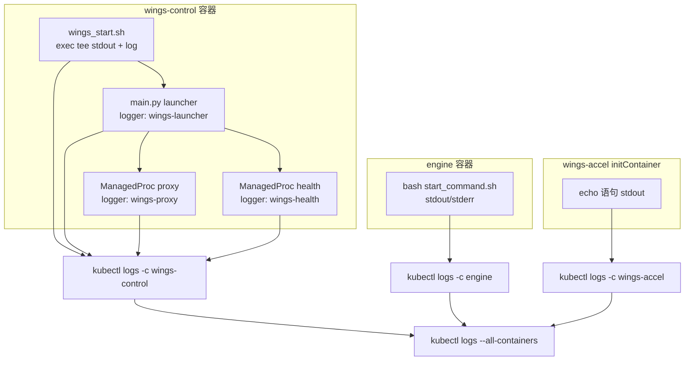

#### 统一日志格式（`utils/log_config.py`）

所有 Python 组件使用统一格式：
```
%(asctime)s [%(levelname)s] [%(name)s] %(message)s
```

输出示例：
```
2026-03-12 10:00:00 [INFO] [wings-launcher] start command written: /shared-volume/start_command.sh
2026-03-12 10:00:01 [INFO] [wings-proxy] Reason-Proxy is starting on 0.0.0.0:18000
2026-03-12 10:00:02 [WARNING] [wings-health] health_monitor_error: ...
```

#### `kubectl logs --all-containers` 查看效果

K8s 自动添加容器名前缀，结合统一的 `[%(name)s]` 组件标签：
```
[wings-control] 2026-03-12 10:00:00 [INFO] [wings-launcher] start command written
[wings-control] 2026-03-12 10:00:01 [INFO] [wings-proxy] Reason-Proxy is starting
[engine]        INFO 03-12 10:00:02 api_server.py:xxx] vLLM engine started
[wings-control] 2026-03-12 10:00:03 [INFO] [wings-health] Health monitor loop enabled
```

#### 日志噪声过滤

| 模块 | 过滤内容 | 机制 |
|------|---------|------|
| `noise_filter.py` | `/health` 探针、`Prefill/Decode batch` 噪声、pynvml 警告 | logging.Filter + sys.stdout/stderr 包装 |
| `speaker_logging.py` | 多 worker 日志抑制、uvicorn.access、/health 出入站 | speaker 决策 + _DropByRegex Filter |

#### 日志文件持久化（现状）

Shell 层面 `wings_start.sh` 通过 `exec > >(tee -a "$LOG_FILE") 2>&1` 将全部输出
同时写入 `/var/log/wings/wings_start.log`（5 副本滚动），**但该路径未挂载持久卷，
容器重启后丢失**。Python 层面**无** `RotatingFileHandler`，所有日志仅输出到 stderr。

#### 待实现：共享日志卷 + RotatingFileHandler

`kubectl logs --all-containers` 是**客户端聚合**（kubectl 分别请求各容器日志流，合并显示），Pod 内部无法直接访问其他容器的 stdout。要在 Pod 内部获取聚合日志，需要通过共享卷方案：

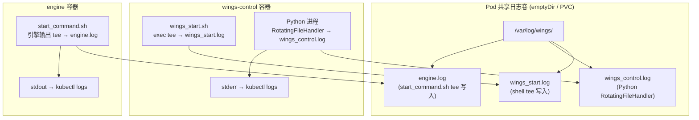

#### 实现要点

| 层级 | 改动 | 说明 |
|------|------|------|
| `log_config.py` | 添加 `RotatingFileHandler` | `LOG_FILE_PATH=/var/log/wings/wings_control.log`，50MB × 5 副本 |
| `wings_entry.py` | 引擎命令追加 `tee` | `python3 -m vllm... 2>&1 \| tee -a /var/log/wings/engine.log` |
| K8s 模板 | 添加 `log-volume` (emptyDir) | wings-control 和 engine 都挂载到 `/var/log/wings` |
| 持久化（可选） | `emptyDir` → `hostPath` 或 `PVC` | 容器重启后保留日志 |

#### 日志保存逻辑和位置

使用共享日志卷后，`/var/log/wings/` 目录由 wings-control 和 engine 两个容器共享读写。各日志文件的写入逻辑和保存内容如下：

| 日志文件 | 写入者/机制 | 保存内容 | 滚动策略 |
|---------|-----------|---------|---------|
| `wings_start.log` | `wings_start.sh` 的 `exec > >(tee -a)` | wings-control 整个 shell 进程的 stdout/stderr（涵盖 Python 输出、pip 输出、shell echo、报错 traceback 等所有内容） | 按时间戳备份，保留最近 5 个（shell 层 `ls -t \| tail +6 \| xargs rm`） |
| `wings_control.log` | Python `RotatingFileHandler` | wings-launcher（启动命令生成）、wings-proxy（反向代理请求转发）、wings-health（健康检查循环）3 个组件的**结构化日志** | 50MB 自动滚动，保留 5 个备份（`wings_control.log.1` ~ `.5`） |
| `engine.log` | `start_command.sh` 中 `tee -a` | 推理引擎全部 stdout/stderr（模型加载进度、推理请求处理、GPU 显存/性能指标、vLLM/SGLang/MindIE 原生日志、Accel 补丁安装输出） | 无自动滚动（引擎原生输出不经过 Python logging） |

> **`wings_start.log` 与 `wings_control.log` 的关系**：`wings_start.log` 是 shell 层的全量镜像（⊃ `wings_control.log`），包含 Python 之外的输出。`wings_control.log` 是 Python 层的结构化子集，格式统一、可解析，适合日志平台采集。

**写入时序**：

```
Pod 启动
├─ wings-accel initContainer → echo 日志 → stdout（不写文件）
│
├─ wings-control 容器启动
│   ├─ wings_start.sh
│   │   ├─ mkdir -p /var/log/wings/
│   │   └─ exec > >(tee -a /var/log/wings/wings_start.log) 2>&1  ← 开始写
│   ├─ python -m app.main
│   │   ├─ setup_root_logging()
│   │   │   └─ RotatingFileHandler(/var/log/wings/wings_control.log)  ← 开始写
│   │   ├─ build_launcher_plan() → 写 start_command.sh
│   │   ├─ 启动 proxy 子进程 → 日志通过 wings-proxy logger → 同文件
│   │   └─ 启动 health 子进程 → 日志通过 wings-health logger → 同文件
│
└─ engine 容器启动
    ├─ 等待 start_command.sh
    └─ bash start_command.sh
        ├─ export WINGS_ENGINE_PATCH_OPTIONS=...
        ├─ python install.py --features ... (输出到 tee)
        └─ python3 -m vllm... 2>&1 | tee -a /var/log/wings/engine.log  ← 开始写
```

**日志卷的最终目录结构**：

```
/var/log/wings/                         ← 共享卷挂载点
├── wings_start.log                     ← 当前 shell 日志
├── wings_start.log.2026-03-14_10-00-00 ← 备份 1（上次启动）
├── wings_start.log.2026-03-14_09-00-00 ← 备份 2
├── wings_control.log                   ← 当前 Python 日志
├── wings_control.log.1                 ← 滚动备份 1（最近 50MB）
├── wings_control.log.2                 ← 滚动备份 2
└── engine.log                          ← 引擎全部输出（持续追加）
```

Pod 内查看聚合日志：
```bash
# 任一容器内执行
tail -f /var/log/wings/*.log          # 聚合查看
tail -f /var/log/wings/engine.log     # 单看引擎
cat /var/log/wings/wings_control.log | grep wings-proxy  # 只看代理日志
```

#### 重构改动清单

| 文件 | 改动 |
|------|------|
| `utils/log_config.py` | **新建** — 统一格式常量 + `setup_root_logging()`；**待增** `RotatingFileHandler` 写入 `/var/log/wings/wings_control.log` |
| `main.py` | 改用 `setup_root_logging()` + `LOGGER_LAUNCHER`，移除冗余 `[launcher]` 前缀 |
| `proxy/proxy_config.py` | 改用 `setup_root_logging()` + `LOGGER_PROXY`，替换独立 `basicConfig` |
| `proxy/speaker_logging.py` | `_ensure_root_handler()` 使用统一格式 |
| `proxy/health_service.py` | 增加 `LOGGER_HEALTH` 独立 logger，替代共用 `C.logger` |
| `wings_start.sh` | 移除死代码 `LAUNCHER_LOG_FILE` / `WINGS_PROXY_LOG_FILE` |
| K8s 模板 | **待增** `log-volume` (emptyDir) 挂载到 `/var/log/wings`，wings-control + engine 共享 |
| `wings_entry.py` | **待增** 引擎命令追加 `tee -a /var/log/wings/engine.log` |

#### 分布式场景下的日志

分布式模式下每个节点是独立 Pod（StatefulSet），每个 Pod 内部仍是三容器结构。跨 Pod 日志无法通过共享卷聚合：

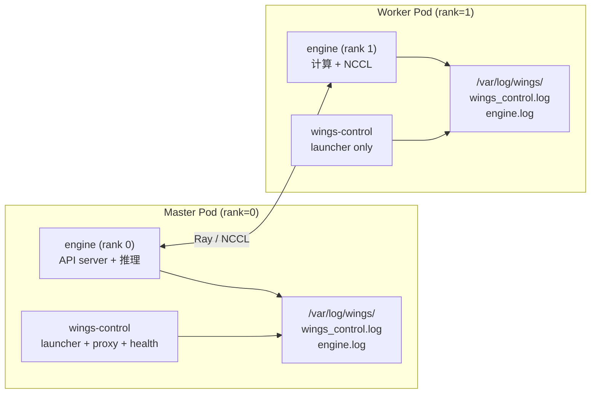

| 维度 | Master Pod (rank=0) | Worker Pod (rank≥1) |
|------|--------------------|--------------------|
| wings-control 日志 | launcher + proxy + health 完整流程 | launcher 完整流程，**无** proxy/health |
| engine 日志 | API server + 推理请求日志 | 计算任务 + NCCL 通信日志 |
| `/var/log/wings/` | 3 个日志文件（完整） | 2 个日志文件（engine 内容不同） |

跨节点日志查看方式：

| 方式 | 命令/工具 | 适用场景 |
|------|---------|---------|
| kubectl 逐 Pod | `kubectl logs sts/my-infer-0 --all-containers` | 调试 |
| stern 按 label | `stern -l app=my-infer --all-containers` | 开发环境 |
| NFS 共享存储 | 所有 Pod `log-volume` 挂同一 NFS，按 Pod 名子目录隔离 | 日志集中存储 |
| EFK/Loki | fluentbit 采集 → Elasticsearch/Loki → 可视化查询 | 生产环境 |

现有分布式日志能力：
- `speaker_logging.py` 的 `LOG_INFO_SPEAKERS` 控制 worker 只输出 WARNING+，减少日志量
- `main.py` 的 `_determine_role()` 日志中包含 `role=master/worker` 标识

### 6.3 接口设计

**外部查看接口（kubectl）**：

| 接口 | 说明 |
|------|------|
| `kubectl logs <pod> -c wings-control` | 查看控制层日志（launcher + proxy + health） |
| `kubectl logs <pod> -c engine` | 查看引擎日志 |
| `kubectl logs <pod> -c wings-accel` | 查看 initContainer 日志（仅启动阶段） |
| `kubectl logs <pod> --all-containers` | 查看全部容器日志（客户端聚合） |
| `kubectl logs <pod> --all-containers -f` | 实时跟踪全部日志 |
| `stern -l app=my-infer --all-containers` | 跨 Pod 聚合（需安装 stern） |

**Pod 内部查看接口（共享日志卷）**：

| 接口 | 说明 |
|------|------|
| `tail -f /var/log/wings/*.log` | 聚合查看全部日志文件 |
| `tail -f /var/log/wings/engine.log` | 单独查看引擎日志 |
| `cat /var/log/wings/wings_control.log \| grep wings-proxy` | 按组件过滤 |
| `ls -lh /var/log/wings/` | 查看日志文件大小和备份数 |

**环境变量配置接口**：

| 环境变量 | 默认值 | 说明 |
|---------|-------|------|
| `LOG_FILE_PATH` | `/var/log/wings/wings_control.log` | Python 日志文件路径 |
| `NOISE_FILTER_DISABLE` | `0`（启用过滤） | 设为 `1` 关闭噪声过滤 |
| `LOG_INFO_SPEAKERS` | 空（全 worker 输出 INFO） | 逗号分隔的 worker 索引，仅这些 worker 的 INFO 级别日志会输出 |

### 6.4 数据结构设计

**已有常量（`log_config.py`）**：

| 数据结构 | 描述 |
|----------|------|
| `LOG_FORMAT` | `"%(asctime)s [%(levelname)s] [%(name)s] %(message)s"` |
| `LOGGER_LAUNCHER` | logger name = `"wings-launcher"` |
| `LOGGER_PROXY` | logger name = `"wings-proxy"` |
| `LOGGER_HEALTH` | logger name = `"wings-health"` |
| `setup_root_logging()` | 统一初始化 root logger 格式和 handler |

**待新增常量**：

| 数据结构 | 描述 |
|----------|------|
| `LOG_FILE_PATH` | 环境变量，默认 `/var/log/wings/wings_control.log` |
| `LOG_MAX_BYTES` | `50 * 1024 * 1024`（50MB） |
| `LOG_BACKUP_COUNT` | `5`（保留 5 个备份文件） |
| `RotatingFileHandler` | `setup_root_logging()` 中新增，写入 `LOG_FILE_PATH`，`maxBytes=LOG_MAX_BYTES`，`backupCount=LOG_BACKUP_COUNT` |

**K8s 卷定义**：

| 资源 | 名称 | 类型 | 挂载路径 | 说明 |
|------|------|------|---------|------|
| Volume | `log-volume` | `emptyDir: {}` | — | Pod 级别声明 |
| VolumeMount (wings-control) | `log-volume` | — | `/var/log/wings` | Python + shell 写入日志 |
| VolumeMount (engine) | `log-volume` | — | `/var/log/wings` | engine.log 写入 + 读取其他日志 |

---

## US7 RAG 二级推理【继承】

### 7.1 需求背景
RAG 场景下长文档推理需要 Map-Reduce 分块并行策略，提升长上下文处理效率。

### 7.2 实现设计

**触发条件**（`ENABLE_RAG_ACC=true` 时）：
1. 请求包含 `<|doc_start|>` / `<|doc_end|>` 标签
2. 文本长度 ≥ 2048 字符
3. 文档块数量 ≥ 3

**处理流程**：

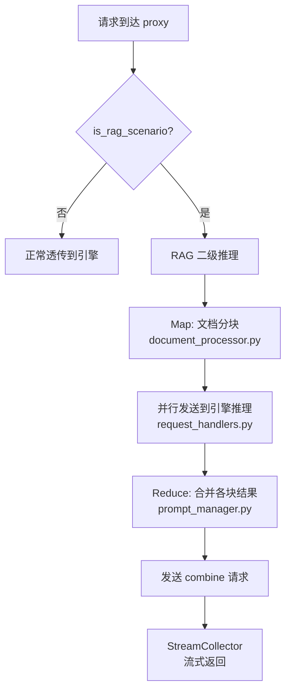

**继承状态**: 100% 继承，8 个文件完全一致：

**与引擎层的关系**：

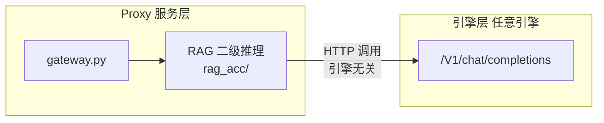

**引擎无关性**: RAG 模块通过 HTTP 调用引擎的 `/v1/chat/completions` API，不依赖任何引擎特定接口。四个引擎均支持。

**跳过机制**：请求体包含 `/no_rag_acc` 即可强制跳过。

### 7.3 接口设计

与解耦前保持一致

### 7.4 数据结构设计

与解耦前保持一致

---

## US8 MindIE 分布式长上下文【新增】

### 8.1 需求背景
DeepSeek 满血模型在 MindIE 分布式场景下，当输入输出总长度超过阈值时，需要启用四维并行策略支持长上下文。

### 8.2 实现设计

**触发条件**（三个同时满足）：

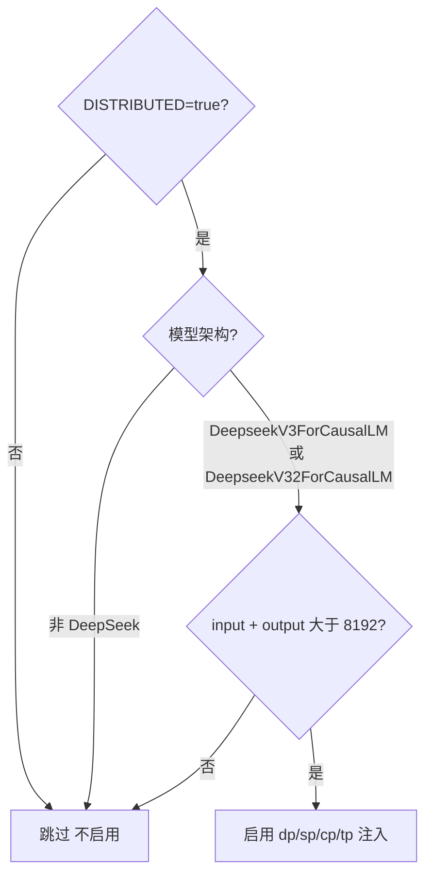

**注入参数**（四维并行策略）：

| 参数 | 环境变量 | 默认值 | 含义 |
|------|---------|--------|------|
| dp | `MINDIE_DS_DP` | 1 | 数据并行 |
| sp | `MINDIE_DS_SP` | 8 | 序列并行 |
| cp | `MINDIE_DS_CP` | 2 | 上下文并行 |
| tp | `MINDIE_DS_TP` | 2 | 张量并行 |

**配置流转图**：

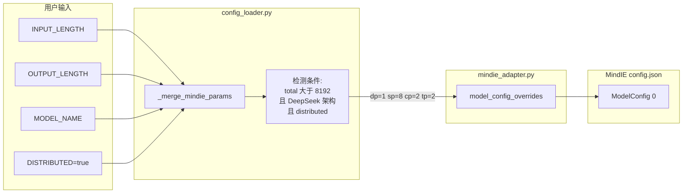

**注入方式**：通过 `_merge_mindie_params()` 在 `config_loader.py` 中将参数写入，再由 `mindie_adapter.py` 透传到 MindIE 的 config.json（走 adapter 的 inline-Python merge 机制）。

**已实现的代码**：

```python
# config_loader.py — _merge_mindie_params()
_LONG_CTX_THRESH = int(os.getenv("MINDIE_LONG_CONTEXT_THRESH", "8192"))

if (ctx.get('distributed')
        and model_architecture in ["DeepseekV3ForCausalLM", "DeepseekV32ForCausalLM"]
        and total_seq_len > _LONG_CTX_THRESH):
    params['dp'] = int(os.getenv("MINDIE_DS_DP", "1"))
    params['sp'] = int(os.getenv("MINDIE_DS_SP", "8"))
    params['cp'] = int(os.getenv("MINDIE_DS_CP", "2"))
    params['tp'] = int(os.getenv("MINDIE_DS_TP", "2"))
```

```python
# mindie_adapter.py — 透传到 ModelConfig[0]
if engine_config.get("sp") is not None:
    model_config_overrides["sp"] = engine_config["sp"]
if engine_config.get("cp") is not None:
    model_config_overrides["cp"] = engine_config["cp"]
# dp/tp: 非 MOE 模型时从 US8 注入
if engine_config.get("dp") is not None and not engine_config.get("isMOE", False):
    model_config_overrides["dp"] = engine_config["dp"]
```

**最终生成的 config.json 片段**：

```json
{
  "BackendConfig": {
    "ModelDeployConfig": {
      "maxSeqLen": 16384,
      "ModelConfig": [{
        "modelName": "DeepSeek-R1",
        "modelWeightPath": "/weights/DeepSeek-R1",
        "worldSize": 8,
        "dp": 1,
        "sp": 8,
        "cp": 2,
        "tp": 2,
        "trustRemoteCode": true
      }]
    }
  }
}
```

**注意**：`multiNodesInferEnabled` 对单个 daemon 实例设为 `false`，跨节点协调由上层 `ms_coordinator/ms_controller` 处理。

### 8.3 接口设计

| 接口 | 说明 |
|------|------|
| `MINDIE_LONG_CONTEXT_THRESH` | 长上下文触发阈值，默认 `8192` |
| `MINDIE_DS_DP` / `MINDIE_DS_SP` / `MINDIE_DS_CP` / `MINDIE_DS_TP` | 四维并行参数环境变量，默认 `1/8/2/2` |
| `INPUT_LENGTH` + `OUTPUT_LENGTH` | 序列总长度来源 |
| `config.json` → `ModelConfig[0]` | 注入目标：MindIE 引擎配置文件 |

### 8.4 数据结构设计

| 数据结构 | 描述 |
|----------|------|
| `_LONG_CTX_THRESH` | 长上下文阈值，默认 8192 |
| `model_config_overrides` | 注入 dp/sp/cp/tp 的 dict，透传到 MindIE config.json |
| MindIE config.json 目标路径 | `BackendConfig.ModelDeployConfig.ModelConfig[0]` |