> 遗留
> 1。accel使能逻辑，完备
> 2.~~日志汇聚逻辑，以方便打屏，同时保存本地静态日志~~ ✅ 已实现（RotatingFileHandler + 噪声过滤 + speaker 多 worker 日志控制）
> 3.页面json传参逻辑:指定开关和引擎字段后，允许命令直接转换，跳过wingscontral的参数解析逻辑，直接透传给引擎，这里透传的只局限于引擎参数，
> 目录结构，调整。ST场景下，ray的版本。
> 硬件检测的逻辑，我不能够本地使用的逻辑


## US1 统一对外引擎命令【继承+新增】

### 1.1 需求背景

用户面对 vLLM/SGLang/MindIE/vLLM-Ascend 四个引擎时，每个引擎的启动参数名称和格式各不相同，增加使用门槛。
此外，MaaS 页面需要"页面 JSON 透传"能力：指定开关和引擎字段后，允许命令直接转换，跳过 wings-control 的参数解析逻辑，直接透传给引擎。

#### 核心诉求

| 诉求 | 说明 |
|------|------|
| 参数统一 | wings-control 提供 38 个标准化 CLI/ENV 参数，屏蔽各引擎差异 |
| JSON 透传 | 通过 `--config-file` / `CONFIG_FILE` 传入引擎原生参数的 JSON，直接穿透到引擎命令行或配置文件 |
| 跳过默认合并 | `CONFIG_FORCE=true` 开关可跳过系统四层配置合并，用户 JSON 完全独占 |

### 1.2 实现设计

#### wings-control 层面

**解耦前**（老 wings）：wings.py 单文件 → 直接 subprocess 拉引擎 → 参数硬编码在各引擎 adapter 中。

```python
# old engine_manager.py — 动态加载 adapter 并在本容器内直接启动引擎
def start_engine_service(params):
    engine_name = params["engine"]
    adapter_module = importlib.import_module(  # 动态导入 adapter 模块
        f"wings.engines.{engine_name}_adapter"
    )
    adapter_module.start_engine(params)        # adapter 内部调用 subprocess.Popen
```

**解耦后**（wings-control）：

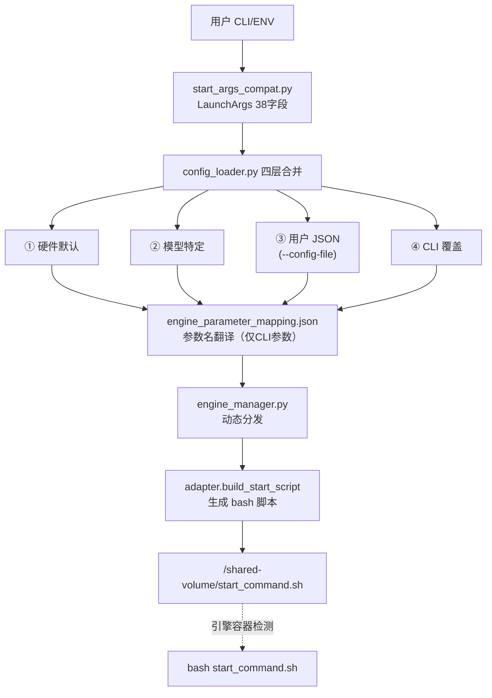

```python
# 解耦版本 main.py — 脚本生成 + 共享卷传递（简化示意）
# 1. 解析 CLI 参数
launch_args = parse_known_args(sys.argv)       # → LaunchArgs dataclass

# 2. 配置合并 + 脚本生成（build_launcher_plan 内部调用链）:
#    load_and_merge_configs() → engine_manager.start_engine_service()
#    → adapter.build_start_script(params)
launcher_plan = build_launcher_plan(launch_args, port_plan)

# 3. 写入共享卷
_write_start_command(launcher_plan.command)
#    → safe_write_file("/shared-volume/start_command.sh", script)

# 4. 启动 proxy + health 子进程
procs = _build_processes(port_plan)
# → [ManagedProc("proxy", ...), ManagedProc("health", ...)]
```

**命令统一映射表**：

| 引擎 | 入口命令 | 参数格式 |
|------|----------|----------|
| vllm | `python3 -m vllm.entrypoints.openai.api_server` | `--key value` |
| vllm (DP) | `vllm serve <model>` | `--key value` |
| vllm_ascend | 同 vllm（+ CANN 环境初始化） | `--key value` |
| sglang | `python3 -m sglang.launch_server`（老版本用 `python`） | `--key value` |
| mindie | `./bin/mindieservice_daemon` | JSON 配置文件 |

#### 页面 JSON 透传逻辑

##### config-file 输入方式

`--config-file` 参数（或环境变量 `CONFIG_FILE`）支持两种输入格式：

| 格式 | 示例 | 判断逻辑 |
|------|------|---------|
| **内联 JSON 字符串** | `--config-file '{"tensor_parallel_size": 4}'` | 以 `{` 开头 `}` 结尾 → `json.loads()` |
| **文件路径** | `--config-file /path/to/config.json` | 非 JSON → `os.path.exists()` → `load_json_config()` |

代码位置：`config_loader.py` `_load_user_config()` 函数。

##### 四层配置合并流程

配置合并在 `load_and_merge_configs()` 中完成，分为两条路径：

**路径 A：标准合并（默认，`CONFIG_FORCE=false`）**

```
① engine_specific_defaults = 硬件默认 + 模型默认 + CLI→mapping翻译
② engine_config = deep_merge(engine_specific_defaults, user_config)   ← user_config 覆盖同名key
③ cmd_known_params['engine_config'] = engine_config
```

- user_config 中的同名 key **覆盖**系统默认值
- user_config 中的新增 key **保留**到 engine_config
- 系统默认参数中 user_config 未指定的 key 仍然**保留**（不可删除）

**路径 B：强制覆盖（`CONFIG_FORCE=true`）**

```
① engine_config = user_config                     ← 跳过所有默认配置
② cmd_known_params['engine_config'] = engine_config
```

- 完全跳过 `_get_model_specific_config()`，不加载硬件默认和模型默认
- 用户 JSON 独占 engine_config，100% 透传
- 用户 JSON 必须包含所有引擎必需参数（如 `model`、`host`、`port`），否则引擎启动失败

关键代码：

```python
# config_loader.py load_and_merge_configs()
if user_config and get_config_force_env():
    engine_config = user_config                                    # 路径B
else:
    engine_specific_defaults = _get_model_specific_config(...)     # 路径A
    engine_config = _merge_configs(engine_specific_defaults, user_config)
```

##### mapping 翻译规则

参数名翻译（`engine_parameter_mapping.json`）**仅作用于 CLI/ENV 的 38 个字段**，在 `_set_common_params()` 中执行：

```python
# 只翻译 CLI 参数（engine_cmd_parameter），不翻译 user_config
for key, value in vllm_param_map.items():
    if value and engine_cmd_parameter.get(key) is not None:
        params[value] = engine_cmd_parameter.get(key)
```

**user_config（来自 config-file）的 key 不经过 mapping 翻译**，原样进入 engine_config。因此 config-file 中必须使用引擎原生字段名：

| 写法 | vLLM 是否生效 | 原因 |
|------|-------------|------|
| `{"served_model_name": "qwen"}` | ✅ | 引擎原生名，adapter 转为 `--served-model-name` |
| `{"model_name": "qwen"}` | ❌ | wings 统一名，不翻译，vLLM 不认识 `--model-name` |

##### 各引擎 adapter 消费 engine_config 的方式

**vLLM / SGLang**：遍历 engine_config 全部 key，无差别转为 CLI 参数。

```python
# vllm_adapter.py _build_vllm_cmd_parts()
for arg, value in engine_config.items():
    arg_name = f"--{arg.replace('_', '-')}"    # snake_case → --kebab-case
    if isinstance(value, bool):
        if value: cmd_parts.append(arg_name)   # True → --flag
    elif ...:  # JSON dict → 单引号包裹
    else:
        cmd_parts.extend([arg_name, shlex.quote(str(value))])
```

✅ engine_config 中的**任意 key** 都会出现在最终命令中。

**MindIE**：从 engine_config 中 `.get()` 固定 key 列表，组装5个 overrides 子块写入 `conf/config.json`。**不在列表内的 key 作为 extra 追加到 config.json 根级别。**

```python
# mindie_adapter.py build_start_script()
server_overrides = {
    "port": engine_config.get("port", 18000),
    "tokenTimeout": engine_config.get("tokenTimeout", 600),
    ...  # 固定 key 列表
}
# 收集未被消费的 key，追加到 config.json 根级别
extra_overrides = {k: v for k, v in engine_config.items() if k not in _consumed_keys}
overrides_dict = {
    "server": server_overrides, ...,
    "extra": extra_overrides,   # ← 新增：透传未知参数
}
```

MindIE adapter 的固定 key 列表（写入对应 config.json 节点）：

| 分组 | 支持的 key | 写入位置 |
|------|-----------|---------|
| ServerConfig | `ipAddress`, `port`, `httpsEnabled`, `inferMode`, `openAiSupport`, `tokenTimeout`, `e2eTimeout`, `allowAllZeroIpListening`, `interCommTLSEnabled` | `config['ServerConfig']` |
| BackendConfig | `npuDeviceIds`, `multiNodesInferEnabled`, `interNodeTLSEnabled` | `config['BackendConfig']` |
| ModelDeployConfig | `maxSeqLen`, `maxInputTokenLen`, `truncation` | `config['BackendConfig']['ModelDeployConfig']` |
| ModelConfig | `modelName`, `modelWeightPath`, `worldSize`, `cpuMemSize`, `npuMemSize`, `trustRemoteCode`, `tp`, `dp`, `moe_tp`, `moe_ep`, `sp`, `cp`, `isMOE`, `isMTP` | `config['BackendConfig']['ModelDeployConfig']['ModelConfig'][0]` |
| ScheduleConfig | `cacheBlockSize`, `maxPrefillBatchSize`, `maxPrefillTokens`, `prefillTimeMsPerReq`, `prefillPolicyType`, `decodeTimeMsPerReq`, `decodePolicyType`, `maxBatchSize`, `maxIterTimes`, `maxPreemptCount`, `supportSelectBatch`, `maxQueueDelayMicroseconds`, `bufferResponseEnabled`, `decodeExpectedTime`, `prefillExpectedTime` | `config['BackendConfig']['ScheduleConfig']` |
| 其他 | `npu_memory_fraction` | 环境变量 `NPU_MEMORY_FRACTION` |
| **extra（新增）** | **不在以上列表中的任意 key** | **`config` 根级别** |

##### 透传能力矩阵

| 场景 | vLLM/SGLang 透传 | MindIE 透传 | 说明 |
|------|-----------------|-------------|------|
| `CONFIG_FORCE=true` + config-file | 100%（全部转 CLI 参数） | 固定列表 key → 对应节点；其余 key → config.json 根级别 | 跳过系统默认合并 |
| `CONFIG_FORCE=false` + config-file | 部分（默认参数仍注入） | 同上 | user_config 覆盖+新增，默认参数保留 |
| 仅 CLI/ENV（38字段） | 无透传 | 无透传 | 只支持预定义字段 |

##### config-file 约束规范

| 约束 | 说明 | 影响范围 |
|------|------|---------|
| **必须使用引擎原生参数名** | user_config 不经过 mapping 翻译，wings 统一名（如 `model_name`）不会被转为引擎原生名（如 `served_model_name`） | 全部引擎 |
| **不能透传环境变量** | config-file 中的参数只会变成 CLI 参数或写入 config.json，不会在引擎启动前 `export` 为环境变量 | 全部引擎 |
| **38 字段之外的 ENV 不被处理** | wings-control 只读取 `start_args_compat.py` 中硬编码声明的环境变量 | 全部引擎 |
| **`CONFIG_FORCE=true` 要求用户 JSON 完整** | 不走默认合并，缺少基础参数（`model`、`host`、`port` 等）会导致引擎启动失败 | 全部引擎 |
| **JSON 格式严格** | config-file 必须是合法 JSON，key 必须是字符串，不支持注释 | 全部引擎 |
| **空字符串参数被跳过** | adapter 跳过值为空字符串的参数，避免生成残缺命令 | vLLM/SGLang |
| **布尔值 false 被跳过** | vLLM/SGLang adapter 中 `bool=False` 不输出 flag | vLLM/SGLang |
| **安全转义** | 非 JSON 字符串值通过 `shlex.quote()` 防注入 | vLLM/SGLang |
| **MindIE extra key 写入根级别** | 不在固定列表中的 key 追加到 config.json 根级别，如需写入特定节点（如 `ScheduleConfig`）须使用对应的原生 key 名 | MindIE |
| **嵌套 dict 值需使用 JSON 字符串** | config-file 中的 dict 类型值会被保留为 Python dict 对象；vLLM/SGLang adapter 只识别字符串形式的 JSON（如 `"{\"type\": \"dynamic\"}"`），dict 对象会被 `str()` 转为 Python repr 格式导致引擎解析失败。正确做法：将嵌套 JSON 序列化为字符串 | vLLM/SGLang |

##### 全链路样例（vLLM）

K8s 部署配置：

```yaml
env:
  - name: ENGINE
    value: "vllm"
  - name: MODEL_PATH
    value: "/weights/Qwen2.5-7B"
  - name: MODEL_NAME
    value: "qwen2.5-7b"
  - name: CONFIG_FILE
    value: '{"gpu_memory_utilization": 0.85, "rope_scaling": "{\"type\": \"dynamic\", \"factor\": 2.0}", "enable_prefix_caching": true}'
```

**Step 1** — CLI 解析：`CONFIG_FILE` ENV 被 argparse 读取为 `config_file` 字段

**Step 2** — `_load_user_config()`：检测到 JSON 字符串 → `json.loads()`

```python
user_config = {
    "gpu_memory_utilization": 0.85,
    "rope_scaling": "{\"type\": \"dynamic\", \"factor\": 2.0}",
    "enable_prefix_caching": True
}
```

**Step 3** — `_get_model_specific_config()` 生成系统默认（含 CLI 映射后的参数）:

```python
engine_specific_defaults = {
    "model": "/weights/Qwen2.5-7B",             # model_path → model (mapping)
    "served_model_name": "qwen2.5-7b",          # model_name → served_model_name (mapping)
    "host": "0.0.0.0",
    "port": 18000,
    "gpu_memory_utilization": 0.9,              # CLI 默认值
    "tensor_parallel_size": 1,                  # 自动计算
    "max_model_len": 5120,                      # input_length + output_length
    "trust_remote_code": True,
    "enable_prefix_caching": False,             # CLI 默认值
    ...
}
```

**Step 4** — `_merge_configs()` 合并 user_config（后者优先）:

```python
engine_config = {
    "model": "/weights/Qwen2.5-7B",             # ← 系统默认保留
    "served_model_name": "qwen2.5-7b",          # ← 系统默认保留
    "host": "0.0.0.0",                           # ← 系统默认保留
    "port": 18000,                                # ← 系统默认保留
    "gpu_memory_utilization": 0.85,              # ← user_config 覆盖 ✅
    "tensor_parallel_size": 1,                   # ← 系统默认保留
    "max_model_len": 5120,                       # ← 系统默认保留
    "trust_remote_code": True,                   # ← 系统默认保留
    "enable_prefix_caching": True,               # ← user_config 覆盖 ✅
    "rope_scaling": "{...}",                     # ← user_config 新增 ✅
}
```

**Step 5** — `_build_vllm_cmd_parts()` 生成最终命令:

```bash
python3 -m vllm.entrypoints.openai.api_server \
    --model /weights/Qwen2.5-7B \
    --served-model-name qwen2.5-7b \
    --host 0.0.0.0 --port 18000 \
    --gpu-memory-utilization 0.85 \
    --tensor-parallel-size 1 \
    --max-model-len 5120 \
    --trust-remote-code \
    --enable-prefix-caching \
    --rope-scaling '{"type": "dynamic", "factor": 2.0}'
```

#### MaaS 层面

1. **上层需要 `--engine` 参数强制传入**

   ```shell
   bash /app/wings_start.sh \
       --engine vllm \
       --model-name DeepSeek-R1-Distill-Qwen-1.5B \
       --model-path /models/DeepSeek-R1-Distill-Qwen-1.5B \
       --device-count 1 \
       --trust-remote-code
   ```

2. **JSON 透传入口**

   ```shell
   # 方式一：CLI 内联 JSON
   bash /app/wings_start.sh \
       --engine vllm \
       --config-file '{"gpu_memory_utilization": 0.85, "rope_scaling": "..."}'

   # 方式二：环境变量（K8s 推荐）
   env:
     - name: CONFIG_FILE
       value: '{"gpu_memory_utilization": 0.85}'

   # 方式三：JSON 文件路径
   bash /app/wings_start.sh \
       --config-file /path/to/custom_config.json
   ```

3. **完全透传模式**

   ```yaml
   env:
     - name: CONFIG_FORCE
       value: "true"
     - name: CONFIG_FILE
       value: '{"model": "/weights/xxx", "host": "0.0.0.0", "port": 17000, ...全部引擎原生参数}'
   ```

4. **wings-control Containers 分配 /shared-volume 目录，同时继承老版本 containers 所有特性。**

   ```yaml
   - name: wings-control
     volumeMounts:
       - name: shared-volume
         mountPath: /shared-volume
   ```

### 1.3 接口设计

#### CLI/ENV 标准参数（38 字段）

| 接口 | 说明 |
|------|------|
| `start_args_compat.py` CLI 入口 | `--engine`, `--model-path`, `--config-file` 等统一参数 |
| 环境变量入口 | `ENGINE`, `MODEL_PATH`, `CONFIG_FILE` 等，等效于 CLI 参数 |
| `engine_parameter_mapping.json` | 统一参数名 → 各引擎原生参数名的翻译字典（仅翻译 CLI 参数，不翻译 config-file 内容） |
| `/shared-volume/start_command.sh` | 输出产物：生成的 bash 启动脚本 |

#### JSON 透传接口

| 接口 | 说明 |
|------|------|
| `--config-file` / `CONFIG_FILE` | 用户自定义 JSON 参数入口，支持内联 JSON 字符串或文件路径 |
| `CONFIG_FORCE` 环境变量 | `true` 时跳过系统默认合并，用户 JSON 完全独占 engine_config |

### 1.4 数据结构设计

#### LaunchArgs（38 字段，frozen dataclass）

| 分类 | 字段 |
|------|------|
| 基础 | `host`, `port`, `model_name`, `model_path`, `engine`, `config_file`, `model_type`, `save_path` |
| 序列 | `input_length`, `output_length` |
| 硬件 | `gpu_usage_mode`, `device_count` |
| 精度 | `dtype`, `kv_cache_dtype`, `quantization`, `quantization_param_path` |
| 性能 | `gpu_memory_utilization`, `enable_chunked_prefill`, `block_size`, `max_num_seqs`, `seed`, `max_num_batched_tokens` |
| 高级特性 | `trust_remote_code`, `enable_expert_parallel`, `enable_prefix_caching`, `enable_speculative_decode`, `speculative_decode_model_path`, `enable_rag_acc`, `enable_auto_tool_choice`, `enable_sparse`, `lc_sparse_threshold`, `total_budget`, `local_kvstore_capacity` |
| 分布式 | `distributed`, `nnodes`, `node_rank`, `head_node_addr`, `distributed_executor_backend` |

#### engine_config 字典

最终传递给 adapter 的参数字典，来源为四层合并（或 `CONFIG_FORCE` 模式下的 user_config 独占）。vLLM/SGLang 场景下所有 key 透传为 CLI 参数，MindIE 场景下只有 adapter 硬编码列表中的 key 生效。

---

## US2 适配四个引擎【继承】

### 2.1 需求背景
需要同时支持 vLLM、SGLang、MindIE、vLLM-Ascend 四个引擎，每个引擎的启动方式差异大。

### 2.2 实现设计（参数拼接逻辑）


#### wings-ctrol层面
**适配器统一契约**：每个 adapter 实现 `build_start_script(params) → str`，返回 bash 脚本体。

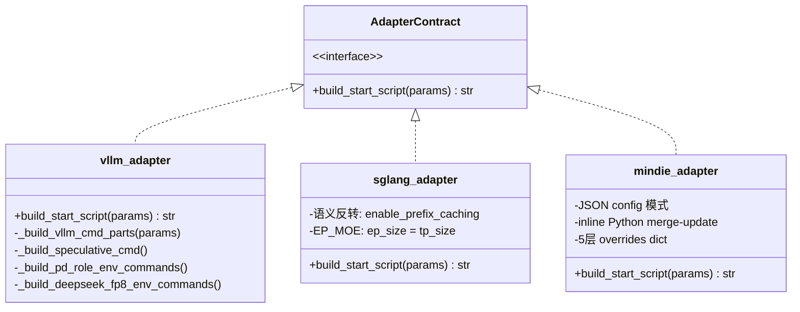

**特定场景参数拼接示例**：

| 场景 | vLLM | SGLang | MindIE |
|------|------|--------|--------|
| GPU 显存占比 | `--gpu-memory-utilization 0.9` | `--mem-fraction-static 0.9` | config.json: `npu_memory_fraction: 0.9` |
| 前缀缓存 | `--enable-prefix-caching` | `--enable-radix-cache` | 不支持(跳过) |
| 量化 | `--quantization awq` | `--quantization awq` | config.json: `quantization: awq` |

**vLLM 参数拼接核心**：

```python
engine_config = {
    "model": "/weights/Qwen2.5-72B",
    "host": "0.0.0.0",
    "port": 17000,
    "tensor_parallel_size": 4,
    "trust_remote_code": True,       # 布尔 True → --trust-remote-code
    "quantization": "",              # 空字符串 → 跳过
    "kv_transfer_config": '{"key": "val"}'  # JSON → 单引号包裹
}
# 输出: python3 -m vllm.entrypoints.openai.api_server \
#   --model /weights/Qwen2.5-72B --host 0.0.0.0 --port 17000 \
#   --tensor-parallel-size 4 --trust-remote-code \
#   --kv-transfer-config '{"key": "val"}'
```

**SGLang 语义反转处理**：

```python
# 输入参数名                → SGLang CLI 参数名
"context_length"            → "context-length"          # 使用 context_length
"enable_prefix_caching"=True → 移除 (SGLang 默认开启)
"enable_prefix_caching"=False→ --disable-radix-cache    # 语义反转
"enable_torch_compile"=True → --enable-torch-compile
"enable_ep_moe"=True        → --ep-size <tp_size>       # EP=TP
```

**MindIE 特殊处理** — 不用 CLI 参数，通过 adapter 生成 inline Python 脚本来 merge-update config.json：

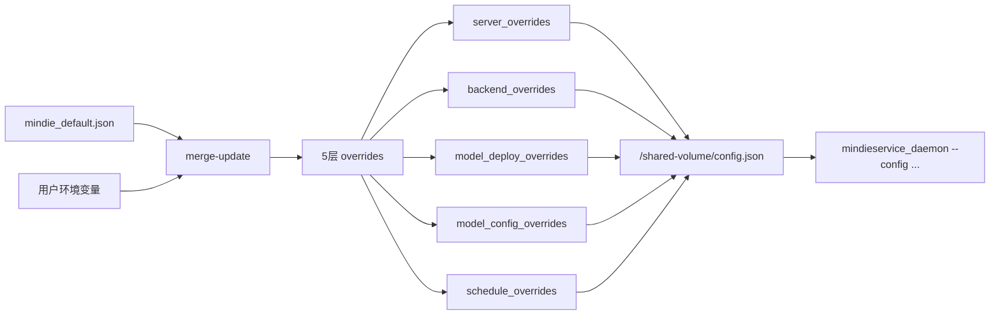

### 2.3 接口设计

与解耦前保持一致

### 2.4 数据结构设计

与解耦前保持一致

---

## US3 单机/分布式【继承】

### 3.1 需求背景
同一套代码需要同时支持单机单卡、单机多卡、多机多卡场景，且两种模式的用户接口应保持一致。

### 3.2 实现设计（逻辑一致性）

#### wings-ctrol层面

**角色判定**（`wings_control.py._determine_role()`）：

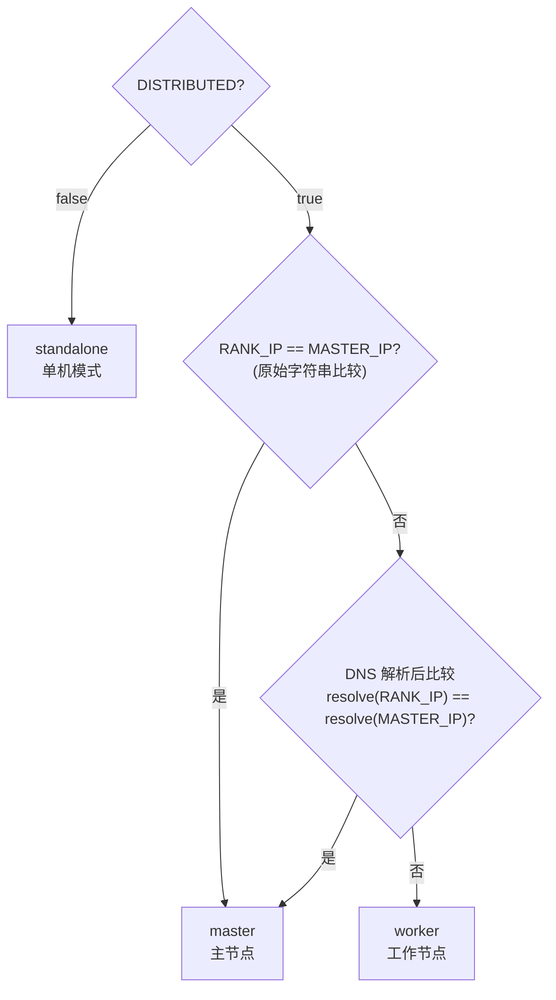

两级判定策略（与老版本 wings 保持一致）：

| 优先级 | 策略 | 说明 |
|--------|------|------|
| 1 | 原始字符串比较 | `RANK_IP == MASTER_IP`，与老版本 `$MASTER_IP = $RANK_IP` 直接比较一致，无 DNS 查询开销。RANK_IP 由上层（MaaS）传入，每个 Pod 唯一 |
| 2 | DNS 解析后比较 | MASTER_IP 为 DNS 名称（如 K8s StatefulSet headless service）时，解析为 IP 后比较 |

**单机模式**：

- `build_launcher_plan()` → 写 `start_command.sh` → 启动 proxy + health → 完成

**分布式模式**：

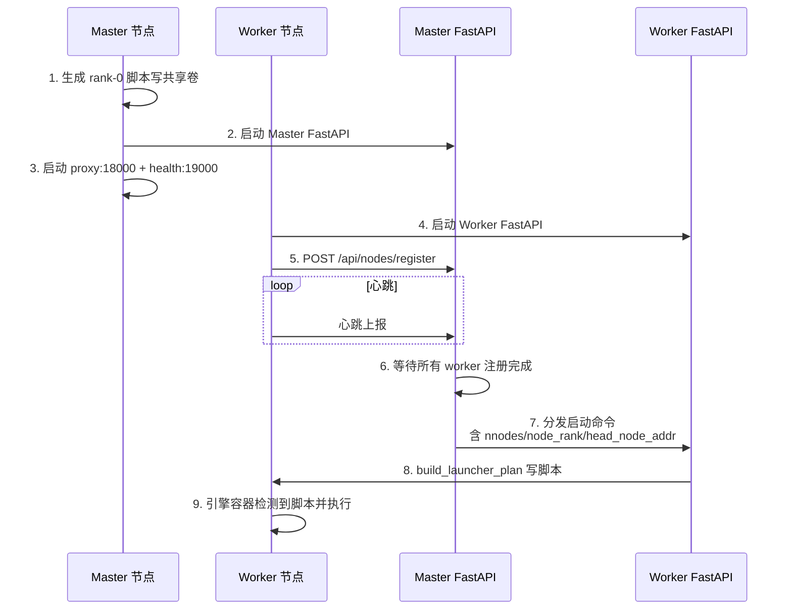

**两者一致性**：都走 `build_launcher_plan()` → 写 `start_command.sh` 的统一流程，区别仅在于 master 多了注册/分发协调层。

**TP 设置逻辑（解耦版本 = 老版本）**：

```python
def _adjust_tensor_parallelism(params, device_count, tp_key, if_distributed=False):
    # 1. 300I A2 PCIe 卡: 强制 TP=4 (4 或 8 张)
    # 2. 默认 TP != device_count: warning + 强制 TP=device_count
    # 3. 其他: TP = device_count
```

**Ray 分布式启动流程**：

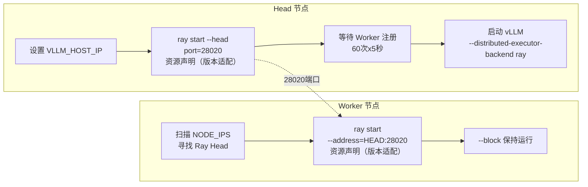

**Ray 资源声明版本适配**（基于 `ENGINE_VERSION` 环境变量）：

| 引擎 | ENGINE_VERSION | 资源声明标志 | 说明 |
|------|---------------|-------------|------|
| vllm (NV) | 任意 | `--num-gpus=1` | NVIDIA 始终使用 GPU 声明 |
| vllm_ascend | >= 0.14 | `--resources='{"NPU": 1}'` | v0.14 起使用自定义 NPU 资源 |
| vllm_ascend | < 0.14 | `--num-gpus={tp_size}` | 兼容 V1 行为 |
| 任意 | 未设置 | 按 0.14 处理 | 默认当前版本 |

可通过 `RAY_RESOURCE_FLAG` 环境变量完全覆盖自动检测结果。

**Triton NPU 补丁**（仅 vllm_ascend >= 0.14）：

v0.14 起 vllm-ascend worker.py 无条件导入 `torch_npu._inductor`，触发 Triton driver 初始化失败（"0 active drivers"）。wings-control 在生成的启动脚本中自动注入补丁代码修复此问题。低版本不存在此问题，跳过补丁。

**`--enforce-eager` 标志**（仅 vllm_ascend >= 0.14）：

绕过 Triton 编译，避免 Ascend NPU 上 Triton 后端缺失导致的运行时错误。低版本无此问题，不添加该标志。

**DP 分布式 (dp_deployment)**：

```bash
# Rank-0 (Head):
exec vllm serve /weights --data-parallel-address infer-0 \
  --data-parallel-rpc-port 13355 --data-parallel-size 2 \
  --data-parallel-size-local 1 --data-parallel-external-lb --data-parallel-rank 0

# Rank-N (Worker):
exec vllm serve /weights --data-parallel-address infer-0 \
  --data-parallel-rpc-port 13355 --data-parallel-size 2 \
  --data-parallel-size-local 1 --data-parallel-external-lb \
  --headless --data-parallel-start-rank N
```

**DeepSeek V3/V32 Ascend DP 特殊处理**：
```python
# DeepseekV3ForCausalLM / DeepseekV32ForCausalLM + vllm_ascend:
dp_size = "4"           # 固定 4 路 DP
dp_size_local = "2"     # 每节点 2 路
dp_start_rank = "2" if node_rank != 0 else "0"
```

**解耦版本 vs 老版本 分布式差异**：

| 项 | 老版本 | 解耦版本 | 状态 |
|----|----|----|------|
| 进程启动 | subprocess.Popen | 脚本→共享卷 | ✅ 设计差异 |
| Ray 端口 | 28020 | 28020 | ✅ 一致 |
| Ray 资源声明 | `--num-gpus` | 版本适配：>= 0.14 `--resources NPU`，< 0.14 `--num-gpus`（兼容 V1） | ✅ 向后兼容 |
| DP 入口 | `vllm serve` | `vllm serve` | ✅ 一致 |
| Triton NPU Patch | 无 | ✅ 有（>= 0.14 条件性注入） | 解耦版本 领先 |
| `--enforce-eager` | 无 | ✅ 有（>= 0.14 条件性添加） | 解耦版本 领先 |
| 崩溃恢复 | 无 | ✅ 有（M5 新增） | 解耦版本 领先 |
| 角色判定 | shell 字符串比较 `$MASTER_IP = $RANK_IP` | 两级策略：RANK_IP vs MASTER_IP 字符串比较 → DNS 解析（与老版本一致） | ✅ 一致 |
| MindIE ranktable | 外部 `RANK_TABLE_PATH` 必须预置 | 首选外部 `RANK_TABLE_PATH`，降级动态生成 | ✅ 向后兼容 |

### 3.3 接口设计

与解耦前保持一致

### 3.4 数据结构设计

与解耦前保持一致

---

## US4 统一服务化【继承】

### 4.1 需求背景
需要对外暴露统一的 OpenAI 兼容 API，屏蔽后端引擎差异。

### 4.2 实现设计

#### wings-control层面
**Proxy 架构**（继承）：

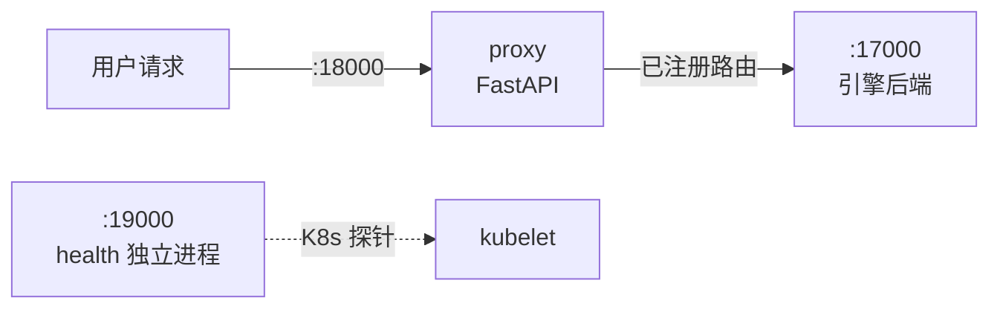

**API 端点清单（11 个对外路径，全部继承）**：

| 路径 | 方法 | 功能 |
|------|------|------|
| `/v1/chat/completions` | POST | 对话补全 |
| `/v1/completions` | POST | 文本补全 |
| `/v1/responses` | POST | Responses API 兼容入口 |
| `/v1/rerank` | POST | 重排序 |
| `/v1/embeddings` | POST | 向量嵌入 |
| `/tokenize` | POST | 分词 |
| **`/metrics`** | **GET** | **指标透传** |
| `/health` | GET / HEAD | 健康检查 |
| `/v1/models` | GET | 模型列表 |
| `/v1/version` | GET | 版本信息 |

> 多模态端点（video/image）已在代码清理中移除

### 4.3 接口设计

除了metrics接口外，与解耦前保持一致

### 4.4 数据结构设计

与解耦前保持一致

---

## US5 Accel 使能逻辑【新增】

### 5.1 需求背景
需要在不修改引擎镜像的前提下，动态注入加速补丁（如算子优化 whl 包）。

### 5.2 实现设计

**三容器协作流程**：

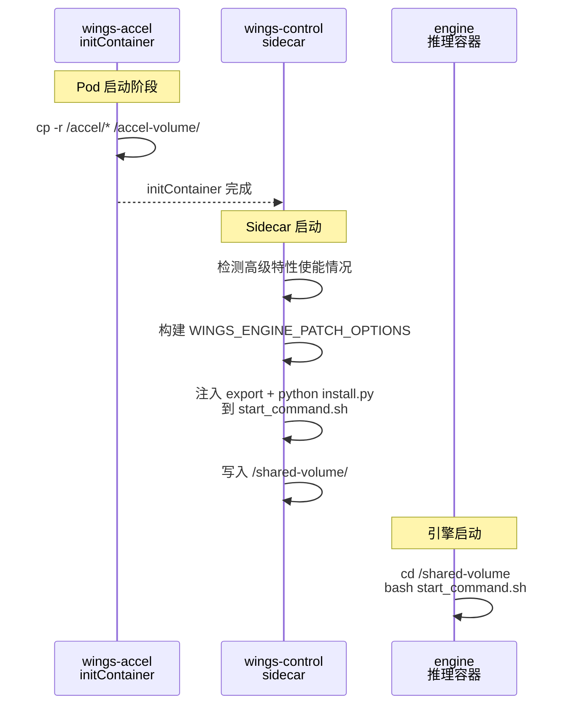

**四个步骤**：

| 步骤 | 执行者 | 动作 |
|------|--------|------|
| ①使能加速特性 | MaaS 用户 | 页面勾选高级特性开关（推测解码、稀疏 KV 等），下发 `ENABLE_ACCEL=true` |
| ②补丁文件拷贝 | initContainer (wings-accel) | Alpine 镜像将 `/accel/*` 整体拷贝到 `accel-volume` 共享卷（Pod 启动前完成） |
| ③环境变量注入 | wings-control (wings_entry.py) | 根据引擎类型、版本和已使能的高级特性，自动构建并注入 `WINGS_ENGINE_PATCH_OPTIONS` 到 `start_command.sh` |
| ④补丁安装+引擎启动 | engine 容器 | 执行 `start_command.sh`：先 `python install.py --features "$WINGS_ENGINE_PATCH_OPTIONS"` 安装补丁，再启动推理引擎 |

#### Maas层面

**1. 传递环境变量**

MaaS 页面下发 YAML 时需传递以下参数：

| 参数 | 说明 | 示例 |
|------|------|------|
| `ENGINE_VERSION` | 引擎版本号，决定 `wings-accel` initContainer 镜像标签，同时控制 Ray 资源声明方式和 Triton 补丁注入 | `0.12.0` |
| 高级特性开关 | 页面上的特性勾选项，对应 `start_args_compat.py` 中的布尔参数 | 见下表 |

MaaS 页面**不直接传递** `WINGS_ENGINE_PATCH_OPTIONS`，该值由 wings-control 内部根据以下信息自动构建：
- `--engine`（引擎类型）→ 确定 patch key
- `ENGINE_VERSION`（引擎版本）→ 填入 version 字段
- 页面高级特性开关 → 确定要激活的 features 列表

**ENGINE_VERSION 的多重用途**：

| 用途 | 消费模块 | 说明 |
|------|---------|------|
| Accel 补丁版本 | `wings_entry.py` | 决定 `WINGS_ENGINE_PATCH_OPTIONS` 中的 version 字段 |
| initContainer 镜像标签 | K8s YAML | `wings-accel:${ENGINE_VERSION}` |
| Ray 资源声明适配 | `vllm_adapter.py` `_get_ray_resource_flag()` | >= 0.14: `--resources NPU`；< 0.14: `--num-gpus` |
| Triton 补丁 + enforce-eager | `vllm_adapter.py` `_need_triton_patch_and_eager()` | >= 0.14: 注入补丁 + 添加 `--enforce-eager`；< 0.14: 跳过 |

**高级特性（需补丁）**

以下 5 个高级特性需要通过 wings-accel 打补丁：

| 高级特性（需补丁） | 环境变量 | 对应 features 名称 |
|-------------------|---------|-------------------|
| 推测解码 | `ENABLE_SPECULATIVE_DECODE` | `speculative_decode` |
| 稀疏 KV Cache | `ENABLE_SPARSE` | `sparse_kv` |
| LMCache 卸载 | `LMCACHE_OFFLOAD` | `lmcache_offload` |
| 软件 FP8 量化 | `ENABLE_SOFT_FP8` | `soft_fp8` |
| 软件 FP4 量化 | `ENABLE_SOFT_FP4` | `soft_fp4` |

**`WINGS_ENGINE_PATCH_OPTIONS` 格式**

JSON 字符串，结构为 `{引擎名: {version: 版本号, features: [补丁名称列表]}}`：

```json
{
  "vllm": {
    "version": "0.12.rc1",
    "features": ["speculative_decode", "sparse_kv"]
  }
}
```

完整构建示例：
- 用户选择引擎 `vllm`，MaaS 传入 `ENGINE_VERSION=0.12.rc1`
- 页面勾选了「推测解码」和「稀疏 KV」两个高级特性
- wings-control 检测到 `ENABLE_SPECULATIVE_DECODE=true` 和 `ENABLE_SPARSE=true`
- 从 `supported_features.json` 校验该版本支持这两个补丁
- 最终注入到 `start_command.sh`：

```bash
export WINGS_ENGINE_PATCH_OPTIONS='{"vllm":{"version":"0.12.rc1","features":["speculative_decode","sparse_kv"]}}'
```

若用户只勾选了基础特性（如 RAG 加速、前缀缓存），则不需要 Accel——`WINGS_ENGINE_PATCH_OPTIONS` 不注入。

**2. 页面下发 YAML 时，三个 container 各自的 args**

**① wings-accel initContainer**（cp 操作：将补丁文件复制到共享卷）：

```yaml
initContainers:
- name: wings-accel
  image: wings-accel:${ENGINE_VERSION}   # MaaS 按引擎版本替换
  imagePullPolicy: IfNotPresent
  command: ["/bin/sh", "-c"]
  args:
  - |
    echo '[wings-accel] Copying accel files to /accel-volume...'
    cp -r /accel/* /accel-volume/
    echo '[wings-accel] Accel files ready.'
  volumeMounts:
  - name: accel-volume
    mountPath: /accel-volume
```

**② wings-control sidecar**（生成 start_command.sh，注入补丁安装和环境变量）：

```yaml
containers:
- name: wings-control
  image: wings-control:latest
  imagePullPolicy: IfNotPresent
  env:
  - name: ENABLE_ACCEL
    value: "true"
  - name: ENGINE_VERSION
    value: "${ENGINE_VERSION}"
  # 高级特性开关（按需下发）
  - name: ENABLE_SPECULATIVE_DECODE
    value: "true"
  - name: ENABLE_SPARSE
    value: "true"
  volumeMounts:
  - name: shared-volume
    mountPath: /shared-volume
  - name: accel-volume
    mountPath: /accel-volume
```

**③ engine 容器**（等待 start_command.sh，执行即可；install.py 已由 wings-control 内嵌到 start_command.sh 头部）：

```yaml
command: ["/bin/sh", "-c"]
args:
- |
  echo '[engine] Waiting for start_command.sh from wings-control...'
  while [ ! -f /shared-volume/start_command.sh ]; do sleep 2; done
  echo '[engine] start_command.sh found! Executing.'
  cd /shared-volume && bash start_command.sh
volumeMounts:
- name: shared-volume
  mountPath: /shared-volume
- name: accel-volume
  mountPath: /accel-volume
```

> **说明**：wings-control 在 `ENABLE_ACCEL=true` 且有高级特性使能时，会在生成的 `start_command.sh` 头部自动插入：
>
> ```bash
> export WINGS_ENGINE_PATCH_OPTIONS='{"vllm":{"version":"0.12.rc1","features":["speculative_decode","sparse_kv"]}}'
> if [ -f "/accel-volume/install.py" ]; then
>  python /accel-volume/install.py --features "$WINGS_ENGINE_PATCH_OPTIONS"
> fi
> ```
>
> 引擎容器只需挂载 `accel-volume` 并执行 `start_command.sh`，无需感知 ENABLE_ACCEL 开关。

#### wings-control层面

wings-control 在 Accel 使能场景下承担三个职责：

**① 构建特性环境变量**

`wings_entry.py` 中的 `_build_accel_env_line(engine)` 根据引擎类型、版本和已使能的高级特性自动构建 `WINGS_ENGINE_PATCH_OPTIONS`：

```python
# 引擎名到 patch key 的映射（vllm_ascend 复用 vllm 的补丁体系）
_ENGINE_PATCH_KEY_MAP = {
    "vllm": "vllm",
    "vllm_ascend": "vllm",
    "sglang": "sglang",
    "mindie": "mindie",
}

# 高级特性开关 → features 名称映射
_FEATURE_SWITCH_MAP = {
    "ENABLE_SPECULATIVE_DECODE": "speculative_decode",
    "ENABLE_SPARSE": "sparse_kv",
    "LMCACHE_OFFLOAD": "lmcache_offload",
    "ENABLE_SOFT_FP8": "soft_fp8",
    "ENABLE_SOFT_FP4": "soft_fp4",
}
```

构建逻辑：

1. 遍历 `_FEATURE_SWITCH_MAP`，收集所有已使能（`=true`）的高级特性对应的 features 名称
2. 若无任何高级特性使能，`WINGS_ENGINE_PATCH_OPTIONS` 不注入
3. 否则，组装 `{patch_key: {"version": ENGINE_VERSION, "features": [...]}}` 并导出
4. 用户也可通过 `WINGS_ENGINE_PATCH_OPTIONS` 环境变量直接传入自定义值（JSON 格式校验，非法则回退）

输出示例：`export WINGS_ENGINE_PATCH_OPTIONS='{"vllm":{"version":"0.12.rc1","features":["speculative_decode","sparse_kv"]}}'`

**② 注入补丁安装脚本调用**

当 `settings.ENABLE_ACCEL=True` 且至少一个高级特性使能时（由 `settings.py` 中的 `ENABLE_ACCEL` 环境变量驱动），`build_launcher_plan()` 在 `start_command.sh` 头部注入：

```bash
#!/usr/bin/env bash
set -euo pipefail
# --- wings-accel: install patches ---
export WINGS_ENGINE_PATCH_OPTIONS='{"vllm":{"version":"0.12.rc1","features":["speculative_decode","sparse_kv"]}}'
if [ -f "/accel-volume/install.py" ]; then
    echo '[wings-accel] Installing patches from /accel-volume...'
    python /accel-volume/install.py --features "$WINGS_ENGINE_PATCH_OPTIONS"
    echo '[wings-accel] Patch installation complete.'
else
    echo '[wings-accel] WARNING: /accel-volume/install.py not found, skipping patch install.'
fi
# --- 以下为引擎启动命令 ---
python3 -m vllm.entrypoints.openai.api_server ...
```

注入位于 `accel_preamble`，插入顺序：`shebang` → `set -euo pipefail` → `export WINGS_ENGINE_PATCH_OPTIONS` → `python install.py --features` → `adapter 生成的引擎命令`。

若 `ENABLE_ACCEL=true` 但无高级特性使能，则 `accel_preamble` 为空，不注入任何内容。

**③ 引擎启动命令不变**

引擎的启动命令由 `adapter.build_start_script(params)` 生成，Accel 不改变引擎命令本身，仅在其前方追加补丁安装和环境变量。引擎在运行时通过读取 `WINGS_ENGINE_PATCH_OPTIONS` 环境变量决定激活哪些补丁功能。

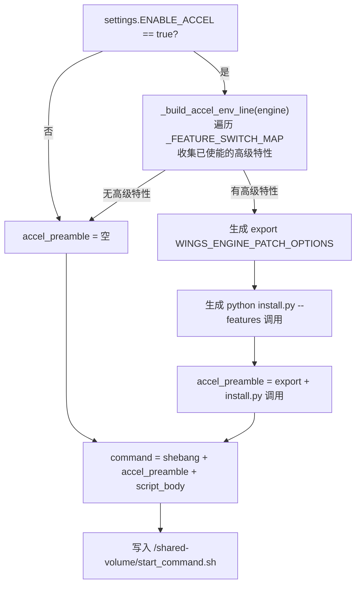

#### wings-accel层面

wings-accel 是一个轻量级 Alpine initContainer 镜像，职责是将补丁文件传递到共享卷。

**目录结构**：

```
wings-accel/
├── Dockerfile                  # Alpine 3.18 基础镜像，WORKDIR=/accel
├── build-accel-image.sh        # 构建脚本 → wings-accel:<TAG>
├── install.py                  # 补丁安装入口（Python），接收 --features JSON 参数
├── install.sh                  # 旧安装入口（保留向后兼容）
├── supported_features.json     # 特性声明（引擎→版本→补丁列表）
└── wings_engine_patch/
    └── install.sh              # 底层安装：pip install *.whl
```

**① 保证特性脚本可用**

- `Dockerfile` 中显式 `chmod +x` `install.py` 和两个 `install.sh`，确保运行时有执行权限

- `supported_features.json` 声明每个引擎版本支持的补丁列表，供验证和管理使用：

  ```json
  {
    "vllm":   { "0.12.0": ["speculative_decode", "sparse_kv", "lmcache_offload", "soft_fp8", "soft_fp4"] },
    "sglang": { "0.4.0":  ["speculative_decode", "sparse_kv"] },
    "mindie": { "1.0.0":  ["speculative_decode"] }
  }
  ```

**② 安装链路**

initContainer 阶段（K8s Pod 启动时）：

```
/accel/* → cp -r → /accel-volume/   （initContainer 完成后退出）
```

引擎容器阶段（执行 `start_command.sh` 时）：

```
python /accel-volume/install.py --features "$WINGS_ENGINE_PATCH_OPTIONS"
  → 解析 JSON：提取 engine/version/features
  → 校验 supported_features.json
  → pip install wings_engine_patch/*.whl   （在引擎容器的 Python 环境中安装补丁）
```

**③ 清晰报错**

- `install.py` 在 `start_command.sh` 中包裹在 `if [ -f ... ]` 检测里——若 initContainer 未运行或 `accel-volume` 未挂载，输出 WARNING 日志而不是直接 crash
- `install.py` 解析 `--features` JSON 失败时，输出 ERROR 并以非 0 退出码终止
- `install.py` 校验 `supported_features.json`，不支持的特性输出 WARNING（不阻断安装）
- `pip install *.whl` 若失败，由 `set -euo pipefail` 捕获，引擎启动中止并在容器日志中输出详细错误信息
- 构建脚本 `build-accel-image.sh` 在 Dockerfile 缺失时立即 `exit 1` 并提示 `错误: wings-accel/Dockerfile 不存在`

### 5.3 接口设计

| 接口 | 说明 |
|------|------|
| 加速特性环境变量 | 5 个高级特性开关，`true` / `false` |
| `WINGS_ENGINE_PATCH_OPTIONS` 环境变量 | JSON 格式，自动构建或用户自定义覆盖 |
| `install.py --features <JSON>` | Accel 补丁安装入口，解析 features 后 pip install whl |
| K8s `initContainers` 定义 | `wings-accel` 容器声明（image、volumeMounts） |

### 5.4 数据结构设计

| 数据结构 | 描述 |
|----------|------|
| `_ENGINE_PATCH_KEY_MAP` | `{"vllm": "vllm", "vllm_ascend": "vllm", "sglang": "sglang", "mindie": "mindie"}` |
| `_FEATURE_SWITCH_MAP` | 高级特性开关到 features 名称的映射，如 `{"ENABLE_SPECULATIVE_DECODE": "speculative_decode", ...}` |
| `supported_features.json` | Accel 包自带的特性声明文件 |
| `accel-volume` | K8s emptyDir，initContainer → 引擎容器的补丁传递通道 |

---

## US6 日志汇聚逻辑【重构，已实现】

### 6.1 需求背景

**老架构**：单进程模型（`wings.py` 直接 `subprocess.Popen` 启动引擎），引擎 stdout 通过管道自然汇聚到 wings 进程输出中，日志天然一体。

**新架构痛点**：Sidecar 三容器（initContainer + 控制容器 + 引擎容器），每个容器有独立 stdout/stderr：

| 痛点 | 说明 |
|------|------|
| 日志分散 | 需 `kubectl logs -c <name>` 逐容器查看，无法一屏看全 |
| 格式不统一 | wings-control 是 Python logging，engine 是引擎原生格式，initContainer 是 echo |
| 无文件持久化 | 容器 stdout 仅保留在 kubelet 节点日志中，容器重启后 Pod 内无本地日志可查 |
| 分布式日志隔离 | StatefulSet 多 Pod 跨节点，kubectl 只能逐 Pod 查看 |

**目标**：
1. **方便打屏** — `kubectl logs --all-containers` 即可聚合查看，格式统一
2. **保存本地静态日志** — Pod 内 `/var/log/wings/` 共享卷，任一容器 `tail -f *.log` 聚合查看，支持持久化

### 6.2 实现设计

#### 老 wings 对比

老 wings 单进程模型，wings.py 直接 subprocess 启动引擎，引擎日志通过 stdout 管道自然汇聚到 wings 进程输出中。

#### 重构后方案

**不做跨容器日志搬运**，依赖 K8s 原生容器日志机制 + 共享日志卷双通道：

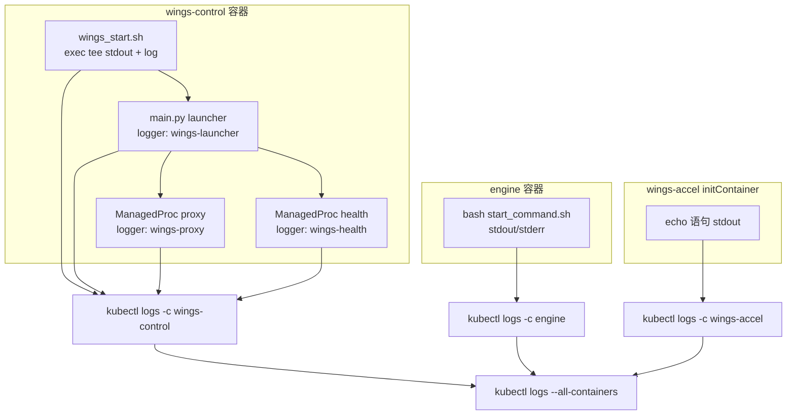

#### 统一日志格式（`utils/log_config.py`）

所有 Python 组件使用统一格式：
```
%(asctime)s [%(levelname)s] [%(name)s] %(message)s
```

输出示例：
```
2026-03-12 10:00:00 [INFO] [wings-launcher] start command written: /shared-volume/start_command.sh
2026-03-12 10:00:01 [INFO] [wings-proxy] Reason-Proxy is starting on 0.0.0.0:18000
2026-03-12 10:00:02 [WARNING] [wings-health] health_monitor_error: ...
```

#### `kubectl logs --all-containers` 查看效果

K8s 自动添加容器名前缀，结合统一的 `[%(name)s]` 组件标签：
```
[wings-control] 2026-03-12 10:00:00 [INFO] [wings-launcher] start command written
[wings-control] 2026-03-12 10:00:01 [INFO] [wings-proxy] Reason-Proxy is starting
[engine]        INFO 03-12 10:00:02 api_server.py:xxx] vLLM engine started
[wings-control] 2026-03-12 10:00:03 [INFO] [wings-health] Health monitor loop enabled
```

#### 日志噪声过滤

| 模块 | 行数 | 过滤内容 | 机制 | 环境变量开关 |
|------|------|---------|------|---------------|
| `noise_filter.py` | 364 | `/health` 探针日志 | logging.Filter (`_DropByRegex`) | `HEALTH_FILTER_ENABLE`（默认 true） |
| `noise_filter.py` | 364 | `Prefill/Decode batch` 噪声 | logging.Filter | `BATCH_NOISE_FILTER_ENABLE`（默认 true） |
| `noise_filter.py` | 364 | pynvml FutureWarning | warnings.filterwarnings | `PYNVML_FILTER_ENABLE`（默认 true） |
| `noise_filter.py` | 364 | stdout/stderr 行级过滤 | `_LineFilterIO` 包装器 | `STDIO_FILTER_ENABLE`（默认 true） |
| `speaker_logging.py` | 507 | 多 worker 日志抑制 | speaker 决策（PID hash 或索引匹配） | `LOG_INFO_SPEAKERS` |
| `speaker_logging.py` | 507 | uvicorn.access 日志 | `_quiet_uvicorn_access()` | — |
| `speaker_logging.py` | 507 | `/health` 出入站 | `_install_health_log_filters()` 给 httpx/httpcore 及其子 logger | — |

> **全局禁用**：`NOISE_FILTER_DISABLE=1` 可关闭 `noise_filter.py` 的全部 4 类过滤器。安装入口：`install_noise_filters()` 依次执行 `_install_logging_filters()` → `_install_warning_filters()` → `_install_stdio_filters()`。

#### 日志文件持久化（已实现）

Shell 层面 `wings_start.sh` 通过 `exec > >(tee -a "$LOG_FILE") 2>&1` 将全部输出
同时写入 `/var/log/wings/wings_start.log`（5 副本滚动）。Python 层面 `log_config.py` 的 `setup_root_logging()` **已实现** `RotatingFileHandler`，写入 `/var/log/wings/wings_control.log`（50MB × 5 备份），同时包含**重复 handler 防护**（检测 `baseFilename` 避免多次添加）。

#### 共享日志卷 + RotatingFileHandler（已实现）

`kubectl logs --all-containers` 是**客户端聚合**（kubectl 分别请求各容器日志流，合并显示），Pod 内部无法直接访问其他容器的 stdout。要在 Pod 内部获取聚合日志，需要通过共享卷方案：

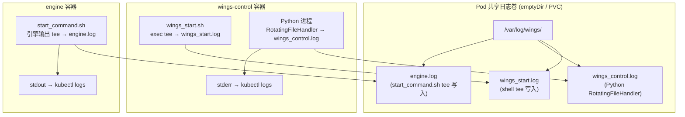

#### 实现要点

| 层级 | 改动 | 状态 | 说明 |
|------|------|------|------|
| `log_config.py` | `RotatingFileHandler`（131 行） | ✅ 已实现 | `LOG_FILE_PATH=/var/log/wings/wings_control.log`，50MB × 5 副本，含重复 handler 防护 |
| `speaker_logging.py` | `/health` 出入站过滤（507 行） | ✅ 已实现 | 过滤 uvicorn.access inbound + httpx/httpcore（含子 logger `_client`/`_async`/`_sync`）outbound |
| `noise_filter.py` | 4 类噪声过滤器（364 行） | ✅ 已实现 | `/health` 探针、Prefill/Decode batch、pynvml 警告、stdio 行级过滤 |
| `health_service.py` | `configure_worker_logging()` | ✅ 已实现 | 独立 health 进程的 httpx/httpcore 日志级别设为 WARNING |
| `wings_entry.py` | 引擎命令追加 `tee` | ✅ 已实现 | `exec > >(tee -a /var/log/wings/engine.log) 2>&1` |
| K8s 模板 | 添加 `log-volume` (emptyDir) | 待部署配置 | wings-control 和 engine 都挂载到 `/var/log/wings` |
| 持久化（可选） | `emptyDir` → `hostPath` 或 `PVC` | 可选 | 容器重启后保留日志 |

#### 日志保存逻辑和位置

使用共享日志卷后，`/var/log/wings/` 目录由 wings-control 和 engine 两个容器共享读写。各日志文件的写入逻辑和保存内容如下：

| 日志文件 | 写入者/机制 | 保存内容 | 滚动策略 |
|---------|-----------|---------|---------|
| `wings_start.log` | `wings_start.sh` 的 `exec > >(tee -a)` | wings-control 整个 shell 进程的 stdout/stderr（涵盖 Python 输出、pip 输出、shell echo、报错 traceback 等所有内容） | 按时间戳备份，保留最近 5 个（shell 层 `ls -t \| tail +6 \| xargs rm`） |
| `wings_control.log` | Python `RotatingFileHandler` | wings-launcher（启动命令生成）、wings-proxy（反向代理请求转发）、wings-health（健康检查循环）3 个组件的**结构化日志** | 50MB 自动滚动，保留 5 个备份（`wings_control.log.1` ~ `.5`） |
| `engine.log` | `start_command.sh` 中 `tee -a` | 推理引擎全部 stdout/stderr（模型加载进度、推理请求处理、GPU 显存/性能指标、vLLM/SGLang/MindIE 原生日志、Accel 补丁安装输出） | 无自动滚动（引擎原生输出不经过 Python logging） |

> **`wings_start.log` 与 `wings_control.log` 的关系**：`wings_start.log` 是 shell 层的全量镜像（⊃ `wings_control.log`），包含 Python 之外的输出。`wings_control.log` 是 Python 层的结构化子集，格式统一、可解析，适合日志平台采集。

**写入时序**：

```
Pod 启动
├─ wings-accel initContainer → echo 日志 → stdout（不写文件）
│
├─ wings-control 容器启动
│   ├─ wings_start.sh
│   │   ├─ mkdir -p /var/log/wings/
│   │   └─ exec > >(tee -a /var/log/wings/wings_start.log) 2>&1  ← 开始写
│   ├─ python -m app.main
│   │   ├─ setup_root_logging()
│   │   │   └─ RotatingFileHandler(/var/log/wings/wings_control.log)  ← 开始写
│   │   ├─ build_launcher_plan() → 写 start_command.sh
│   │   ├─ 启动 proxy 子进程 → 日志通过 wings-proxy logger → 同文件
│   │   └─ 启动 health 子进程 → 日志通过 wings-health logger → 同文件
│
└─ engine 容器启动
    ├─ 等待 start_command.sh
    └─ bash start_command.sh
        ├─ export WINGS_ENGINE_PATCH_OPTIONS=...
        ├─ python install.py --features ... (输出到 tee)
        └─ python3 -m vllm... 2>&1 | tee -a /var/log/wings/engine.log  ← 开始写
```

**日志卷的最终目录结构**：

```
/var/log/wings/                         ← 共享卷挂载点
├── wings_start.log                     ← 当前 shell 日志
├── wings_start.log.2026-03-14_10-00-00 ← 备份 1（上次启动）
├── wings_start.log.2026-03-14_09-00-00 ← 备份 2
├── wings_control.log                   ← 当前 Python 日志
├── wings_control.log.1                 ← 滚动备份 1（最近 50MB）
├── wings_control.log.2                 ← 滚动备份 2
└── engine.log                          ← 引擎全部输出（持续追加）
```

Pod 内查看聚合日志：
```bash
# 任一容器内执行
tail -f /var/log/wings/*.log          # 聚合查看
tail -f /var/log/wings/engine.log     # 单看引擎
cat /var/log/wings/wings_control.log | grep wings-proxy  # 只看代理日志
```

#### 重构改动清单

| 文件 | 改动 | 状态 |
|------|------|------|
| `utils/log_config.py`（131 行） | 统一格式常量 + `setup_root_logging()` + `RotatingFileHandler`（50MB × 5 备份）+ 重复 handler 防护 | ✅ 已完成 |
| `utils/noise_filter.py`（364 行） | 4 类噪声过滤器（`/health`、`Prefill/Decode batch`、`pynvml`、`stdio`）+ 环境变量独立开关 | ✅ 已完成 |
| `main.py` | 改用 `setup_root_logging()` + `LOGGER_LAUNCHER`，移除冗余 `[launcher]` 前缀 | ✅ 已完成 |
| `proxy/proxy_config.py` | 改用 `setup_root_logging()` + `LOGGER_PROXY`，替换独立 `basicConfig` | ✅ 已完成 |
| `proxy/speaker_logging.py`（507 行） | `_ensure_root_handler()` 使用统一格式 + `/health` 出入站过滤（含 httpx/httpcore 子 logger） | ✅ 已完成 |
| `proxy/health_service.py`（160 行） | 增加 `LOGGER_HEALTH` 独立 logger + `configure_worker_logging()` + httpx/httpcore WARNING 级别 | ✅ 已完成 |
| `wings_start.sh` | 移除死代码 `LAUNCHER_LOG_FILE` / `WINGS_PROXY_LOG_FILE` | ✅ 已完成 |
| `wings_entry.py`（246 行） | 引擎命令追加 `tee -a /var/log/wings/engine.log` + accel_preamble 注入 | ✅ 已完成 |
| K8s 模板 | `log-volume` (emptyDir) 挂载到 `/var/log/wings`，wings-control + engine 共享 | 待部署配置 |

#### 分布式场景下的日志

分布式模式下每个节点是独立 Pod（StatefulSet），每个 Pod 内部仍是三容器结构。跨 Pod 日志无法通过共享卷聚合：

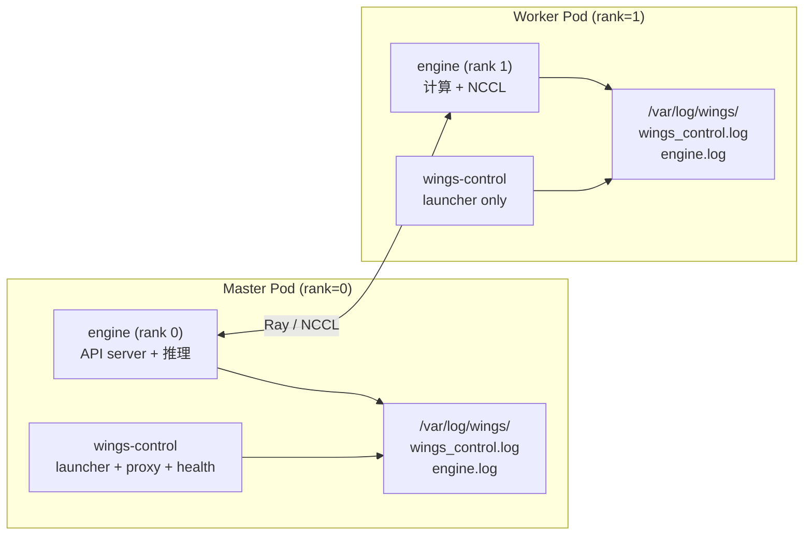

| 维度 | Master Pod (rank=0) | Worker Pod (rank≥1) |
|------|--------------------|--------------------|
| wings-control 日志 | launcher + proxy + health 完整流程 | launcher 完整流程，**无** proxy/health |
| engine 日志 | API server + 推理请求日志 | 计算任务 + NCCL 通信日志 |
| `/var/log/wings/` | 3 个日志文件（完整） | 2 个日志文件（engine 内容不同） |

跨节点日志查看方式：

| 方式 | 命令/工具 | 适用场景 |
|------|---------|---------|
| kubectl 逐 Pod | `kubectl logs sts/my-infer-0 --all-containers` | 调试 |
| stern 按 label | `stern -l app=my-infer --all-containers` | 开发环境 |
| NFS 共享存储 | 所有 Pod `log-volume` 挂同一 NFS，按 Pod 名子目录隔离 | 日志集中存储 |
| EFK/Loki | fluentbit 采集 → Elasticsearch/Loki → 可视化查询 | 生产环境 |

现有分布式日志能力：
- `speaker_logging.py` 的 `LOG_INFO_SPEAKERS` 控制 worker 只输出 WARNING+，减少日志量
- `main.py` 的 `_determine_role()` 日志中包含 `role=master/worker` 标识

### 6.3 接口设计

**外部查看接口（kubectl）**：

| 接口 | 说明 |
|------|------|
| `kubectl logs <pod> -c wings-control` | 查看控制层日志（launcher + proxy + health） |
| `kubectl logs <pod> -c engine` | 查看引擎日志 |
| `kubectl logs <pod> -c wings-accel` | 查看 initContainer 日志（仅启动阶段） |
| `kubectl logs <pod> --all-containers` | 查看全部容器日志（客户端聚合） |
| `kubectl logs <pod> --all-containers -f` | 实时跟踪全部日志 |
| `stern -l app=my-infer --all-containers` | 跨 Pod 聚合（需安装 stern） |

**Pod 内部查看接口（共享日志卷）**：

| 接口 | 说明 |
|------|------|
| `tail -f /var/log/wings/*.log` | 聚合查看全部日志文件 |
| `tail -f /var/log/wings/engine.log` | 单独查看引擎日志 |
| `cat /var/log/wings/wings_control.log \| grep wings-proxy` | 按组件过滤 |
| `ls -lh /var/log/wings/` | 查看日志文件大小和备份数 |

**环境变量配置接口**：

| 环境变量 | 默认值 | 说明 |
|---------|-------|------|
| `LOG_FILE_PATH` | `/var/log/wings/wings_control.log` | Python 日志文件路径（`RotatingFileHandler` 目标） |
| `NOISE_FILTER_DISABLE` | `0`（启用过滤） | 设为 `1` 关闭 `noise_filter.py` 全部 4 类过滤器 |
| `HEALTH_FILTER_ENABLE` | `1`（启用） | `/health` 探针日志过滤 |
| `BATCH_NOISE_FILTER_ENABLE` | `1`（启用） | Prefill/Decode batch 噪声过滤 |
| `PYNVML_FILTER_ENABLE` | `1`（启用） | pynvml FutureWarning 过滤 |
| `STDIO_FILTER_ENABLE` | `1`（启用） | stdout/stderr 行级过滤 |
| `LOG_INFO_SPEAKERS` | 空（全 worker 输出 INFO） | 逗号分隔的 worker 索引，仅这些 worker 的 INFO 级别日志会输出 |

### 6.4 数据结构设计

**已有常量（`log_config.py` 131 行）**：

| 数据结构 | 描述 |
|----------|------|
| `LOG_FORMAT` | `"%(asctime)s [%(levelname)s] [%(name)s] %(message)s"`（支持环境变量覆盖） |
| `LOG_DATE_FORMAT` | `"%Y-%m-%d %H:%M:%S"` |
| `LOGGER_LAUNCHER` | logger name = `"wings-launcher"` |
| `LOGGER_PROXY` | logger name = `"wings-proxy"` |
| `LOGGER_HEALTH` | logger name = `"wings-health"` |
| `LOG_FILE_PATH` | `/var/log/wings/wings_control.log`（支持环境变量覆盖） |
| `LOG_MAX_BYTES` | `50 * 1024 * 1024`（50MB） |
| `LOG_BACKUP_COUNT` | `5`（保留 5 个备份文件） |
| `setup_root_logging()` | 统一初始化 root logger 格式、handler（`basicConfig(force=True)` + `RotatingFileHandler`），含重复 handler 去重检测 |

**已实现常量（`log_config.py` 131 行）**：

| 数据结构 | 描述 | 状态 |
|----------|------|------|
| `LOG_FILE_PATH` | 环境变量 `LOG_FILE_PATH`，默认 `/var/log/wings/wings_control.log` | ✅ 已实现 |
| `LOG_MAX_BYTES` | `50 * 1024 * 1024`（50MB） | ✅ 已实现 |
| `LOG_BACKUP_COUNT` | `5`（保留 5 个备份文件） | ✅ 已实现 |
| `RotatingFileHandler` | `setup_root_logging()` 中实现，写入 `LOG_FILE_PATH`，`maxBytes=LOG_MAX_BYTES`，`backupCount=LOG_BACKUP_COUNT`；含 `baseFilename` 去重防护 | ✅ 已实现 |

**K8s 卷定义**：

| 资源 | 名称 | 类型 | 挂载路径 | 说明 |
|------|------|------|---------|------|
| Volume | `log-volume` | `emptyDir: {}` | — | Pod 级别声明 |
| VolumeMount (wings-control) | `log-volume` | — | `/var/log/wings` | Python + shell 写入日志 |
| VolumeMount (engine) | `log-volume` | — | `/var/log/wings` | engine.log 写入 + 读取其他日志 |

---

## US7 RAG 二级推理【继承】

### 7.1 需求背景
RAG 场景下长文档推理需要 Map-Reduce 分块并行策略，提升长上下文处理效率。

### 7.2 实现设计

**触发条件**（`ENABLE_RAG_ACC=true` 时）：
1. 请求包含 `<|doc_start|>` / `<|doc_end|>` 标签
2. 文本长度 ≥ 2048 字符
3. 文档块数量 ≥ 3

**处理流程**：

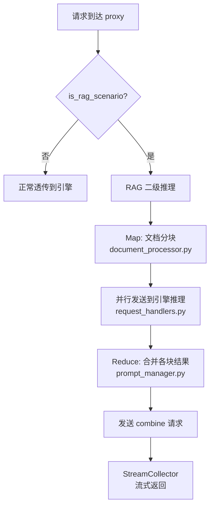

**继承状态**: 100% 继承，8 个文件完全一致：

**与引擎层的关系**：

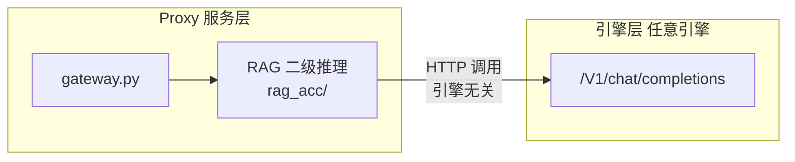

**引擎无关性**: RAG 模块通过 HTTP 调用引擎的 `/v1/chat/completions` API，不依赖任何引擎特定接口。四个引擎均支持。

**跳过机制**：请求体包含 `/no_rag_acc` 即可强制跳过。

### 7.3 接口设计

与解耦前保持一致

### 7.4 数据结构设计

与解耦前保持一致

---

## US8 MindIE 分布式长上下文【新增】

### 8.1 需求背景
DeepSeek 满血模型在 MindIE 分布式场景下，当输入输出总长度超过阈值时，需要启用四维并行策略支持长上下文。

### 8.2 实现设计

**触发条件**（三个同时满足）：

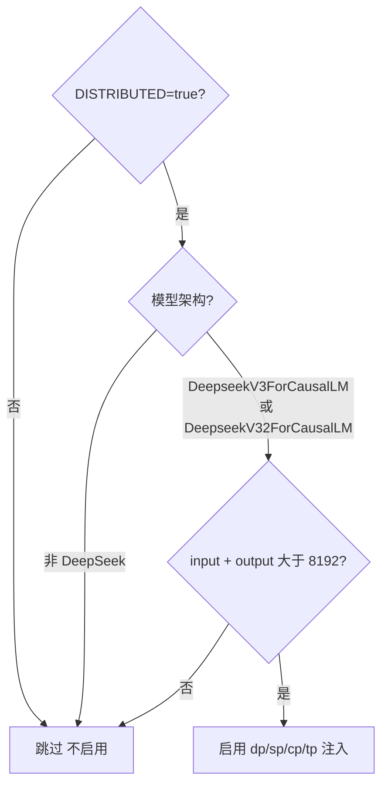

**注入参数**（四维并行策略）：

| 参数 | 环境变量 | 默认值 | 含义 |
|------|---------|--------|------|
| dp | `MINDIE_DS_DP` | 1 | 数据并行 |
| sp | `MINDIE_DS_SP` | 8 | 序列并行 |
| cp | `MINDIE_DS_CP` | 2 | 上下文并行 |
| tp | `MINDIE_DS_TP` | 2 | 张量并行 |

**配置流转图**：

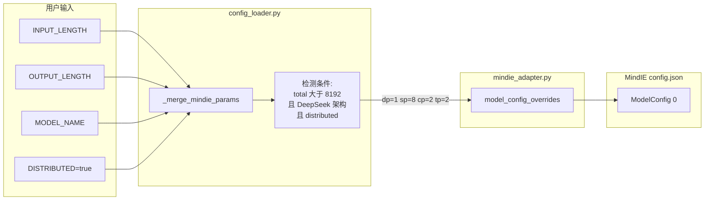

**注入方式**：通过 `_merge_mindie_params()` 在 `config_loader.py` 中将参数写入，再由 `mindie_adapter.py` 透传到 MindIE 的 config.json（走 adapter 的 inline-Python merge 机制）。

**已实现的代码**：

```python
# config_loader.py — _merge_mindie_params()
_LONG_CTX_THRESHOLD = int(os.getenv("MINDIE_LONG_CONTEXT_THRESHOLD", "8192"))

if (ctx.get('distributed')
        and model_architecture in ["DeepseekV3ForCausalLM", "DeepseekV32ForCausalLM"]
        and total_seq_len > _LONG_CTX_THRESHOLD):
    params['dp'] = int(os.getenv("MINDIE_DS_DP", "1"))
    params['sp'] = int(os.getenv("MINDIE_DS_SP", "8"))
    params['cp'] = int(os.getenv("MINDIE_DS_CP", "2"))
    params['tp'] = int(os.getenv("MINDIE_DS_TP", "2"))
```

```python
# mindie_adapter.py — 透传到 ModelConfig[0]
if engine_config.get("sp") is not None:
    model_config_overrides["sp"] = engine_config["sp"]
if engine_config.get("cp") is not None:
    model_config_overrides["cp"] = engine_config["cp"]
# dp/tp: 非 MOE 模型时从 US8 注入
if engine_config.get("dp") is not None and not engine_config.get("isMOE", False):
    model_config_overrides["dp"] = engine_config["dp"]
```

**最终生成的 config.json 片段**：

```json
{
  "BackendConfig": {
    "ModelDeployConfig": {
      "maxSeqLen": 16384,
      "ModelConfig": [{
        "modelName": "DeepSeek-R1",
        "modelWeightPath": "/weights/DeepSeek-R1",
        "worldSize": 8,
        "dp": 1,
        "sp": 8,
        "cp": 2,
        "tp": 2,
        "trustRemoteCode": true
      }]
    }
  }
}
```

**注意**：`multiNodesInferEnabled` 对单个 daemon 实例设为 `false`，跨节点协调由上层 `ms_coordinator/ms_controller` 处理。

### 8.3 接口设计

| 接口 | 说明 |
|------|------|
| `MINDIE_LONG_CONTEXT_THRESHOLD` | 长上下文触发阈值，默认 `8192` |
| `MINDIE_DS_DP` / `MINDIE_DS_SP` / `MINDIE_DS_CP` / `MINDIE_DS_TP` | 四维并行参数环境变量，默认 `1/8/2/2` |
| `INPUT_LENGTH` + `OUTPUT_LENGTH` | 序列总长度来源 |
| `config.json` → `ModelConfig[0]` | 注入目标：MindIE 引擎配置文件 |

### 8.4 数据结构设计

| 数据结构 | 描述 |
|----------|------|
| `_LONG_CTX_THRESHOLD` | 长上下文阈值，默认 8192 |
| `model_config_overrides` | 注入 dp/sp/cp/tp 的 dict，透传到 MindIE config.json |
| MindIE config.json 目标路径 | `BackendConfig.ModelDeployConfig.ModelConfig[0]` |