> 遗留
> 1. accel使能逻辑，完备
> 2. 日志汇聚逻辑，以方便打屏，同时保存本地静态日志
> 3. 页面json传参逻辑:指定开关和引擎字段后，允许命令直接转换，跳过 wings-control 的参数解析逻辑，直接透传给引擎（仅限引擎参数）
> 4. 目录结构调整；ST场景下 Ray 版本
> 5. 硬件检测的逻辑，本地可用性检测


## US1 统一对外引擎命令【继承+新增】

### 1.1 需求背景

用户面对 vLLM / SGLang / MindIE / vLLM-Ascend 四个引擎，每个引擎启动参数名称和格式各不相同。wings-control 提供统一 CLI/ENV 入口 + JSON 透传能力，屏蔽引擎差异。

| 核心诉求 | 说明 |
|---------|------|
| 参数统一 | 38 个标准化 CLI/ENV 参数（`LaunchArgs`），屏蔽各引擎差异 |
| JSON 透传 | `--config-file` / `CONFIG_FILE` 传入引擎原生参数 JSON |
| 跳过默认合并 | `CONFIG_FORCE=true` 时用户 JSON 完全独占，跳过四层合并 |

### 1.2 实现设计

#### 整体流程

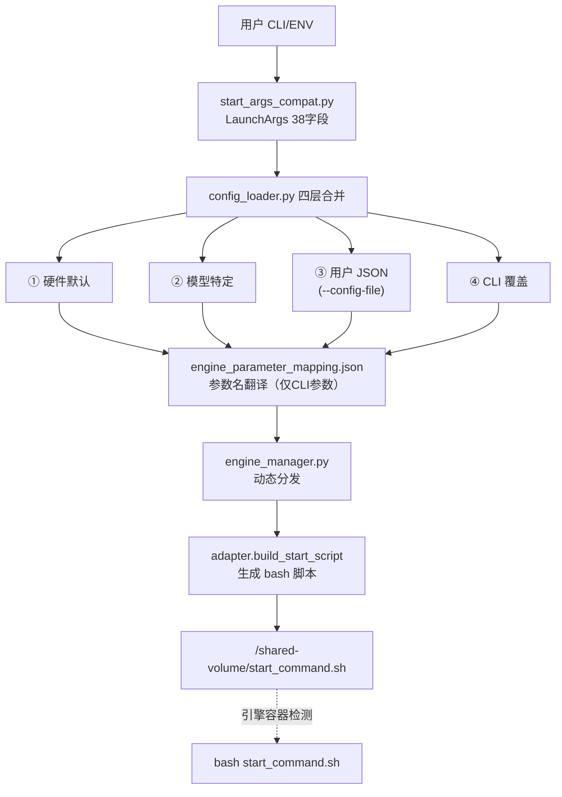

**解耦前后对比**：

| 维度 | 老 wings | 解耦 wings-control |
|------|---------|-------------------|
| 架构 | `wings.py` 单文件 → `subprocess.Popen` 直接启动引擎 | 脚本生成 → 共享卷 → 引擎容器执行 |
| 参数 | adapter 内硬编码 | `LaunchArgs` 38 字段 → mapping → adapter |
| 输出 | 进程句柄 | `/shared-volume/start_command.sh` bash 脚本 |

**引擎入口命令对照**：

| 引擎 | 入口命令 | 参数格式 |
|------|----------|----------|
| vllm | `python3 -m vllm.entrypoints.openai.api_server` | `--key value` |
| vllm (DP) | `vllm serve <model>` | `--key value` |
| vllm_ascend | 同 vllm（+ CANN 环境初始化） | `--key value` |
| sglang | `python3 -m sglang.launch_server`（老版本用 `python`） | `--key value` |
| mindie | `./bin/mindieservice_daemon` | JSON 配置文件 |

#### config-file 输入方式

| 格式 | 示例 | 判断逻辑 |
|------|------|---------|
| 内联 JSON 字符串 | `--config-file '{"tensor_parallel_size": 4}'` | 以 `{` 开头 `}` 结尾 → `json.loads()` |
| 文件路径 | `--config-file /path/to/config.json` | 非 JSON → `os.path.exists()` → `load_json_config()` |

代码位置：`config_loader.py` → `_load_user_config()`

#### 四层配置合并

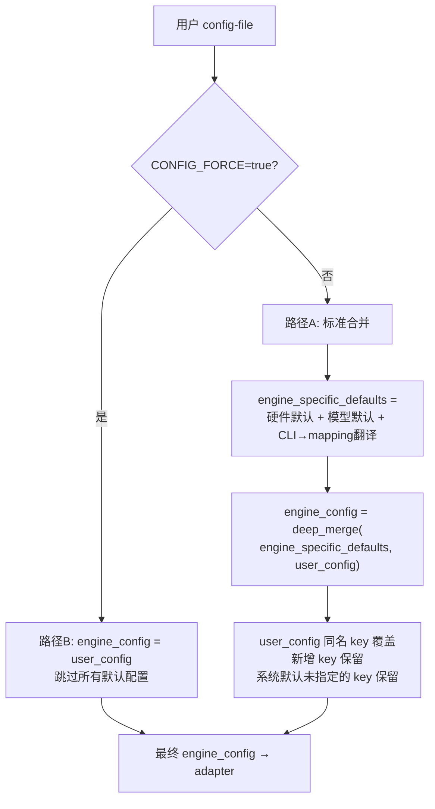

| 路径 | 条件 | 行为 | 注意 |
|------|------|------|------|
| A 标准合并 | `CONFIG_FORCE=false`（默认） | user_config 覆盖同名 key，保留新增 key，系统默认补齐 | 安全：缺参数不影响 |
| B 强制覆盖 | `CONFIG_FORCE=true` | user_config 独占 engine_config，跳过 `_get_model_specific_config()` | 危险：用户 JSON 必须完整 |

关键代码：

```python
# config_loader.py load_and_merge_configs()
if user_config and get_config_force_env():
    engine_config = user_config                                    # 路径B
else:
    engine_specific_defaults = _get_model_specific_config(...)     # 路径A
    engine_config = _merge_configs(engine_specific_defaults, user_config)
```

#### mapping 翻译规则

`engine_parameter_mapping.json` **仅翻译 CLI/ENV 的 38 字段**，在 `_set_common_params()` 中执行。**user_config（config-file）的 key 不经过 mapping 翻译**，原样进入 engine_config。

| 写法 | vLLM 是否生效 | 原因 |
|------|-------------|------|
| `{"served_model_name": "qwen"}` | ✅ | 引擎原生名 |
| `{"model_name": "qwen"}` | ❌ | wings 统一名，不翻译 |

#### adapter 消费 engine_config 的方式

| 引擎 | 消费方式 | 未知 key 处理 |
|------|---------|-------------|
| vLLM / SGLang | 遍历全部 key，`snake_case` → `--kebab-case` CLI 参数 | 全部输出 |
| MindIE | `.get()` 固定 key 列表 → 5 层 overrides 写入 `config.json` | extra key → config.json 根级别 |

MindIE adapter 固定 key 分组：

| 分组 | key 列表 | 写入位置 |
|------|---------|---------|
| ServerConfig | `ipAddress`, `port`, `httpsEnabled`, `inferMode`, `openAiSupport`, `tokenTimeout`, `e2eTimeout`, `allowAllZeroIpListening`, `interCommTLSEnabled` | `config['ServerConfig']` |
| BackendConfig | `npuDeviceIds`, `multiNodesInferEnabled`, `interNodeTLSEnabled` | `config['BackendConfig']` |
| ModelDeployConfig | `maxSeqLen`, `maxInputTokenLen`, `truncation` | `config['BackendConfig']['ModelDeployConfig']` |
| ModelConfig | `modelName`, `modelWeightPath`, `worldSize`, `cpuMemSize`, `npuMemSize`, `trustRemoteCode`, `tp`, `dp`, `moe_tp`, `moe_ep`, `sp`, `cp`, `isMOE`, `isMTP` | `config['BackendConfig']['ModelDeployConfig']['ModelConfig'][0]` |
| ScheduleConfig | `cacheBlockSize`, `maxPrefillBatchSize`, `maxPrefillTokens`, `prefillTimeMsPerReq`, `prefillPolicyType`, `decodeTimeMsPerReq`, `decodePolicyType`, `maxBatchSize`, `maxIterTimes`, `maxPreemptCount`, `supportSelectBatch`, `maxQueueDelayMicroseconds`, `bufferResponseEnabled`, `decodeExpectedTime`, `prefillExpectedTime` | `config['BackendConfig']['ScheduleConfig']` |
| 其他 | `npu_memory_fraction` | 环境变量 `NPU_MEMORY_FRACTION` |
| **extra** | **不在以上列表中的任意 key** | **`config` 根级别** |

#### 透传能力矩阵

| 场景 | vLLM/SGLang | MindIE |
|------|------------|--------|
| `CONFIG_FORCE=true` + config-file | 100% 全部转 CLI 参数 | 固定 key → 对应节点；其余 → config.json 根级别 |
| `CONFIG_FORCE=false` + config-file | user_config 覆盖+新增，默认保留 | 同上 |
| 仅 CLI/ENV（38字段） | 无透传（只走 mapping） | 无透传（只走 mapping） |

#### config-file 约束规范

| 约束 | 说明 |
|------|------|
| 必须使用引擎原生参数名 | user_config 不经过 mapping 翻译 |
| 不能透传环境变量 | 只变成 CLI 参数或写入 config.json |
| 38 字段之外的 ENV 不被处理 | 只读取 `start_args_compat.py` 中声明的环境变量 |
| `CONFIG_FORCE=true` 要求完整 | 缺少 `model`/`host`/`port` 等会导致启动失败 |
| JSON 格式严格 | 合法 JSON，不支持注释 |
| 空字符串/布尔 false 被跳过 | vLLM/SGLang adapter 中跳过 |
| 安全转义 | 非 JSON 字符串值 `shlex.quote()` 防注入 |
| MindIE extra key 写入根级别 | 需写入特定节点须使用对应原生 key 名 |

#### MaaS 层面

```yaml
# 基础用法
bash /app/wings_start.sh --engine vllm --model-name xxx --model-path /models/xxx --device-count 1

# JSON 透传（三种方式）
# ① CLI 内联:  --config-file '{"gpu_memory_utilization": 0.85}'
# ② 环境变量:  CONFIG_FILE='{"gpu_memory_utilization": 0.85}'
# ③ 文件路径:  --config-file /path/to/custom_config.json

# 完全透传模式
# CONFIG_FORCE=true + CONFIG_FILE='{"model": "...", "host": "...", ...全部引擎原生参数}'
```

### 1.3 接口设计

| 接口 | 说明 |
|------|------|
| CLI 入口 | `--engine`, `--model-path`, `--config-file` 等 38 个统一参数 |
| 环境变量 | `ENGINE`, `MODEL_PATH`, `CONFIG_FILE` 等，等效 CLI |
| `engine_parameter_mapping.json` | 统一名 → 引擎原生名（仅 CLI 参数） |
| `CONFIG_FORCE` | `true` 跳过系统合并，user JSON 独占 |
| 输出 | `/shared-volume/start_command.sh` |

### 1.4 数据结构设计

#### LaunchArgs（38 字段，frozen dataclass）

| 分类 | 字段 |
|------|------|
| 基础 | `host`, `port`, `model_name`, `model_path`, `engine`, `config_file`, `model_type`, `save_path` |
| 序列 | `input_length`, `output_length` |
| 硬件 | `gpu_usage_mode`, `device_count` |
| 精度 | `dtype`, `kv_cache_dtype`, `quantization`, `quantization_param_path` |
| 性能 | `gpu_memory_utilization`, `enable_chunked_prefill`, `block_size`, `max_num_seqs`, `seed`, `max_num_batched_tokens` |
| 高级特性 | `trust_remote_code`, `enable_expert_parallel`, `enable_prefix_caching`, `enable_speculative_decode`, `speculative_decode_model_path`, `enable_rag_acc`, `enable_auto_tool_choice`, `enable_sparse`, `lc_sparse_threshold`, `total_budget`, `local_kvstore_capacity` |
| 分布式 | `distributed`, `nnodes`, `node_rank`, `head_node_addr`, `distributed_executor_backend` |

---

## US2 适配四个引擎【继承】

### 2.1 需求背景

同时支持 vLLM、SGLang、MindIE、vLLM-Ascend 四个引擎，启动方式差异大，需统一 adapter 契约。

### 2.2 实现设计

#### adapter 统一契约

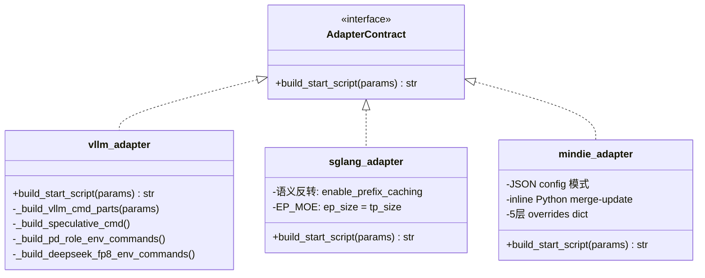

#### 参数拼接差异对照

| 场景 | vLLM | SGLang | MindIE |
|------|------|--------|--------|
| GPU 显存占比 | `--gpu-memory-utilization 0.9` | `--mem-fraction-static 0.9` | config.json: `npu_memory_fraction: 0.9` |
| 前缀缓存 | `--enable-prefix-caching` | `--enable-radix-cache` | 不支持（跳过） |
| 量化 | `--quantization awq` | `--quantization awq` | config.json: `quantization: awq` |

#### vLLM 参数拼接核心

engine_config 全量遍历，`snake_case` → `--kebab-case`：
- `bool=True` → `--flag`（不带值）
- `bool=False` / 空字符串 → 跳过
- JSON dict → 单引号包裹
- 其他 → `shlex.quote(str(value))`

#### SGLang 语义反转

| 输入参数 | SGLang 处理 |
|---------|-----------|
| `context_length` | → `--context-length`（直接使用） |
| `enable_prefix_caching=True` | 移除（SGLang 默认开启） |
| `enable_prefix_caching=False` | → `--disable-radix-cache`（语义反转） |
| `enable_torch_compile=True` | → `--enable-torch-compile` |
| `enable_ep_moe=True` | → `--ep-size <tp_size>`（EP=TP） |

#### MindIE 参数拼接

不用 CLI 参数，通过 inline Python 脚本 merge-update `config.json`：

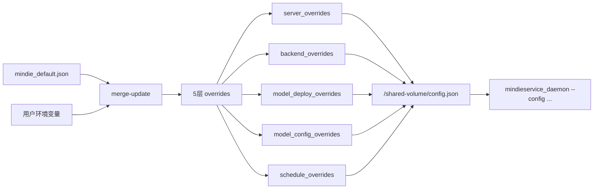

### 2.3 接口设计

与解耦前保持一致

### 2.4 数据结构设计

与解耦前保持一致

---

## US3 单机/分布式【继承】

### 3.1 需求背景

同一套代码支持单机单卡、单机多卡、多机多卡，两种模式用户接口一致。

### 3.2 实现设计

#### 角色判定

`wings_control.py._determine_role()` 三级判定策略：

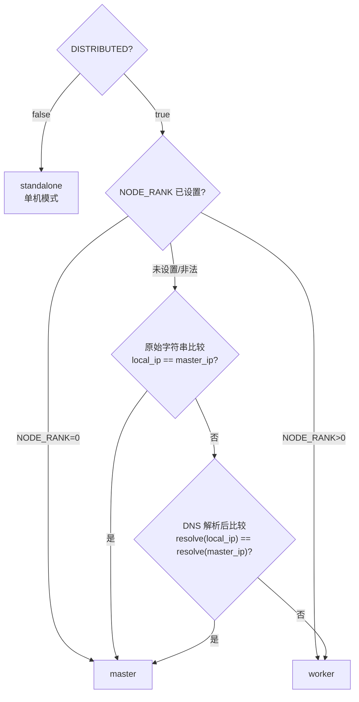

| 优先级 | 策略 | 适用场景 |
|--------|------|---------|
| 1 | `NODE_RANK` 环境变量 | hostNetwork 同机多 Pod 共享 IP |
| 2 | 原始字符串比较 | 兼容 V1 `$MASTER_IP = $RANK_IP` |
| 3 | DNS 解析后比较 | K8s StatefulSet headless service |

#### 单机 vs 分布式统一流程

两者都走 `build_launcher_plan()` → 写 `start_command.sh`，区别仅在于 master 多了注册/分发协调层：

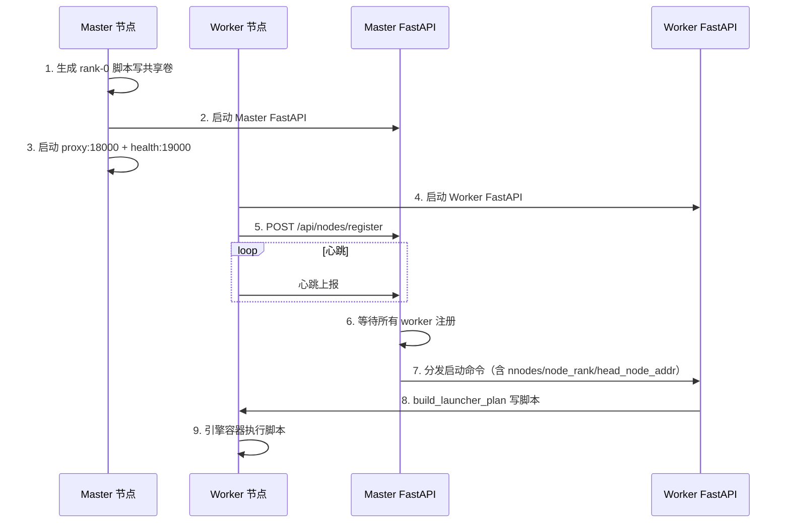

#### TP 设置逻辑

```python
def _adjust_tensor_parallelism(params, device_count, tp_key, if_distributed=False):
    # 1. 300I A2 PCIe 卡: 强制 TP=4（4 或 8 张）
    # 2. 用户指定 TP != device_count: warning + 强制 TP=device_count
    # 3. 默认: TP = device_count
```

#### Ray 分布式启动

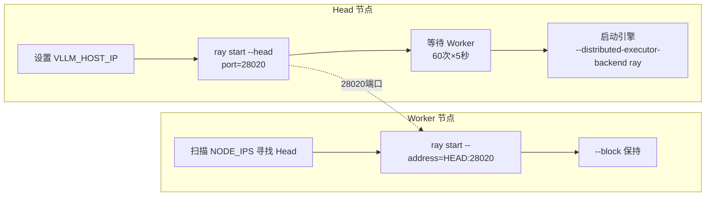

**Ray 资源声明版本适配**（基于 `ENGINE_VERSION`）：

| 引擎 | ENGINE_VERSION | 资源声明 |
|------|---------------|---------|
| vllm (NV) | 任意 | `--num-gpus=1` |
| vllm_ascend | >= 0.14 | `--resources='{"NPU": 1}'` |
| vllm_ascend | < 0.14 | `--num-gpus={tp_size}`（兼容 V1） |
| 任意 | 未设置 | 按 0.14 处理 |

可通过 `RAY_RESOURCE_FLAG` 环境变量完全覆盖。

#### Ascend 特定修补（仅 vllm_ascend >= 0.14）

| 修补 | 原因 | 处理 |
|------|------|------|
| Triton NPU 补丁 | worker.py 无条件导入 `torch_npu._inductor`，触发 "0 active drivers" | 启动脚本中注入补丁代码 |
| `--enforce-eager` | Triton 后端缺失导致运行时错误 | 自动添加该标志 |

#### DP 分布式 (dp_deployment)

```bash
# Rank-0 (Head):
exec vllm serve /weights --data-parallel-address infer-0 \
  --data-parallel-rpc-port 13355 --data-parallel-size 2 \
  --data-parallel-size-local 1 --data-parallel-external-lb --data-parallel-rank 0

# Rank-N (Worker):
exec vllm serve /weights --data-parallel-address infer-0 \
  --data-parallel-rpc-port 13355 --data-parallel-size 2 \
  --data-parallel-size-local 1 --data-parallel-external-lb \
  --headless --data-parallel-start-rank N
```

**DeepSeek V3/V32 Ascend DP 特殊处理**：固定 `dp_size=4`，`dp_size_local=2`，`dp_start_rank = 2 if node_rank != 0 else 0`。

#### 解耦版本 vs 老版本

| 项 | 老版本 | 解耦版本 | 状态 |
|----|--------|---------|------|
| 进程启动 | subprocess.Popen | 脚本→共享卷 | 设计差异 |
| Ray 端口 | 28020 | 28020 | ✅ 一致 |
| Ray 资源声明 | `--num-gpus` | 版本适配：>=0.14 `--resources NPU`，<0.14 `--num-gpus` | ✅ 向后兼容 |
| DP 入口 | `vllm serve` | `vllm serve` | ✅ 一致 |
| Triton NPU Patch | 无 | ✅ 有（>=0.14 条件注入） | 领先 |
| `--enforce-eager` | 无 | ✅ 有（>=0.14 条件添加） | 领先 |
| 崩溃恢复 | 无 | ✅ 有（M5 新增） | 领先 |
| 角色判定 | shell 字符串比较 | 三级策略 | ✅ 向后兼容 |
| MindIE ranktable | 外部必须预置 | 首选外部，降级动态生成 | ✅ 向后兼容 |

### 3.3 接口设计

与解耦前保持一致

### 3.4 数据结构设计

与解耦前保持一致

---

## US4 统一服务化【继承】

### 4.1 需求背景

对外暴露统一的 OpenAI 兼容 API，屏蔽后端引擎差异。

### 4.2 实现设计

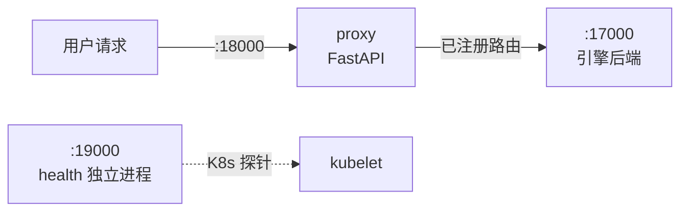

**API 端点清单（11 个对外路径）**：

| 路径 | 方法 | 功能 |
|------|------|------|
| `/v1/chat/completions` | POST | 对话补全 |
| `/v1/completions` | POST | 文本补全 |
| `/v1/responses` | POST | Responses API 兼容 |
| `/v1/rerank` | POST | 重排序 |
| `/v1/embeddings` | POST | 向量嵌入 |
| `/tokenize` | POST | 分词 |
| `/metrics` | GET | 指标透传 |
| `/health` | GET / HEAD | 健康检查 |
| `/v1/models` | GET | 模型列表 |
| `/v1/version` | GET | 版本信息 |

> 多模态端点（video/image）已在代码清理中移除

### 4.3 接口设计

除 metrics 接口外，与解耦前保持一致

### 4.4 数据结构设计

与解耦前保持一致

---

## US5 Accel 使能逻辑【新增】

### 5.1 需求背景

在不修改引擎镜像的前提下，动态注入加速补丁（算子优化 whl 包）。

### 5.2 实现设计

#### 三容器协作总览

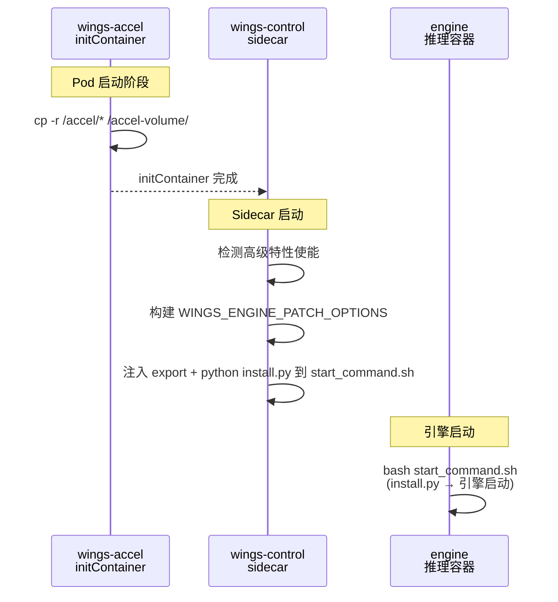

| 步骤 | 执行者 | 动作 |
|------|--------|------|
| ① 使能 | MaaS 用户 | 页面勾选高级特性，下发 `ENABLE_ACCEL=true` |
| ② 拷贝 | initContainer (wings-accel) | `/accel/*` → `accel-volume` 共享卷 |
| ③ 注入 | wings-control (`wings_entry.py`) | 构建 `WINGS_ENGINE_PATCH_OPTIONS`，注入到 `start_command.sh` |
| ④ 安装+启动 | engine 容器 | `python install.py --features "$WINGS_ENGINE_PATCH_OPTIONS"` → 引擎启动 |

#### MaaS 层面

**ENGINE_VERSION 多重用途**：

| 用途 | 消费模块 |
|------|---------|
| Accel 补丁版本 | `wings_entry.py` → `WINGS_ENGINE_PATCH_OPTIONS` version 字段 |
| initContainer 镜像标签 | K8s YAML `wings-accel:${ENGINE_VERSION}` |
| Ray 资源声明适配 | `vllm_adapter.py` `_get_ray_resource_flag()` |
| Triton+enforce-eager | `vllm_adapter.py` `_need_triton_patch_and_eager()` |

**5 个高级特性（需补丁）**：

| 高级特性 | 环境变量 | features 名称 |
|---------|---------|--------------|
| 推测解码 | `ENABLE_SPECULATIVE_DECODE` | `speculative_decode` |
| 稀疏 KV Cache | `ENABLE_SPARSE` | `sparse_kv` |
| LMCache 卸载 | `LMCACHE_OFFLOAD` | `lmcache_offload` |
| 软件 FP8 量化 | `ENABLE_SOFT_FP8` | `soft_fp8` |
| 软件 FP4 量化 | `ENABLE_SOFT_FP4` | `soft_fp4` |

`WINGS_ENGINE_PATCH_OPTIONS` 格式示例：

```json
{"vllm": {"version": "0.12.rc1", "features": ["speculative_decode", "sparse_kv"]}}
```

#### wings-control 层面

**① 构建特性环境变量**（`wings_entry.py` → `_build_accel_env_line(engine)`）：

```python
# 引擎名到 patch key 映射（vllm_ascend 复用 vllm 补丁体系）
_ENGINE_PATCH_KEY_MAP = {
    "vllm": "vllm", "vllm_ascend": "vllm", "sglang": "sglang", "mindie": "mindie",
}
# 高级特性开关 → features 名称
_FEATURE_SWITCH_MAP = {
    "ENABLE_SPECULATIVE_DECODE": "speculative_decode",
    "ENABLE_SPARSE": "sparse_kv",
    "LMCACHE_OFFLOAD": "lmcache_offload",
    "ENABLE_SOFT_FP8": "soft_fp8",
    "ENABLE_SOFT_FP4": "soft_fp4",
}
```

构建逻辑：遍历 `_FEATURE_SWITCH_MAP` → 收集已使能特性 → 无高级特性则不注入，有则组装 JSON → 用户也可通过 `WINGS_ENGINE_PATCH_OPTIONS` 环境变量覆盖。

**② 注入到 start_command.sh**：

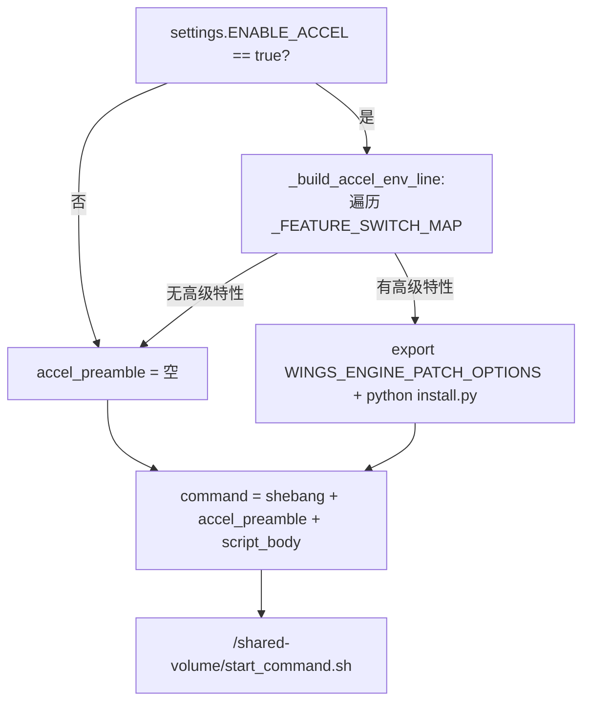

注入顺序：`shebang` → `set -euo pipefail` → `export WINGS_ENGINE_PATCH_OPTIONS` → `python install.py --features` → adapter 引擎命令。

#### wings-accel 层面

轻量 Alpine initContainer，职责：将补丁文件传到共享卷。

| 组件 | 说明 |
|------|------|
| `Dockerfile` | Alpine 3.18，`WORKDIR=/accel`，`chmod +x` 安装脚本 |
| `install.py` | 补丁安装入口，解析 `--features` JSON → pip install whl |
| `supported_features.json` | 特性声明（引擎→版本→补丁列表），校验用 |
| `wings_engine_patch/install.sh` | 底层安装：`pip install *.whl` |

**安装链路**：

```
initContainer: /accel/* → cp -r → /accel-volume/
engine容器: python /accel-volume/install.py --features "$WINGS_ENGINE_PATCH_OPTIONS"
  → 解析 JSON → 校验 supported_features.json → pip install *.whl
```

**错误处理**：`install.py` 不存在 → WARNING（不 crash）；JSON 解析失败 → ERROR + 非 0 退出；不支持特性 → WARNING（不阻断）；pip 失败 → `set -euo pipefail` 捕获中止。

### 5.3 接口设计

| 接口 | 说明 |
|------|------|
| 5 个高级特性环境变量 | `true` / `false` 开关 |
| `WINGS_ENGINE_PATCH_OPTIONS` | JSON 格式，自动构建或用户覆盖 |
| `install.py --features <JSON>` | Accel 补丁安装入口 |
| K8s `initContainers` | `wings-accel` 容器声明 |

### 5.4 数据结构设计

| 数据结构 | 描述 |
|----------|------|
| `_ENGINE_PATCH_KEY_MAP` | 引擎名→patch key 映射（vllm_ascend 复用 vllm） |
| `_FEATURE_SWITCH_MAP` | 5 个高级特性开关→features 名称 |
| `supported_features.json` | Accel 包特性声明文件 |
| `accel-volume` | K8s emptyDir，initContainer→引擎容器传递通道 |

---

## US6 日志汇聚逻辑【重构】

### 6.1 需求背景

| 对比 | 老架构 | 新架构 |
|------|--------|--------|
| 模型 | 单进程，引擎 stdout 管道自然汇聚 | Sidecar 三容器，各自独立 stdout |
| 痛点 | 无 | 日志分散 / 格式不统一 / 无文件持久化 / 分布式隔离 |

**目标**：① `kubectl logs --all-containers` 聚合查看，格式统一；② Pod 内 `/var/log/wings/` 共享卷持久化。

### 6.2 实现设计

#### 双通道日志架构

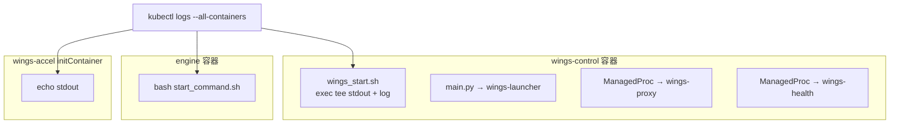

#### 统一日志格式

```
%(asctime)s [%(levelname)s] [%(name)s] %(message)s
```

组件标签：`wings-launcher` / `wings-proxy` / `wings-health`

#### 日志噪声过滤

| 模块 | 过滤内容 | 机制 |
|------|---------|------|
| `noise_filter.py` | `/health` 探针、`Prefill/Decode batch`、pynvml 警告 | logging.Filter + stdout/stderr 包装 |
| `speaker_logging.py` | 多 worker 日志抑制、uvicorn.access、/health 出入站 | speaker 决策 + `_DropByRegex` Filter |

#### 日志文件持久化

**现状**：`wings_start.sh` 通过 `exec > >(tee -a "$LOG_FILE") 2>&1` 写入 `/var/log/wings/wings_start.log`（5 副本滚动），但未挂载持久卷，重启丢失。Python 层无 `RotatingFileHandler`。

**待实现：共享日志卷方案**：

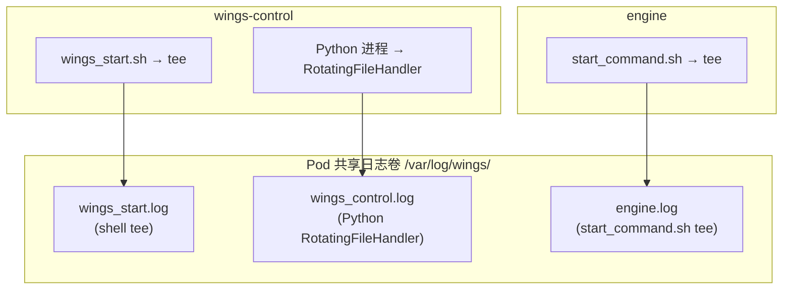

| 日志文件 | 写入者 | 内容 | 滚动策略 |
|---------|--------|------|---------|
| `wings_start.log` | shell `exec tee` | 整个 shell 进程全量输出 | 按时间戳备份，保留 5 个 |
| `wings_control.log` | Python `RotatingFileHandler` | launcher/proxy/health 结构化日志 | 50MB × 5 备份 |
| `engine.log` | `start_command.sh tee` | 引擎全部 stdout/stderr | 无自动滚动 |

> `wings_start.log` ⊃ `wings_control.log`（shell 层全量 vs Python 层结构化子集）

#### 待实现改动项

| 文件 | 改动 |
|------|------|
| `log_config.py` | 添加 `RotatingFileHandler`（50MB × 5） |
| `wings_entry.py` | 引擎命令追加 `tee -a /var/log/wings/engine.log` |
| K8s 模板 | 添加 `log-volume` (emptyDir) 共享挂载 |

#### 分布式场景

每个节点独立 Pod，Pod 内共享日志卷，跨 Pod 依赖外部方案：

| 维度 | Master Pod (rank=0) | Worker Pod (rank≥1) |
|------|--------------------|--------------------|
| wings-control | launcher + proxy + health | launcher only |
| engine | API server + 推理 | 计算 + NCCL |

| 跨节点查看方式 | 适用场景 |
|---------------|---------|
| `kubectl logs sts/xxx --all-containers` | 调试 |
| `stern -l app=xxx --all-containers` | 开发 |
| NFS 共享存储 | 日志集中 |
| EFK/Loki | 生产环境 |

### 6.3 接口设计

| 接口 | 说明 |
|------|------|
| `kubectl logs <pod> -c wings-control` | 控制层日志 |
| `kubectl logs <pod> -c engine` | 引擎日志 |
| `kubectl logs <pod> --all-containers` | 全部聚合 |
| `tail -f /var/log/wings/*.log` | Pod 内聚合 |

| 环境变量 | 默认值 | 说明 |
|---------|--------|------|
| `LOG_FILE_PATH` | `/var/log/wings/wings_control.log` | Python 日志路径 |
| `NOISE_FILTER_DISABLE` | `0` | 设为 `1` 关闭噪声过滤 |
| `LOG_INFO_SPEAKERS` | 空 | 逗号分隔 worker 索引，仅这些输出 INFO |

### 6.4 数据结构设计

| 数据结构 | 描述 |
|----------|------|
| `LOG_FORMAT` | `"%(asctime)s [%(levelname)s] [%(name)s] %(message)s"` |
| `LOGGER_LAUNCHER` / `LOGGER_PROXY` / `LOGGER_HEALTH` | 三个 logger name |
| `setup_root_logging()` | 统一初始化 root logger |
| `LOG_MAX_BYTES` / `LOG_BACKUP_COUNT` | 50MB / 5（待实现） |

---

## US7 RAG 二级推理【继承】

### 7.1 需求背景

RAG 场景下长文档推理需要 Map-Reduce 分块并行策略。

### 7.2 实现设计

**触发条件**（`ENABLE_RAG_ACC=true` 时全部满足）：

| 条件 | 值 |
|------|-----|
| 包含标签 | `<\|doc_start\|>` / `<\|doc_end\|>` |
| 文本长度 | ≥ 2048 字符 |
| 文档块数 | ≥ 3 |

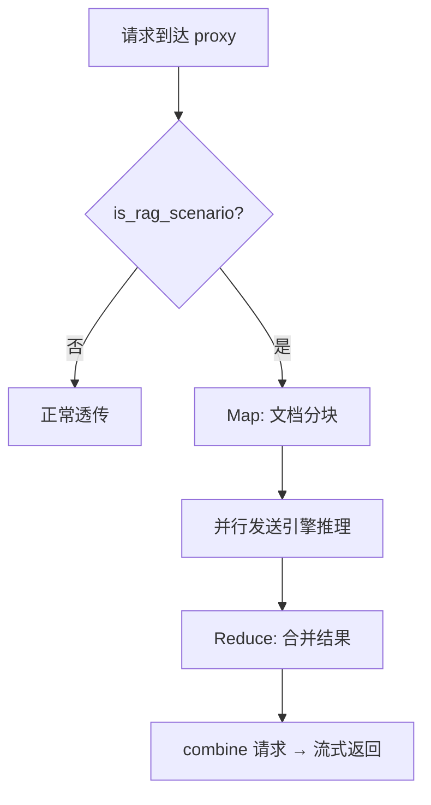

**引擎无关性**：RAG 模块通过 HTTP 调用 `/v1/chat/completions`，不依赖引擎特定接口，四引擎均支持。

**跳过机制**：请求体包含 `/no_rag_acc` 即可强制跳过。

**继承状态**：100% 继承，8 个文件完全一致。

### 7.3 接口设计

与解耦前保持一致

### 7.4 数据结构设计

与解耦前保持一致

---

## US8 MindIE 分布式长上下文【新增】

### 8.1 需求背景

DeepSeek 满血模型在 MindIE 分布式场景下，输入输出总长度超过阈值时启用四维并行策略。

### 8.2 实现设计

**触发条件**（三个同时满足）：

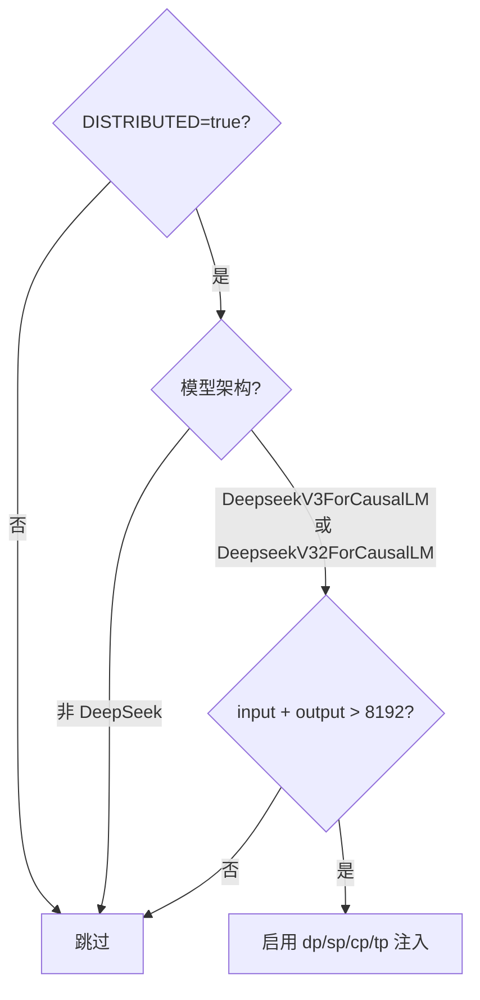

**注入参数**：

| 参数 | 环境变量 | 默认值 | 含义 |
|------|---------|--------|------|
| dp | `MINDIE_DS_DP` | 1 | 数据并行 |
| sp | `MINDIE_DS_SP` | 8 | 序列并行 |
| cp | `MINDIE_DS_CP` | 2 | 上下文并行 |
| tp | `MINDIE_DS_TP` | 2 | 张量并行 |

**配置流转**：

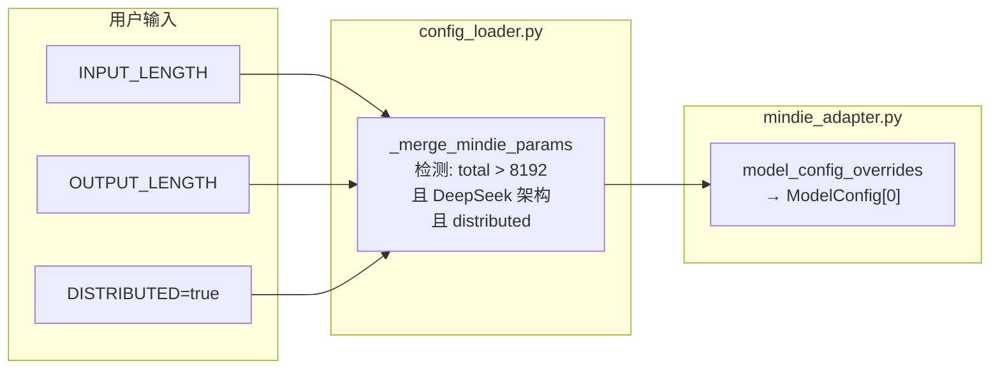

关键代码：

```python
# config_loader.py — _merge_mindie_params()
_LONG_CTX_THRESHOLD = int(os.getenv("MINDIE_LONG_CONTEXT_THRESHOLD", "8192"))

if (ctx.get('distributed')
        and model_architecture in ["DeepseekV3ForCausalLM", "DeepseekV32ForCausalLM"]
        and total_seq_len > _LONG_CTX_THRESHOLD):
    params['dp'] = int(os.getenv("MINDIE_DS_DP", "1"))
    params['sp'] = int(os.getenv("MINDIE_DS_SP", "8"))
    params['cp'] = int(os.getenv("MINDIE_DS_CP", "2"))
    params['tp'] = int(os.getenv("MINDIE_DS_TP", "2"))
```

**注意**：`multiNodesInferEnabled` 对单个 daemon 实例设为 `false`，跨节点协调由上层 `ms_coordinator/ms_controller` 处理。

### 8.3 接口设计

| 接口 | 说明 |
|------|------|
| `MINDIE_LONG_CONTEXT_THRESHOLD` | 触发阈值，默认 8192 |
| `MINDIE_DS_DP/SP/CP/TP` | 四维并行参数，默认 1/8/2/2 |
| `INPUT_LENGTH` + `OUTPUT_LENGTH` | 序列总长度来源 |
| `config.json` → `ModelConfig[0]` | 注入目标 |

### 8.4 数据结构设计

| 数据结构 | 描述 |
|----------|------|
| `_LONG_CTX_THRESHOLD` | 长上下文阈值，默认 8192 |
| `model_config_overrides` | dp/sp/cp/tp dict → MindIE config.json |
| 目标路径 | `BackendConfig.ModelDeployConfig.ModelConfig[0]` |
